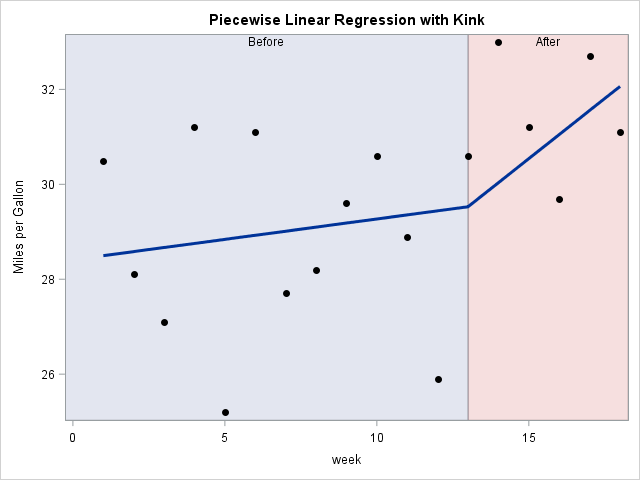

```{r setup, echo=FALSE}
library(broom)
library(knitr)
library(ggplot2); theme_set(theme_bw(base_size=15))
library(patchwork)
library(tidyverse)
library(kableExtra)
#library(car)

# Ensure the plot options are set correctly
#opts_chunk$set(dev.args=list(bg='transparent'), comment="", warning=FALSE, echo=FALSE)
opts_chunk$set(comment="", warning=FALSE, echo=FALSE)
knitr::opts_chunk$set(echo = TRUE)
knitr::opts_chunk$set(fig.dim=c(8,5), out.width="70%", fig.retina=2)

```


## learning outcomes

-- Undertand the concept of piecewise models

-- Implement piecewise models in R

## Introduction to piecewise models

Sometimes we need to specify a different line for different ranges of our predictor variable. Such a model is called `piecewise`. The change points are called `knots`. 


## Introduction to piecewise models

::::{.columns}


:::{.column with="50%"}




:::


:::{.column with="50%"}


A model with a single change in slope at `knot` <span class="highlight">$\kappa$</span> would have the equation:  $$ y = \beta_0 + \beta_1x + \beta_2 (x-\kappa)_+  + \varepsilon$$


:::

::::


Where $(x-\kappa)_+$:

\begin{cases} 
x-\kappa & \text{if } x > \kappa \\
0 & \text{if } x \leq \kappa
\end{cases}


## Introduction to piecewise models

This can be calculated in R as  `ifelse(x<k, 0, x-k)` read as if `x` is less than `k`, then use zero, else use `x-k`.

If there are two knots, $\kappa_1$ and $\kappa_2$, the same code can be used multiple times.


## The Indianapolis 500 data

-- This data has the winning speed (an average over 500 miles) for the very famous motor race.

&nbsp;

-- In the Indianapolis data have gaps due to the races being cancelled in  1917-18  and  1942-45 while the USA was active in the world wars.  We will use the midpoints of the missing years as the knots: $\kappa_1 = 1917.5$ and $\kappa_2= 1943.5$.

&nbsp;

-- We can imagine three different slopes before World War I, between the two wars, and after World War II.  ()

## The Indianapolis 500 data


```{r Indianapolis 500 winning speed, echo=-1}
Indy <- read.csv(file="Indianap500.csv",header=TRUE)
plot(Speed ~ Year, data=Indy)
```


## The Indianapolis 500 data


```{r Indianapolis.change.slopes}
Knot1=1917.5; Knot2 = 1943.5
Indy |> 
  mutate(t2 = ifelse(Year<Knot1, 0, Year-Knot1),
         t3 = ifelse(Year<Knot2, 0, Year-Knot2)) -> Indy
```


&nbsp;

::::{.columns}


:::{.column with="50%"}

```{r}
Indy |> head() |> kable() |> kable_styling(font_size = 20)
```

:::
  
:::{.column with="50%"}

```{r}
Indy |> tail() |> kable() |> kable_styling(font_size = 20)
```


:::
  
::::
  


## The Indianapolis 500 models

```{r}
Indy.pce0 <- lm(Speed ~ Year, data = Indy)
Indy.pce1 <- lm(Speed ~ Year + t2 + t3, data = Indy)


summary(Indy.pce1)
```
## The Indianapolis 500 models


```{r}
anova(Indy.pce0, Indy.pce1)
```


## The Indianapolis 500 models

```{r IndianapolisChangeSlopes}
Indy |> mutate(Fits = fitted.values(Indy.pce1)) |> 
ggplot(aes(y=Speed, x=Year)) +
  geom_point(color = "blue") +
  geom_point(aes(y = Fits), color = "red", shape = "*", size = 6) +
labs(y="Average speed")
```


## Allowing for discontinuity

```{r LinesWithDiscontinuity}
Indy |> 
  mutate(Const2 = ifelse(Year > Knot1, 1, 0),
         Const3 = ifelse(Year > Knot2, 1, 0)) -> Indy

Indy.pce2 <- lm(Speed ~ Year + t2 + t3 + Const2 + Const3, data = Indy)
```

## Allowing for discontinuity

```{r}
anova(Indy.pce1, Indy.pce2)
```


The anova() indicates that, overall, the model is significantly improved by allowing for discontinuity. The regression coefficients show this is almost entirely due to the change at the second knot, not the first.

## Allowing for discontinuity

```{r}
summary(Indy.pce2)
```
## Allowing for discontinuity

```{r IndianapolisDiscontinuities}
Indy$Fits = fitted.values(Indy.pce2)
Indy |> ggplot(aes(y=Speed, x=Year)) +
  geom_point(color = "blue") +
  geom_point(aes(y = Fits), color = "red") +
labs(y="Average speed")
```

## Example: Child Lung Function Data


-- FEV (forced expiratory volume) is a measure of lung function.

-- Determinations of FEV on 318 female children who were seen in a childhood respiratory disease study in Massachusetts in the U.S.

-- It is of interest to model FEV (response) as function of age.


## Example: Child Lung Function Data

```{r getFevData, echo=0}
Fev <- read.csv(file="fev.csv", header=TRUE)
plot(FEV~Age, data=Fev)
```


## Example: Child Lung Function Data

--  relationship between FEV and age is not linear.

-- We saw how to model FEV as a polynomial. The fourth order polynomial model was the best.


```{r Fev.poly}
Fev.lm4 <- lm(FEV~poly(Age,4), data=Fev)
```

## Example: Child Lung Function Data

If we plot this we find the model seems to have a strange wobble, and steep increasing curves at both ends of the age range.

```{r quartic plot}
Fev |> mutate(Fits = fitted.values(Fev.lm4)) |>
ggplot(aes(y=FEV, x=Age))  + geom_point() +
geom_point(aes(y=Fits), color = "red", size = 6)
```


## Child Lung Function Data, a new approach

Lets fit a piecewise model instead. Visually it looks like the FEV values flatten out from Age=12 onwards.


```{r Fev piecewise}
k <- 11.5
Fev <- Fev |> mutate(Age2 = ifelse(Age<k, 0, Age-k))

Fev.pce1 <- lm(FEV ~ Age + Age2, data = Fev)
summary(Fev.pce1)
```

## Child Lung Function Data, a new approach


```{r fitsFev.pce1}
Fev |> mutate(Fits=fitted.values(Fev.pce1)) |>
ggplot(aes(y=FEV, x=Age)) + geom_point() +
geom_point(aes(y=Fits), color = "red", size = 6)
```

## Child Lung Function Data, a new approach

```{r summFev.pce1}
round(summary(Fev.lm4)$sigma,4)
round(summary(Fev.pce1)$sigma, 4)
```
Both standard errors area similar and the graph looks more biologically reasonable, so we would probably prefer the piecewise model. 

By constructing new variables, we have increased our ability to fit meaningful and more easily interpretable models.