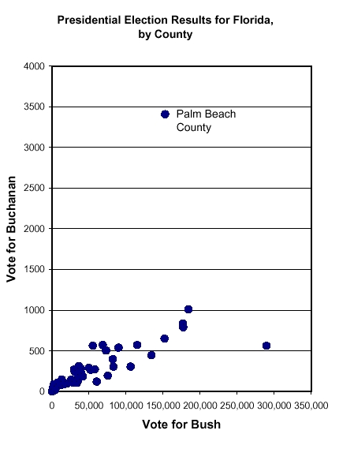

# Outliers and Influential Points{#Outliers}

<a href="downloads/Lecture6.Rmd" download>Download the in-class Rmd</a>

<!--- Data files for these notes live in /data at the repository root. --->

```{r setup, purl=FALSE, include=FALSE, message=FALSE, warning=FALSE}
library(knitr)
opts_chunk$set(dev=c("png", "pdf"))
opts_chunk$set(fig.height=6, fig.width=7, fig.path="Figures/", fig.alt="unlabelled")
opts_chunk$set(comment="", fig.align="center", tidy=TRUE, cache=TRUE)
options(knitr.kable.NA = '')
library(tidyverse)
library(broom)
library(tsibble)
library(fable)
library(feasts)
library(lubridate)
```


<!--- Do not edit anything above this line. --->

In the previous lecture we looked at diagnostic tools for linear regression models.

We saw that a model can appear inappropriate for the data because of one or two odd points

In this lecture we will examine the issue of odd points in more depth.

## What Exactly is an Outlier?

There is no hard and fast definition.

Essentially, an outlier is defined as a data point that emanates from a different model than do the rest of the data.

Notice that this makes the definition dependent on the model in question.




## Detecting Outliers

  Outliers may be detected by:

- Inspection of a scatterplot of the data.
- Inspection of a *fitted line plot* (where fitted regression line is superimposed on scatterplot).
- Plotting residuals versus fitted values or covariate.

Any data point that lies an unusual distance from the fitted line, or has a large residual in comparison to the other data points, may be considered an outlier.

## Outliers for the Hill Racing Data

```{r getHillsData}
data(hills, package="MASS")
Hills <- hills # We used Upper case before.
```

```{r Hills.lm}
Hills.lm <- lm(time~dist, data=Hills) 
```

```{r Hills.lmDiag1, fig.cap="Residuals v fitted plot for Hills data"}
plot(Hills.lm, which=1)
```


Inspection of the plot of residuals versus fitted values suggests three possible outliers: Knock Hill, Bens of Jura, and Lairig Ghru.
Most extreme is Bens of Jura.

The `Knock Hill` outlier may be due to transcription error ---  `time`  of 18.65 recorded as 78.65 minutes. See the help page for this data.


## What to Do When You Find Outliers

Do not ignore them!

First, investigate whether data have been mis-recorded (go back to data source if possible).

If an outlier is not due to transcription errors, then it may need removing before refitting the model.

In general one should refit the model after removing even a single outlier, because removal of one outlier can alter the fitted model, and hence make other points appear less (or more) inconsistent with the model.

Other approaches covered in this course are to use a transformation to reduce its impact, or use weighted regression to reduce its impact.

The field of robust statistics (not covered in this course) is concerned with more sophisticated ways of dealing with outliers.

## Influence

### Leverage

The extent of problems caused by an outlier depends on the amount of influence that this data point has on the fitted model.

The potential influence of a data point can be measured by its leverage. For the *i*^th^ data point in a simple linear regression, leverage is given by

$$h_{ii} = \frac{1}{n} + \frac{(x_i - \bar x)^2}{s_{xx}}$$

Notice that:

- leverage depends only on the *x*-value, so that the actual influence of a data point will not depend on the response value;
- data points with extreme *x*-values (i.e. far from $\bar{x}$) have greatest leverage.


As an aside, the sum of the leverages adds to the number of parameters fitted in a model, so the average leverage will be *p/n*.


### Cook's Distance

The actual influence of a data point can be measured by calculating the change in parameter estimates between

(i) the model built on all the data, and

(ii) the model built on data with the data point removed.


 Cook's distance is a measure of influence that is based on exactly this kind of approach.

Cook's distance depends on both the *x* and *y*-values for a data point, and will be large for data points with both high leverage and large standardized residual.

A value of Cook's distance greater than one is a cause for concern.

## Using plots to detect influence


The fourth plot produced in R by  `plot()`  applied to a linear model is a plot of standardized residuals against leverage, with contours marking extreme Cook's distance.

```{r Hills.lmDiag4, fig.cap="Fourth diagnostic plot for Hills.lm"}
plot(Hills.lm, which=5)
```


For the hill racing data, Lairig Ghru and Bens of Jura have much greater influence than other data points.


N.B. The names of observations appear here because the data is stored with `rownames`. How we import data is important.

You should observe that the `which` argument is not set to 4 as you may have expected. There are actually 6 plots available but the vast majority of need is served with plots 1,2,3, and 5.


## Conclusions on the Hill Racing Data

The Scottish Hill Racing Data appears to contain some outliers.

Some of these outliers are data points with high leverage, and hence may have a marked effect on the fitted model.

Recall that the definition of an outlier will depend on the model that we choose to fit.

Perhaps the outliers only appear as odd points because the model is inadequate.

For example, it may be the variable `climb` has an important effect on race time, and should be included in the model.


## An Exercise

Remove one of the points flagged as unusual in the above analyses. Then re-fit the model to the reduced data. Compare the fit of the two models by plotting their fitted lines on the scatter plot of the data.

Look at the residual analysis for your new model. Does removal of the point you chose affect the status of the other points? 

### A Solution

The following code picks out the row for the maximum residual, and then recomputes the linear model with that removed. To be explicit, the code:

- make a row names variable so we can refer to them explicitly using other `tidyverse` commands. N.B. The standard rownames are an attribute so don't work so nicely for the `filter()` command which operates on columns.
- `filter()`  out the one we don't want
- then revert to having rownames so that our graphs have labelled points
- fit the same model using the reduced dataset.

```{r Hills2.lm}
library(tidyverse) # for data manipulation
library(broom) # going to sweep up a bunch of useful stuff...
augment(Hills.lm)
Hills2 = Hills |> rownames_to_column() |> 
# so we can use them explicitly like a variable
filter(rowname != "Bens of Jura") |> 
# filter out the one we don't want
column_to_rownames() 
# go back to having rownames so that our graphs have labelled points

Hills2.lm <- lm(time~dist, data=Hills2) 
augment(Hills2.lm)
```

N.B. The `augment()` command added columns starting with a period containing several of the values we want for checking assumptions; other added columns will only be explained if they are needed in future. Watch that the first column though is called `.rownames` but we use the `filter()` command on a data set, not the results of `augment()`

 
```{r HillsFittedLinePlot2, fig.cap="Models fitted to Hills data with and without the Bens of Jura race."}
plot(time~dist, data=Hills) 
abline(Hills.lm, lty=2)
abline(Hills2.lm, col=2)
```

N.B. this form of `plot()` and `abline()` is old-fashioned, but still good value

```{r residsHills2.lm, fig.cap="Diagnostic plots for Hills2.lm"}
par(mfrow=c(2,2))
plot(Hills2.lm)
```


## Deleted residuals

Suppose we think an outlier is dragging the line towards itself,  to some extent hiding how unusual it is. 

Suppose we were to delete the $i^{th}$ data point and recalculate the line with it gone.  $$ \hat y_{  -i} = \hat\beta_{0,-i} + \hat\beta_{1,-i} \,\,   x   $$ for $j=1,2,...,n$,  $j\ne i$.  The $-i$ notation means with the $i$ point removed.

Since we can calculate this "deleted line" at any *x*,  we can do it at the value of $x_i$. 

A deleted residual is $$ e_{i, -i}  = y_i - \hat y_{i,-i}$$

We calculate these deleted residuals for each row $i$ in turn.


We standardise each deleted residual using the variance calculated with the $i^{th}$ point removed.  What we get are  known  as *studentized deleted residuals*. 

The R function  `rstudent()`   calculates the deleted residuals for us.   

It is often helpful to plot them on the same graph as standardized residuals. If all the points overlap then no data values are influential.  But the graph below immediately shows us that deleting the two outliers  in the left-middle of the plot would have a big effect, so they are influential. However deleting the point on the right would not change the model much, so it should be left alone.  

```{r deleted residuals}
plot(  rstudent(Hills.lm) ~predict(Hills.lm), col="red",pch="+" , main="Studentized Deleted Residuals")
points(  rstandard(Hills.lm) ~predict(Hills.lm), col="black",pch=1 )
max(rstudent(Hills.lm))  
max(rstandard(Hills.lm))
```


## You might find the following commands useful.

```{r otherUseful}
max(cooks.distance(Hills.lm))
max(cooks.distance(Hills2.lm))
max(hatvalues(Hills.lm)) # leverages
max(hatvalues(Hills2.lm)) 
```
