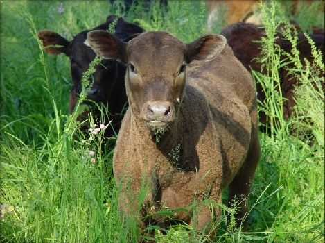

# Orthogonal Factorial Models{#OrthogonalFactorialModels}

[In class version](https://R-Resources.massey.ac.nz/161251/Lectures/Lecture23.html)

<!--- Data is on
https://r-resources.massey.ac.nz/data/161251/
--->

```{r setup, purl=FALSE, include=FALSE}
library(knitr)
opts_chunk$set(dev=c("png", "pdf"))
opts_chunk$set(fig.height=6, fig.width=7, fig.path="Figures/", fig.alt="unlabelled")
opts_chunk$set(comment="", fig.align="center", tidy=TRUE)
options(knitr.kable.NA = '')
library(tidyverse)
library(broom)
```


<!--- Do not edit anything above this line. --->

<!--- GLMsData package has butterfat --->


- We know that the importance of one predictor can depend on whether or
    not we have adjusted for another. This is also true if the predictors are factors.

- This means that we need to look at multiple ANOVA tables in order to
    perform all the possible tests (with particular patterns of
    adjustment).

- However, for orthogonal factorial designs it turns out
    that the issue of adjustment is of no concern.

## What is an Orthogonal Factorial Design?

- The pattern of factor levels (i.e. the number of observations in the different level groups of the different factors), when chosen by an experimenter, is called the factorial design. 

- In essence, the pattern of factor levels (the factorial
    design if this was chosen by an experimenter) is
    **orthogonal** if the sum of squares attributable to one
    factor is the same whether or not the other factor has been included
    in the model.

- In terms of ANOVA tables, this means that *SSA* will be the same
    whether *A* appears on the first or second line of the ANOVA     table.

- A balanced and complete factorial design is orthogonal. We will see what these two terms mean.

## What is a balanced and complete factorial design?

- A factorial design is **complete** if observations are made
    at every possible combination of factor levels, or
    treatment.

- For example, if factor *A* has 3 levels, and factor *B* has 4
    levels, then a complete design requires that we observe responses at
    each of the possible $3\times4 = 12$ treatments.

- A factorial design is **balanced** if the same number of
    experimental units are observed at each treatment. In other words, *n~ij~ = r* is the (constant) **number of replications**,
    i.e. the number of observations in each treatment.

- Balance and completeness need to be achieved by design
    (they will not usually be the case in an observational study or survey).

## Consequences of an Orthogonal Factorial Design

In a two-way orthogonal design:

- The *P*-values for each factor in the ANOVA table remain precisely the
    same irrespective of the order in which the factors are listed.

- In considering the importance of factor *B* it does not matter
    whether or not we have adjusted for *A* (and vice versa).

The idea of orthogonality can be extended to three or more factor
models.

## A Designed Experiment for Dairy Cattle


An experiment was performed to investigate butterfat content of milk (the response variable, measured as a percentage).
The factors are:

- Cow breed, with five levels: Ayrshire, Canadian, Guernsey, Holstein-Fresian, Jersey.
- Cow age, with two levels: mature, and 2 years old.




- 10 replicates (cows) observed at each treatment (i.e. combination of
    breed and maturity).

- The design is complete **and** balanced,
    so therefore orthogonal.

### Analysis of Dairy Cattle Data

`r xfun::embed_file("../../data/cows.csv")`

```{r Cows.lm.1, echo=-1, eval=-2}
Cows <- read.csv(file="../../data/cows.csv", header=TRUE)
Cows <- read.csv(file="cows.csv", header=TRUE)
head(Cows)
Cows.lm.1 <- lm(Butterfat ~ Breed + Age, data=Cows)
anova(Cows.lm.1)
```

```{r Cows.lm.2}
Cows.lm.2 <- lm(Butterfat ~ Age + Breed, data=Cows)
anova(Cows.lm.2)
```

The figures in the ANOVA tables for models `Cows.lm.1` and `Cows.lm.2` are identical,
    despite the difference in order in which the factors are considered.
    This occurs because of the orthogonal design.

There is overwhelming evidence of a breed effect (*P*-value smaller than
    $2 \times 10^{-16}$) on mean butterfat content.
    
There is no evidence of an age effect.

### Summary Table

```{r summariesCows}
summary(Cows.lm.1)$coefficients
summary(Cows.lm.2)$coefficients
```

Note that by default, level one of `Age` (2 years old) and level one of `Breed`, Ayrshire,
    are set as the reference levels for the treatment constraint.

The Jerseys seem to provide the highest butterfat concentration.

We should look at model diagnostics.


## Rats – Not Another Task!

This task concerns a complete and balanced experiment into rat weight gain.

Two factors:

1. Protein: either beef or cereal;
2. Amount: either low or high.

We have ten replicates at each treatment.


The following ANOVA table (with certain elements obscure by `#`) was
obtained using R.

```{r echo=FALSE}
RatDiet <- read.csv(file="../../data/ratdiet.csv", header=TRUE)
MyTable = as.data.frame(anova(lm(Gain ~Amount + Protein, data=RatDiet)))
MyTable[,"Pr(>F)"] = round(MyTable[,"Pr(>F)"], 4)
MyTable[,3:4] ="#"
MyTable[3,4:5] =""
knitr::kable(MyTable)
```

1.  Calculate the obscured values.

2.  What can you conclude (if anything) about the effect of `Protein` ignoring the
    effects of `Amount`?

## Mathematical formulation of factorial models

As we move towards more complex factorial models, with more than two
factors and interactions, we need to start using the mathematical
formulation of these models as they are more concise.

### One-way ANOVA model

Remember that the one-way model
$$Y_i = \mu + \alpha_2 z_{i2} + \ldots + \alpha_K z_{iK} + \varepsilon_i~~~~~(i=1,2,\ldots,n)$$

can be written as $$\boldsymbol{Y_{ij} = \mu + \alpha_i + \varepsilon_{ij}}$$
where

- $Y_{ij}$ is the response of the $j$th unit at the $i$th level
    of the factor $(i=1,\ldots,K;~j=1,\ldots,n_i)$;

- $K$ denotes the number of levels, and $n_i$ the number of
    observations at level $i$ of the factor.

- Assume treatment constraint $\alpha_1=0$.

- $\varepsilon_{11}, \varepsilon_{12}, \ldots, \varepsilon_{Kn_K}$ are random errors
    satisfying assumptions ***A1*** to ***A4***.

### Two-way (main effects) ANOVA model

A two-way model with factors *A* and *B* in multiple regression form
$$Y_i = \mu + \alpha_2 z_{Ai2} + \ldots + \alpha_K z_{AiK} 
+ \beta_2 z_{Bi2} + \ldots + \beta_L z_{BiL} + \varepsilon_i~~~~~(i=1,2,\ldots,n)$$
becomes:
$$\boldsymbol{Y_{ijk} = \mu + \alpha_i + \beta_j + \varepsilon_{ijk}}$$

where $Y_{ijk}$ is the response for the $k$th unit at level $i$ of
    factor *A* and level $j$ of factor *B* ($i=1,\ldots,K;~j=1,\ldots,L;~k=1,\ldots,n_{ij}$).

- $\alpha_1, \ldots, \alpha_K$ and $\beta_1, \ldots, \beta_L$ are
    parameters describing the ‘main effects’ of *A* and *B*
    respectively.

- Assume treatment constraints, $\alpha_1 = 0$ and $\beta_1 = 0$.

- $\varepsilon_{111}, \varepsilon_{112}, \ldots, \varepsilon_{KLn_{KL}}$, are error
    terms satisfying assumptions ***A1–A4***.

