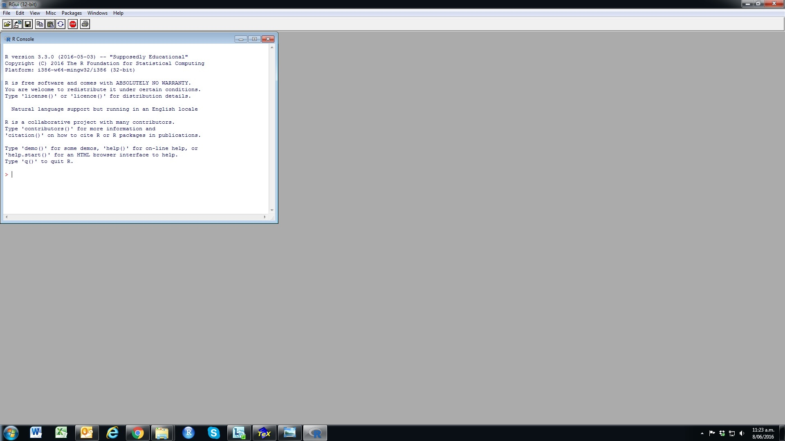

```{r extraLibs}
library(MASS)
```


In this lecture we will look at:

  - What is R?

  - Basic R syntax

- Use of R via RStudio.


## What is R?

  - R is a statistical software system.

  - R is a programming language that has many "inbuilt" statistical
    commands (e.g. to fit a linear regression).

  - R started life as a quasi-clone of commercial package S-Plus, but
    development of R and S-Plus now slowly diverging.

  - Advantages over other statistics packages include flexibility,
    power, and quality of graphical display.

  - R is open-source software, and part of GNU project. It can be
    downloaded from `http://cran.r-project.org/` and used for free.

  - There are versions of R for all common operating systems --- Windows, Linux, and MacOS.

## A Little R History

|                                       |                                           |
| :-----------------------------------: | :---------------------------------------: |
|  |  |

  
 Ross Ihaka (left) and Robert Gentleman.

  - R is a New Zealand invention\!

  - R originally developed by Ross Ihaka and Robert Gentleman in the
    Department of Statistics, University of Auckland.

  - First (test) version of R released in public domain in 1995.

  - R Development Core Team took over supervision of R in 1997.

 - This Team includes about 20 statisticians worldwide.

## Starting R in the Computing Labs

- Start R for the first time via the Start menu (or desktop icon if available).
- Select R (version `r version$major`) from the appropriate program group.
- RGui (**R G**raphical **U**ser **I**nterface) should appear as displayed.



N.B. Check the version number. Ideally we want to be sure that we are running the latest version, but do not change versions partway through the semester unless it is truly necessary.

## Starting RStudio in the Computing Labs

- Start RStudio for the first time via the Start menu (or desktop icon if available).
- You should see the window split into sub-windows. Please note that RStudio is undergoing constant development. Your version may not look quite like the image  displayed below.


 

N.B. the contents of the RGUI are all available in RStudio. We will work in RStudio because it offers many extra features.


## Working directory

  - When you quit R you will get a pop-up asking "Save workspace
    image?".

  - If you click yes, then the *R workspace* that you have
    created will be saved in your *working directory*.

  - You can find out where your working directory is by typing the
    command `getwd()` at the R prompt.

  - The working directory can be changed using the Change
    dir... command from the R File menu.

Note the command `getwd()` is in typewriter font. This font
is used in lectures for R input and output (amongst other things). The parentheses are included to show you that this is a command; typing `getwd` alone will not give you what you want!

## Save your work using scripts!

  - Please get into the habit of writing all your R commands in a
    *R script* before you run it in the console.

  - An R script is a text file containing code which can be run directly
    by highlighting then hitting `CTRL-R`.
    
      - Comments following `#` symbols in script files are not executed.

  - To create a new script use the New script command from
    the R File menu or New File\>R Script from
    the RStudio File menu.

  - To save your script, click on the scripts pane, and then go to
    File \> Save As in the menu bar.

  - Scripts allow you to rerun your entire analysis without re-writing
    all the commands, it also helps editing and proofreading your code.

## Managing Your Code


## An even better way

Putting your R commands into the file that becomes your end-use document will make your workflow even more efficient. When we use RStudio, we can make use of the extensive features to create these documents.

Look out for the tutorial sheets introducing you to what we call ***R markdown*** documents. The lecture material you are viewing now was produced using R markdown. 

More on this later...

 

## A First Dip into R

### Expressions and Assignments

Elementary commands are either *expressions* or
*assignments*.

  - An *expression* simply displays result of a
    calculation; not retained in the computer's memory.

  - An *assignment* passes the result of a calculation to a
    variable name (or 'object') which is stored; the result is not
    displayed.


### Examples (for you to try)

```{r}
3+4
```

- The symbol `>` is the command prompt. This is where you would type the `3+4`. The answer will come back when you hit the `<Enter>` key.

- Don't worry too much at this stage about the `[1]`.

```{r}
x <- 3 + 4
x
```

- The `<-` is called the "left assignment" operator which assigns from right (`3+4`) to left (`x`)
- Yes, it takes two keys to get it; there cannot be space between the `<` and the `-` and it is best practice to put space on either side of `<-` in your work.
- It is equivalent to `x=3+4`, but many R users prefer the `<-` because it always means something is created in your workspace. (not always true for `=`)
- A right assignment operator also exists but is not commonly used.

## R Objects

  - All assigned variables (or any other R *objects*) are
    stored until overwritten or explicitly removed (deleted) by the
    command `rm()`.

  - To list stored objects type `ls()` or `objects()`.

```{r}
x <- 8
y <- 3.1415
ls()
rm(x)
objects()
```

## R Syntax

  - R commands, e.g. `ls()`, `rm()`, are followed by parentheses which may
    contain additional information for the function.

  - Writing a command name without parentheses returns the R source code
    for the function. Try one...


## Vectors in R

  - The command `c()` (for *concatenate*) creates vectors.

```{r}
x <- c(2.3,1.2,2.4)
x
c(x,9.0,x)
```

### Regular Sequences

  - The expression `1:n` denotes the **sequence**
1, 2,... *n*. 

  - The expression `seq(i,j,by=k)` is a sequence from *i*) to *j* in
    steps of *k*.

```{r}
1:5
y <- seq(3,10,by=2)
y
```
## Vector Arithmetic in R

- R uses `+`, `-`, `*` and `/` for the basic arithmetic
    operations, and `^` for exponentiation (raising to a power).

  - Vector operations are done element by element, with
    recycling of short vectors if required.


```{r}
x <- c(2,3)
y <- c(1,4,5,6)
2*x
2 + x
y^2
x + y
```

## Types of vector

  - All the vectors we have seen so far have been
    *numeric*; some were *integer* which is a special type of number.

- R also understands vectors of:
    
      - characters: letters, numerals, spaces, and other text.
      - logical values `TRUE` and `FALSE`; abbreviations `T`, `F` are often used.
      - factors (i.e. categorical variables); these may "look" like characters.

```{r}
MyWords <- c("This","is","a","character")
MyWords
c(F,T,F,F)
factor(c("Low","Low","Medium","High","High"))
```

N.B. All of these data types can be used in linear models, although character values are usually converted to factors.

## Logical Comparisons

  - Numerical vectors can be compared by inequalities.

  - `==` denotes equality; the `=` states what something is.

  - `!=` denotes 'not equal'.

  - `>`, `>=` etc. for inequalities.


```{r}
(1:5) == (5:1)
(1:5) > (5:1)
```

You might like to play with these comparisons. Testing the need for the brackets is  worth testing.

## Indexing Vectors

  - To index components of a vector `x`, use the form
    `x[...]`.

  - The square brackets can contain:
    
      - numeric vector specifying elements;
    
      - logical vector: only `TRUE` elements required.


```{r}
x <- c(1.1,3.2,4.3,7.4)
x[c(2,4)]
x[-2]
x[x > 3.5]
which(x > 3.5)
```

## Data Frames

  - A data frame is a collection of column vectors each of
    the same length.

  - The vectors may be numeric, factor, or whatever.

  - Each particular column and row of a data frame is given a name which
    can be chosen by the user, or assigned a default by R.


```{r}
employee <- c("Dilbert", "Wally", "Catbert", "TheBoss")
job<-factor(c("Engineer","Engineer","Manager","Manager"))
x <- c(8,1,NA,-2)
dilbert <- data.frame(employee, job, competence=x)
dilbert
```

### Attaching and Detaching

  - To access variables (columns) of a data frame:
    
      - First `attach` data frame; or
    
      - Use `data.frame$variable` syntax.

```{r showAttach, error=TRUE}
rm(employee,job,x) 
dilbert$competence 
job
attach(dilbert)
job
detach(dilbert)
```


N.B. Using `attach()` without `detach()` can lead to trouble. All is fine when things are done correctly, but the consequences of not using these commands correctly is seldom seen at the time they are used. When the errors come up it will be difficult to diagnose the problem. It is quite unusual to need to use these commands if you use modern ways of working. It is important to know how the `attach()` and `detach()` commands work, but do look to avoid their use.

## Importing Data

- The `scan()` command reads in text from a file as a single variable. You should use this command very infrequently.

- The `read.table()` command is more flexible, importing data in tabular form and storing the result as a data frame.

- other commands exist for importing `csv` files, and a host of other file formats.


- The comma separated values (csv) file format is extremely common and is used often in the course. You should not need to use `scan()` or `read.table()`.

```{r getIBMData, error=TRUE, echo=-1, eval=-2}
IBM <- scan(file="../../data/ibm.txt")
IBM <- scan(file="ibm.txt")
ibm
IBM
```

N.B. R is case sensitive so `ibm` is different to `IBM`. Windows is not case sensitive so the filename can be misspecified without any trouble; other operating systems are case sensitive though. 


```{r getLifeData, error=TRUE}
Life <- read.csv(file="../../data/life.csv", header=TRUE)
head(Life) # shows only the first six rows
```

The `../../data/` in this command is called a relative file path. The `..` means to look up one level from the current working directory; the  file requested is in a subfolder called `data`; the `/` is how we separate folders from subfolders or filenames. This may seem strange to Windows users who want to use a backslash instead. Get used to using the forward slash in R because it works for all operating systems.

The `read.csv()` command makes a number of assumptions about the way the file is formatted. A `csv` file is actually plain text with commas between values. Some people think it is a MS Excel file, but csv files existed long before Excel.
 
## Editing Data

  - Can edit by reassigning elements of a vector or data frame.

  - For data frame or matrix, `A[i,j]` is the *i,j*^th^ element (row
    *i*, column *j*) of the data frame `A`.


```{r}
IBM[5]
IBM[5] <- 65.12
IBM[5]
Life[2,]
Life[2,4]
Life[2,4] <- 7166
```

## R Packages

  - R objects (functions, data etc.) are organized in
    libraries/packages.

  - Some are loaded by default when R starts each time.
    
      - E.g. function `ls()` is part of the `base` package that is
        automatically loaded,

  - Some packages need loading, using either the `library()` or `require()` command.

```{r showMissingFun, error=TRUE}
mvrnorm(1,mu=0,Sigma=1)
library(MASS)
mvrnorm(1,mu=0,Sigma=1)
```

## Some R Functions to Get You Started

  - `help()` accesses R's help system; e.g. `help(ls)`. A quicker way is to use `?ls`

  - `mean()`, `sd()`, `min()`, `max()` and `range()` give mean, standard
    deviation, minimum, maximum and range respectively for a vector
    argument. N.B. `range()` tells you the minimum and maximum as a pair, not the difference between them.

  - `var()` returns variance of a vector argument, or the covariance
    (dispersion) matrix for a matrix argument.

  - `summary()` returns summary information dependent on argument type.

  - `plot()` produces a plot on the current graphics tool. The type of
    plot depends on the type of argument. The simplest use is `plot(x,y)` which
    produces a scatter-plot of vectors `x` and `y`.

Practice is the key when learning R.

## Your First R Exercise

1.  Use R to calculate   
    (i) 3456-789
    (ii) $23\times{}34$
    (iii) 13^3^

2.  Write (efficient) code to create the following sequences:
    
    (i) 2, 4, 6, ... 100; that is, the even numbers up to 100
    
    (ii) 1,2,3,4,5,4,3,2,1

3.  Use the command `y <- rnorm(100)` to store 100 simulated
    standard normal random variables in the vector `y`.
    
    (i) Find the mean and standard deviation of `y`.
    
    (ii) Find the largest simulated value. Which number simulation is this e.g. 54^th^, 23^rd^?
