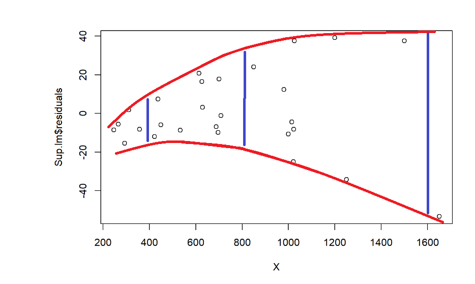

*Weighting by sample size. Interpretation of output. Weighting to counter heteroscedasticity.*

The key idea in this topic is that not all datapoints in the dataset need have the same information value.  Some data rows may contain very precise data, while data in the other rows may be less precise.  We therefore adjust our regression analysis to give more “weight” to those datapoints which are more reliable or informative. 

## Weighting by Sample Size 

###  CPS5 Data

The CPS5 dataset is a famous one in econometrics, referred to often in the book “Introductory Econometrics” by Professor Goldberger of Harvard, among other authors. 

The dataset has individual-level data on 528 employees  EDucation level, whether or not they are in the SOuth of the United States, BL=whether the person was non-white and non-Hispanic 1, otherwise 0, HP= whether or not the person was Hispanic, whether or not the employee was FEmale,  years of work EXperience, MS= marital status (1=married, 0 not),  whether or not they are members of a UNion, and WG= hourly wage.

Goldberger begins his text by calculating the average WG value for  individuals at the various levels of education.  (6 years to 18 years of education).  The data are summarised in the table below.  Note that most people had 12, 14 or 16 years of education, corresponding to high-school graduates, college graduates and university graduates respectively. 
Goldberger then regresses the average WG on ED. 

`r xfun::embed_file("../../data/CPS5grouped.csv")`

```{r read CPS5grouped, eval=-1, echo=-2}
CPS5grouped =read.csv("CPS5grouped.csv",header=TRUE)
CPS5grouped =read.csv("../../data/CPS5grouped.csv",header=TRUE)
CPS5grouped
plot(AvWage ~ EDgroup,  data=CPS5grouped, main="Wage vs Education   ")
grouped.lm  = lm(AvWage~ EDgroup, data=CPS5grouped)
abline(coef(grouped.lm))
```

The data appears to be quite close to the line, which often happens when we have data which have been averaged. The regression suggests we have a high $R^2 >0.9$.   


```{r grouped summary}
summary(grouped.lm)
```

However note that the left-hand points  represent  only a few individuals,  but some right-hand points represent large numbers of individuals. On the following graph the number of individuals, $N$, is represented by the area of the circle.  We would like the regression line to be closer to those points that represent far more people.

```{r cex graph}
plot(AvWage ~ EDgroup, cex=sqrt(N/3), data=CPS5grouped, main=c("Wage vs Education","Area proportional to n"))
abline(coef(grouped.lm))
```


The line is close to the first category (which has only three people in it) and far from the 12, 14, 16-year categories which have the most people. This doesn’t really make sense. 

If we use the ungrouped data (see below) the relationship between Wage and Education is much weaker in terms of goodness of fit of the model. 

`r xfun::embed_file("../../data/CPS5.csv")`

```{r read CPS5, eval=-1, echo=-2}
CPS5= read.csv("CPS5.csv", header=TRUE)
CPS5= read.csv("../../data/CPS5.csv", header=TRUE)
head(CPS5 ); tail(CPS5)
plot(WG ~ ED,  data=CPS5, main="Wage vs Education ")
cps5.lm  = lm(WG~ ED, data=CPS5 )
abline(coef(cps5.lm))
summary(cps5.lm)
```

We see there is an outlier, which could be a typo (decimal point in the wrong place?) However the main focus here is that there is a lot more variation among the individual data than there is among the averaged data, so the $R^2$ is much lower.   Also the regression coefficients have different values. 

## Why  Grouped and Ungrouped Regression Results Differ

*Formulas not examinable but conclusion is important.*

To explain the difference between these two regressions,  we consider the regression of $Y$ vs $X$  ($n$ data)  and $\bar Y$ versus $\bar X$   (where the data have been divided into  $m$ groups  - a much smaller number than $n$.)
In Least Squares we choose $\beta_0$ and $\beta_1$  to minimise          
$$SS_{error} =  \sum^n_{i=1}(y_i - \beta_0- \beta_1 x_i)^2 ~~~~   -(1)  $$
However the regression for the averages treats all $m$ groups as being of equal worth:
 $$ \sum^m_{j=1}(\bar y_j - \beta_0- \beta_1 \bar x_j)^2 ~~~~~~   -(2)  $$                                 
That is,  the computations will try just as hard to fit a   value that arises from a small group of data as a  value from a large group. 

### How are these two sums of squares related?  

If we take the sum in (1) and re-order it into Education level groups we get
$$SS_{error} =  \sum^m_{j=1}\sum^{n_j}_{i=1}(y_{ij} - \beta_0- \beta_1 x_{ij})^2 ~~~~   -(3)  $$
 
Now suppose for a moment we pretend that all the $y_{ij}$ values are the same as the group mean $\bar y_j$   (and note that already $x_{ij} = \bar x_j$ ).  Then the sum on the right-hand side reduces to 
$$SS_{error} =  \sum^m_{j=1}  n_j(\bar y_{ j} - \beta_0 - \beta_1 \bar x_j)^2 ~~~~   -(4)  $$


So the difference between this sum and the sum (2) is that the squared residual  is multiplied by  $n_j$,  the number of people in that group.  We call this multiplier the **weight**  $w_j$. 
	Essentially we interpret the weight as the **amount of information represented by the datapoint**.  So here in this simple example “amount of information” is easily measured as the sample size $w_j= n_j$ at each education level.       

But in fact we don’t have all the $y_{ij}$ equal.        Instead what we do is to add and subtract $\bar y_j$    inside the parentheses in equation (3), and then expand the square:
$$SS_{error} =  \sum^m_{j=1}\sum^{n_j}_{i=1}(y_{ij} -\bar y_j + \bar y_j - \beta_0- \beta_1 x_{ij})^2 ~~~~       $$
$$  =  \sum^m_{j=1}\sum^{n_j}_{i=1}(y_{ij} -\bar y_j)^2  + \sum^m_{j=1}\sum^{n_j}_{i=1}(\bar y_j - \beta_0- \beta_1 \bar x_j)^2 ~~~~~~~    (*)  $$
$$  =  \sum^m_{j=1}\sum^{n_j}_{i=1}(y_{ij} -\bar y_j)^2  + \sum^m_{j=1} n_j~(\bar y_j - \beta_0- \beta_1 \bar x_j)^2 ~~~~       $$
(*) Equality happens because the cross-product term $\sum^m_{j=1} \sum^{n_j}_{i=1} ~2~(y_{ij} -\bar y_j) (\bar y_j - \beta_0- \beta_1 \bar x_j) =0$. 

The key fact is that the error SS  splits into two parts: 

•	The first term is the “pure error”  SS  for $y_{ij}$  and relates to the variation in the $y_{ij}$s around the group means $\bar y_j$, and 

•	the second term is the weighted  SS that one gets from pretending all the $y_{ij}$s   occur at $\bar y_j$ .

Note that estimation of $\beta_0$ and $\beta_1$ *depends only on the second term*.   Therefore  the regression coefficients you get from weighted regression should be *exactly the same* as those from handling the whole data.  

However the estimate of goodness of fit ($R^2$) would be entirely wrong as the variance is underestimated. 

To do a weighted regression all one has to do is specify weights in the lm() command.   Below we compare the weighted least squares (**WLS**) estimates to the ungrouped ordinary least squares (**OLS**) estimates. 

```{r weighted}
cps.wls = lm(AvWage ~ EDgroup, weight=N, data=CPS5grouped)
summary(cps.wls)
summary(cps5.lm)
```

We see that the coefficient estimates are  the same, but the standard errors and the $R^2$ are different. 

The following plot shows the WLS line (solid line) and OLS line (blue dashed line).  The WLS line is closer to where more data are. 

```{r WLS vs OLS}
plot(AvWage ~ EDgroup,  data=CPS5grouped, main="Wage vs Education ", cex=sqrt(N/3))
abline(coef(cps.wls), lty=1, lwd=2)
abline(coef(grouped.lm), lty=2, lwd=2, col =4)
```

## Residuals for Weighted Regression

Clearly a plot of ordinary residuals  could be misleading in the context of weighted least squares.   The low weight points on the left are  badly fitted and this could make them look like influential outliers. 
 
```{r residuals from WLS}
plot(cps.wls$residuals ~ EDgroup,  data=CPS5grouped, main="simple residuals from Weighted Regression" )
abline(h=0, lty=2 )
```
Instead we use  “weighted”  or  “Pearson” Residuals   
 i.e.   **WtRes  =   sqrt(Wt)$\times$ Residuals**        where in the above example $wt = n_j$ . 
 
```{r weighted residuals }
attach(CPS5grouped)
wtres = sqrt(N)*cps.wls$residuals 
plot(wtres ~ EDgroup,  data=CPS5grouped, main="weighted residuals" )
abline(h=0, lty=2 )
```
 
This has given a proper sense of importance to each residual. We see that the low-weight points on the left are not particularly important. 

Unfortunately the $Y$ axis scale is now meaningless so all we can look at is the *shape* and the *relative* importance or lack of fit for  each point. 


## Weighting For Non-Constant Variance

Suppose we have data for which the variance is non-constant. 
So we want to give more weight to those points which have small variance (or are known more precisely)  and give less weight to those points that have bigger variance  (or are known less precisely).

This still fits with the idea that Weight represents the  amount of information carried by each datapoint. 


### Supervisors and Workers

The following data is on the number of supervisors $Y$ (e.g. team leaders) and the number of workers $X$ at a number of industrial establishments.   The data are from the book by Chatterjee and Price "Regression Analysis by Example"

`r xfun::embed_file("../../data/Supervisors.csv")`

```{r read Supervisors, eval=-1, echo=-2}
Supervisors = read.csv("Supervisors.csv")
Supervisors = read.csv("../../data/Supervisors.csv")
Supervisors
plot(Y ~ X,  data=Supervisors)
Sup.lm = lm(Y~X, data=Supervisors)
abline(coef(Sup.lm))
```

Note that the line is overshooting the cluster of points on the left.  The residual plots show curvature and heteroscedasticity.  The fourth graph shows a simple linear model is highly influenced by the points at the right, which have very large residuals.  


```{r Supervisor residuals}
par(mfrow=c(2,2))
plot(Sup.lm)
```

Considering the heteroscedasticity, look at the amount of vertical spread of residuals when $x$= 400, 800  and 1600. As $X$ doubles, the spread roughly doubles.  


This suggests   the sd(residuals)$\propto x$,  or in other words $\sigma = k x$ for some constant k.

Now let us suppose we want to fit a straight-line model $$y_i = \beta_0 + \beta_1 x_i  + \varepsilon_i ~   $$
We would ordinarily solve this by minimising the 
$$SS_{error} = \sum( y_i - \beta_0 - \beta_1 x_i)^2$$ where the components of the sum (the residuals $y_i - \beta_0 - \beta_1 x_i$) have constant standard deviation.  Except now the standard deviation is not constant. 

But what we could do is divide through by $x_i$.  The model becomes $$\frac{y_i}{x_i}  = \frac{\beta_0 + \beta_1 x_i}{x_i}  + \frac{\varepsilon_i}{x_i}  ~~~~(5)$$
where the error term in equation (5) now *has* constant standard deviation  since 
$$sd\left( \frac{\varepsilon_i}{x_i}\right) = \frac{ kx_i}{x_i} = k ~~.$$

Equation (5) could be  written as $Y_{new}=\beta_0 x_{new} + \beta_1$ and solved for $\beta_0$ and $\beta_1$ by least squares in the usual way. 

To do this, the sum we need to minimise is  
$$\sum \left(\frac{y_i}{x_i} - \frac{\beta_0}{x_i} - \beta_1 \right)^2   ~~= ~~ \sum \frac{1}{x_i^2}\left(y_i - \beta_0 -\beta_1 x_i \right)^2$$
which we can write as 
$$\sum w_i \left(y_i - \beta_0 -\beta_1 x_i \right)^2$$ where  the weight $w_i = 1/ x_i^2$.  So the task with this transformation is the same as weighted least squares with these weights.


```{r wls for supervisors}
Sup.wls = lm(Y ~ X  , data=Supervisors, weight = 1/X^2 )
summary(Sup.wls)
 
plot(Y~X, data=Supervisors)
X=Supervisors$X
lines(predict(Sup.lm)~X, lty=2 )
lines(predict(Sup.wls)~X,  lty=1, col=2 )
```
The plot above shows that weighted line (red, solid) is now going closer to the data at the left, where the random error is smallest, whereas the OLS line (dashed) overshot the data at left. 

The plot of weighted residuals below shows constant variance (with perhaps a little curvature). 

```{r Wt Res for Sup.wls}

wtres = Sup.wls$residuals * 1/X 
 
 plot(wtres~ X )
```

```{r, echo=F}
rm(X)
```

## Basic rule for Weighting

Assume weights  $$Wt_i = \frac{ n_i}{\mbox{variance}_i}  . ~~~~~ (6) $$

where, if $n$ doesn't vary between data rows then just replace by $n=1$,  and if the precision of data (1/variance) does not differ between data rows then just drop that term.

Application: You may have heard of the  field of **meta-analysis**, which  is concerned with combining the results of many small studies in order to get an overall result.  

Meta-analysis uses weights of the form (6) to represent the differing amounts and quality of data from the different studies.   


### Revisiting the CPS5grouped data

For these data, there was a column of  standard deviations (StDev) as well as sample sizes N.  So we could use weights $Wt = N/ \mbox{StDev}^2$

```{r CPS5 re-weighted}
CPS5grouped |> mutate(Wt = N/ StDev^2)  ->  CPS5grouped
cps.wls2 = lm(AvWage~ EDgroup, weights=Wt, data=CPS5grouped)
summary(cps.wls2)

plot(AvWage ~ EDgroup,  data=CPS5grouped, main=c("Wage vs Education ","weighted by N and by N/Variance"), cex=sqrt(N/3))
abline(coef(cps.wls), lty=1, lwd=2, col=2)
abline(coef(cps.wls2), lty=2, lwd=2, col =1)
```

The standard deviations are much higher for the highly-educated groups, so that counteracts some of the effect of higher sample sizes. 


## Iterative Least Squares

Finally, sometimes we have to choose the weights iteratively, depending on the regression output.  

Consider the data on rent prices vs number of bedrooms, seen earlier in the course. 

`r xfun::embed_file("../../data/NSrent2021.csv")`

```{r read NSrent, eval=-1, echo=-2}
NSRent=read.csv("NSRent2021.csv",header=TRUE)
NSRent=read.csv("../../data/NSRent2021.csv",header=TRUE)
plot(rent~ bedrooms, data=NSRent)
abline(lm(rent~bedrooms, data=NSRent))
```


We could try a transformation to reduce the effect of outliers on the model, but that would destroy the simple interpretation of the straight-line model 
$$ E[\mbox{rent}] = \beta_0 + \beta_1 \mbox{bedrooms} $$
So instead we could try weighted regression. 

Apart from the last category (bedrooms=6) it is possible the standard deviation of residuals may be increasing proportionally with the predicted value. The following graph confirms this.

```{r sdsPlot}
NSRent |> group_by(bedrooms) |> 
summarise(StDev =sd(rent)) |> 
ggplot(aes(y=StDev, x=bedrooms)) +
geom_point() +
geom_abline(method="lm", col="blue")
```

Let us suppose   $sd(\mbox{residuals}) \propto Y$.   Then 
$$Wt \propto  \frac{1}{\mbox{variance}} \propto \frac{1}{\hat Y^2}$$

We estimate the predicted values $\hat Y$ using OLS and then calculate the weights.  Then calculated the model again using WLS,  and iterate to convergence.  

```{r iteratively reweighted least squares}
rent.lm= lm( rent~ bedrooms, data=NSRent)
coef0 =coef(rent.lm)
wt1 = 1/predict(rent.lm)^2

rent.wls1 = lm(rent ~ bedrooms, weights= wt1, data=NSRent)
coef1 = coef(rent.wls1)
wt2 = 1/predict(rent.wls1)^2

rent.wls2 = lm(rent ~ bedrooms, weights= wt2, data=NSRent)
coef2 = coef(rent.wls2)
wt3 = 1/predict(rent.wls2)^2

rent.wls3 = lm(rent ~ bedrooms, weights= wt3, data=NSRent)
coef3 = coef(rent.wls3)
wt4 = 1/predict(rent.wls3)^2

rent.wls4 = lm(rent ~ bedrooms, weights= wt4, data=NSRent)
coef4 = coef(rent.wls4)
wt5 = 1/predict(rent.wls4)^2

rent.wls5 = lm(rent ~ bedrooms, weights= wt5, data=NSRent)
coef5 = coef(rent.wls5)

cbind(coef0,coef1,coef2,coef3,coef4,coef5) |> kable()
```

```{r compareModelsPlot}
plot(rent~ bedrooms, data=NSRent)
abline ( rent.lm, lty=2)
abline(rent.wls4, lty=1, col=2)
```

Clearly in this example weighting made very little difference!

Nevertheless we can say we have **tried** adjusting for heteroscedasticity, and have a slightly better estimate of the regression parameters. 


Our ability to use this iterative approach is very dependent on our ability to find the right weights. Our effort here is rather subjective in that we said the nonconstant variance is a linear function of the expected value of the response variable.


