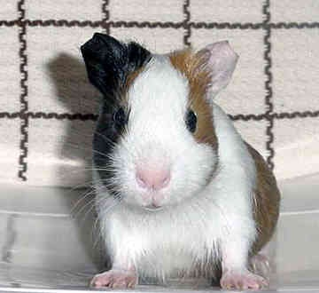

<!--- Data is on
https://r-resources.massey.ac.nz/data/161251/
--->

```{r setup, purl=FALSE, include=FALSE}
library(knitr)
opts_chunk$set(dev=c("png", "pdf"))
opts_chunk$set(fig.height=6, fig.width=7, fig.path="Figures/", fig.alt="unlabelled")
opts_chunk$set(comment="", fig.align="center", tidy=TRUE)
options(knitr.kable.NA = '')
library(tidyverse)
library(broom)
```


<!--- Do not edit anything above this line. --->

<!--- N.B. We use a command from the `broom` package in the example. --->

```{r extraLib, include=FALSE}
library(broom)
```


```{r JGFunction, echo = FALSE}
# this function gets rid of scientific notation when we want P values in the paragraphs.
PrettyPVal = function(x, digits=4){
Rounded = round(x, digits)
Threshold = 10^(-digits)
return(ifelse(Rounded < Threshold, paste0("P<", format(Threshold, scientific=FALSE)), paste0("P=", Rounded)))
}
```


Sometimes it is unclear as to whether a particular explanatory
    variable should be regarded as a factor (categorical explanatory
    variable) or a numerical covariate.

For example, should the effect of a drug be modelled using a four
    level factor (zero, low, medium and high doses) or as a numeric
    variable (0, 10, 20, 30 ml doses)?

We will explore this issue in this lecture, and develop an
    appropriate methodology to compare the two modelling approaches.

## Vitamin C and Tooth Growth


We use an experiment into the effects of vitamin C on tooth growth to illustrate this question.

30 guinea pigs were divided (at random) into three groups of ten and dosed with vitamin C in mg (administered in orange juice).
Group 1 dose was low (0.5mg), group 2 dose was medium (1mg) and group 3 dose was high (2mg).
Length of odontoblasts (teeth) was measured as response variable.




### Exploratory Data Analysis

We fetch the data from the `datasets` package, and then extract only the guinea pigs receiving the Vitamin C supplement. (We could look at the other group later.)

```{r boxplotLengthDose}
data(ToothGrowth)
TG = ToothGrowth |> 
  filter(supp == "VC")
plot(len ~ as.factor(dose), data=TG, col="grey")
bartlett.test(len ~ as.factor(dose), data=TG)
```


### Initial Comments

The  `as.factor()` function tells R to regard the (numeric 
    variable) `dose` as a factor.

The levels are ordered in the natural way.

The box plot is slightly suggestive of a change of dispersion
    (spread) in the response between the groups, but Bartlett’s test
    does not provide clear evidence of heteroscedasticity (*P*-value is
    *P=0.1048*).

From the plot it seems highly plausible that mean tooth growth
    depends on vitamin C levels.

### Question

 Could the dependence of tooth growth on   vitamin C be adequately modelled by a linear regression of `len` on `dose`, or   is a factorial model with `len` and `as.factor(dose)` to be
    preferred?

## Nesting of Linear Effects

Consider a one factor experiment in which the factor levels are
    defined in terms of a numerical variable *x*. In other words, all
    individuals at factor level *j* take the same value of *x* for
    this variable ($j=1,2,\ldots,K$).

We could fit a simple linear regression model to the data:

$$M0: Y_i = \beta_0 + \beta_1 x_i + \varepsilon_i~~~~~~(i=1,2,\ldots,n)$$

We could also fit a standard one-way factorial model which can be written
    as a multiple regression model:

$$M1: Y_i = \mu + \alpha_2 z_{i2} + \cdots + \alpha_K z_{iK}+\varepsilon_i~~~~~~(i=1,2,\ldots,n)$$

where $z_{ij}$ is the indicator variable for unit *i* being at  factor level *j* as usual.

The difference between these models is that the simple regression model ($M0$) assumes that the expected values (means) of the response for each level of the factor follow a straight line. On the contrary, the one-way model ($M1$) allows the mean response to vary arbitrarily across the levels of the factor. Therefore, the $M0$ model will be preferred if the relationship between the factor and the response is linear. The $M1$ model will be preferred if their relationship is not linear.
 
We can show that model $M0$ is nested within model $M1$. It follows that we can compare models $M0$ (the simpler one) and $M1$ (the more complex one) using an *F* test.

Specifically, we will test     *H~0~*: model $M0$ adequate; versus *H~1~*: model $M0$ not adequate,
    using the *F* test statistic:

$$F = \frac{[RSS_{M0} - RSS_{M1}]/(K-2)}{RSS_{M1}/(n-K)}.$$


$M1$ has *n-K* residual degrees of freedom.

The difference in the number of parameters between the models is *K-2*.

Hence the *F*-statistic has *K-2, n-K* degrees of freedom.

If *f~obs~* is the observed value of the test statistic, and
    *X* is a random variable from an *F~K-2,n-K~* distribution,
    then the *P*-value is given by 

$$P= P(X \ge f_{obs})$$

Retention of *H~0~* indicates that a simple linear regression model
    is adequate; i.e. the effect of the variable *x* is adequately
    modelled as linear.

Rejection of *H~0~* indicates that any association between *y*
    and *x* is non-linear.

## Analysis of the Guinea Pig Tooth Data

R Code for Model $M0$:

```{r Tooth.lm.0}
Tooth.lm.0 <- lm(len ~ dose, data=TG)
summary(Tooth.lm.0)
```


R Code for Model $M1$:

```{r Tooth.lm.1}
Tooth.lm.1 <- lm(len ~  as.factor(dose), data=TG)
summary(Tooth.lm.1)
```

R Code to compare the models:

```{r anova1}
anova(Tooth.lm.0, Tooth.lm.1)
```

### Conclusions

The relationship between tooth length and vitamin C is found to be
    statistically significant using both the linear regression model (*`r PrettyPVal(glance(Tooth.lm.0)$p.value)`*) and the factor model (*`r PrettyPVal(glance(Tooth.lm.1)$p.value)`*).

The *F* test for comparing the linear effect and factor model gives an
    *F*-statistic of $f=3.92$ on $K - 2 = 1$ and $n - K = 27$
    degrees of freedom.

The corresponding *P*-value is $P=0.058$. We would retain *H~0~* at
    the 5% significance level, but there is certainly some evidence to
    doubt that the relationship should be modelled as a linear effect.


## Example:  North Shore Rents 2021

We consider the relationship between the asking rent and the number of bedrooms available, for accommodation advertised on Auckland's North Shore, on 15 May 2021.  (Source: Trademe).  A few extremely high-priced outliers have been excluded. One-bedroom accommodation includes studio apartments.
Is it reasonable to assume the relationship between rents and the number of bedrooms is linear? 

```{r bedrooms, echo = -1, eval = -2}
NSrent=read.csv(file= "../../data/NSrent2021.csv",header=TRUE)
NSrent = read.csv(file = "NSrent2021.csv", header = TRUE)
boxplot(rent ~ as.factor(bedrooms), data = NSrent)
```

The boxplots indicate the medians rise fairly linearly with the number of bedrooms, so we might assume this is true for the means as well.  There is a problem with heteroscedasticity, but we will set that aside for now. 

```{r compare lms}
lm1 = lm(rent~ bedrooms, data = NSrent)
summary(lm1)
lm2 = lm(rent ~ as.factor(bedrooms), data = NSrent)
anova(lm1, lm2)
```

The first lm indicates that there is a significant linear relationship between rent and the number of bedrooms. 

The anova comparison shows that we do not need to suppose the relationship is nonlinear: i.e. the linear trend is sufficient to describe the relationship (p-value of 0.1676). This is good, because a simple straight-line model is easy to interpret. 

As for the heteroscedasticity, we might be tempted to try to stabilise the variance by a transforming the `bedrooms` variable, but that would destroy the simplicity of the linear relationship.  Instead, in a later topic we will allow for the heteroscedasticity by using a method called weighted least squares. 


## Analysis of Genetic Data

A haplotype is a unit of genetic information contained on a single chromosome.
Because chromosomes come in pairs (one inherited from each parent), an individual may have either zero, one or two copies of any given haplotype.
The effects of a haplotype on some phenotype (measurable physical attribute) may or may not be linear in the number of copies of the haplotype.


A measure of cholesterol was recorded on 35 subjects. Of these, 8
    have zero copies, 16 had one copy, and 11 had two copies of a
    particular haplotype.

Fitting the number of copies of the haplotype as a linear effect
    gave a residual sum of squares of $153.2$.

Fitting the number of copies of the haplotype as a factor gave a
    residual sum of squares of $126.2$.


### Question


What is the value of the *F*-statistic for testing whether the effect of
haplotype is linear in the number of copies of the haplotype? 

What are
the degrees of freedom for this test statistic?
