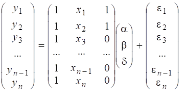
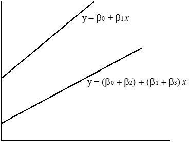
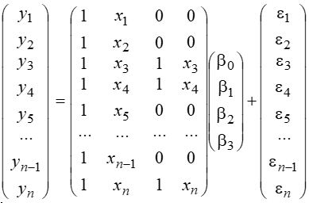

This topic looks at the situation where at least one of the predictor variables is binary.   

We saw an example of this in the Climate data, with the two binary predictors NorthIsland and Sea. 

We can briefly examine the effects of these predictors via boxplots. Both variables seem to have an effect on temperature, but is the effect statistically significant? 

```{r Climate boxplots, eval = -2, echo = -1}
Climate <- read.csv(file= "../../data/Climate.csv", header = TRUE, row.names = 1)
Climate <- read.csv(file= "Climate.csv", header = TRUE, row.names = 1)
par(mfrow=c(1,2))
boxplot(MnJlyTemp~NorthIsland, data=Climate)
boxplot(MnJlyTemp~Sea, data=Climate)
```

## Idea of comparing groups using lm()

Suppose we denote the $i$th data value (response)   from  group $j$   by   $Y_{ij}$  , where   $j= 0,1$   and      $i=1,2,…,n_0$    or $1,2,…,n_1$   respectively.  Thus the group means are  $\mu_0$  and $\mu_1$ .

One way to analyse the data would be to use a two-sample t-test to test the hypothesis $H_0:~~\mu_0= \mu_1$      versus   $H_1:~~\mu_0 \ne\mu_1$.      You will probably have been introduced to such tests in your first-year statistics course.  More about this later. 

Another way of writing down the hypothesis (which will turn out to be convenient) is to treat one group as a “baseline group”  with mean $\mu$ and the other group as a  shifted or
 “treatment” group  with mean  $\mu+\delta$.  Then the hypotheses become   $H_0:~\delta=0$  vs  versus $H_1:~\delta\ne 0$.
	                                      
There is a definite advantage in writing the hypothesis this way. Namely, we can   easily put the test into the linear model  framework, since the regression models are written in the form where we are testing whether a slope (which will be $\delta$) equals zero.    
To write  it this way, define an indicator variable  as  
$z_i = 0$ if  the datum is in group 0, and $z_i=1$ if if is in group 1. 
   
Then we can write a formula for the response as    
$$ E[Y_i] = \mu + \delta z_i   = \beta_0 + \beta_1 z_i$$
say, where $\beta_0 = \mu$ and $\beta_1 = \delta$.

 In other words the two-group comparison can be put in the same form as a linear regression. So  all we would need to do is set up the group indicator variable $z$, regress $Y$ on $z$ and  test the hypothesis that the slope =0. 

## testing using lm()

If we want to test the significance of these two variables we can just use lm(). Remember lm()  assumes the variance of residuals does not depend on the values of the predictor. The boxplots look like this assumption is justified. 

```{r lmTesting}
Climate.lm1=lm(MnJlyTemp~ NorthIsland, data=Climate)
summary(Climate.lm1) 
Climate.lm2=lm(MnJlyTemp~ Sea, data=Climate)
summary(Climate.lm2) 
```


## testing using t.test()

Since this is a simple two-group comparison, we can also investigate using a standard two-sample t.test, which gives basically the same conclusions.

```{r t.test  testing}
t.test(Climate$MnJlyTemp[Climate$NorthIsland==0], Climate$MnJlyTemp[Climate$NorthIsland==1] )
 
t.test(Climate$MnJlyTemp[Climate$Sea==0], Climate$MnJlyTemp[Climate$Sea==1])
``` 
 
On close inspection you will see that the p-values and df are not exactly the same as for the lm().   
The reason is that the default t.test does not assume equal variances, and so uses a method called Welch's method. Essentially it does a fudge on the df  to make the t-distribution work.   

If we want to get exactly the same results in the t.test as in the lm(), then we need to set the var.equal=TRUE option.

```{r var.equal}
t.test(Climate$MnJlyTemp[Climate$NorthIsland==0], Climate$MnJlyTemp[Climate$NorthIsland==1], var.equal=TRUE )
 
t.test(Climate$MnJlyTemp[Climate$Sea==0], Climate$MnJlyTemp[Climate$Sea==1], var.equal=TRUE)
``` 

## How do we know whether to assume equal variances?

A simple rule of thumb we teach/taught in first year courses is that if the standard deviation of residuals does not differ by more than a factor of 2, then we can assume equal variances.

```{r CompareSD}
ratio = sd( Climate$MnJlyTemp[Climate$Sea==0] )/ sd( Climate$MnJlyTemp[Climate$Sea==1] )
ratio
```

Clearly the ratio is much less than 2. 

Now that we are at second year we will do a formal statistical test of $H_0: \sigma_0^2 = \sigma_1^2$   vs  $H_1$ variances are not equal. 

There are two tests commonly used: 
Bartlett's test (which depends more on the errors being normally distributed) and Levene's test (which works even if the data are not normal).  

We will normally use Levene's test. It is found in many packages, but we'll use the one from the `car` package.


```{r getlibrary}
library(car)
```

```{r Climate.bt}
Climate.bt = bartlett.test(MnJlyTemp ~ factor(Sea), data=Climate)
Climate.bt
Climate.lv = leveneTest(MnJlyTemp~ factor(Sea) , data=Climate)
Climate.lv
```

The *P*-value for both these tests is large,  which confirms that, for the  Climate data, we have no reason to doubt the equal variance  assumption.

Note that in a two-group situation like this, the `var.test()` can also be used.


## A covariate and a binary group variable

**Two Parallel Lines** 

**Example.**  In their book "Regression Analysis by Example", Chatterjee and Price present some data on whether boys and girls differ in their scores in an English exam, where we are adjusting for the amount of revision work they did.   

Let 		$Y_i$	= score in English exam 
	     		    $x_i$	= number of hours spent in revision.
	     		    
Consider two lines – one for boys and one for girls.   We can write the two lines in a combined model 

$$ E[Y_i] =  \alpha + \beta  x_i + \delta z_i$$
Where	$z_i=1$ for girls and $z_i=0$ for boys.  Here $\alpha=\beta_0$,  etc.   
In matrix terms this is  
. 

We want to know if x = revision hours is important, and then after that factor has been accounted for, whether there was any difference between girls’ and boys' scores. 
So this is a  *sequential*   analysis, considering one variable and then the next. 

```{r getEnglish, eval = -2, echo = -1}
English <- read.csv(file="../../data/EnglishExam.csv", header=TRUE)
English <- read.csv(file="EnglishExam.csv", header=TRUE)
English
plot(resulty ~revision, pch=sex+1 ,col=4-2*sex, data=English)

English.lm = lm(resulty~ revision+ sex ,  data=English)
summary(English.lm)
```

Consider:  Is this a significant result?  How can you interpret the estimated coefficients of Revision and of Sex?


Since we are thinking of it as a sequential analysis, we can look at the results in terms of anova().   It shows that sex is significant *after adjusting for revision*. 

However if we were to reverse the order of the variables, then we find that sex by itself would not have been a significant predictor.    This illustrates the importance of adjusting for known confounders.

```{r anova for XandZ}
anova(English.lm)
anova(lm(resulty ~ sex + revision, data=English))
```

## Two different slopes

. 

Here we are still parameterising so that one line is a ‘baseline’ and the other is treated as a modification.  Setting it up this way makes it easy to test for no change in intercept ($H_0 :~  \beta_2 = 0$)  and  no change in slope ($H_0 :~  \beta_3 = 0$). 
We write a combined model as 
   $$ E[Y_i] =  \beta_0 + \beta_1  x_i + \beta_2 z_i + \beta_3 x_i z_i$$

where $z_i$= 0 or 1.  The multiplication of $x_i$ and $z_i$ in the last term means that there is a contribution to slope that only occurs for group 1.   In design matrix terms this model is

.

Exercise: convince yourself that this does correspond to the equation above. 

## Hierarchy Principle
We would sequentially fit the models 
  $$ (1)~~~~~~~E[Y] = \beta_0 + \beta_1 X$$
  $$ (2) ~~~~~E[Y] = \beta_0 + \beta_1 X + \beta_2 Z$$
    $$(3)~~~~~~ E[Y] = \beta_0 + \beta_1 X + \beta_2 Z + \beta_3 XZ$$

This structure of sequential fitting is an example of the Hierarchy Principle.

**Hierarchy Principle: Do not fit an interaction between variables unless you already have the main (i.e. simple) effects of those variables in the model.**

Bear in mind, however, that this principle is not compulsory.

The principle won’t always pick up interactions, especially those of the form  where $Y$ is related to $X$ only for one group and not at all for the other. 
e.g.  $$   E[Y] = \beta_0 + \beta_1 X + \beta_3 XZ$$

We need to check in particular for  whether the presence of the interaction term  $\beta_3$  causes the ‘vertical shift’ parameter  $\beta_2$  to become non-significant.

Thus we may find a non-hierarchical model such is best and makes sense in some circumstances.  Nevertheless it is recommended to use the hierarchy principle as first strategy, and stick with it unless there is very a good reason to change. 

## Testing for Interaction

Interaction means that the relationship   between the response   and the covariate   is different for boys and girls. i.e. the slope differs.

```{r interaction model}
English.lm2 = lm(resulty ~  revision+ sex + revision:sex, data=English)
summary(English.lm2)

```
The interaction term  revision:sex  is non-significant, and also makes the coefficient of sex itself to be non-significant. So it is not worth keeping the interaction term. 

In fact if we do plot the fitted lines, from the interaction model we find that they are nearly parallel, which explains why we didn't need the change-in-slope term.

```{r interaction plot}
plot(resulty ~revision, pch=sex+1 ,col=4-2*sex, data=English)
lines(English.lm2$fitted.values[sex==0]~ revision[sex==0], lty=1,col=4, data=English)
lines(English.lm2$fitted.values[sex==1]~ revision[sex==1], lty=2,col=2, data=English)
```

**Discussion**

To try to interpret what happened with the interaction and main effect both being non-significant, I like to think of an analogy.

Suppose some big event is happening and you have two radios, on two different stations, both loudly trying to tell you the news at the same time. But because the words and the order of the reports are slightly different, you cannot understand either news bulletin clearly.  They interfere with each other.  

The solution in the analogy is to turn off one radio and just listen to the other – then hope you get a clear statement of the news.  Note it may not be obvious which radio to turn off.  All we can do is try for the best. 

The application of this analogy in statistical terms is to eliminate one of the two competing explanatory variables (predictors).  In doing so we are making a choice, and it may not necessarily be the right choice. We can use graphs of residuals to guide us, but sometimes it is still not clear which model to choose. 

In the present example what we *can* say is that there *is* a sex difference in the data, and that this difference is *well-expressed* by the shift in the height of the line.  Moreover this choice gives a simple model to interpret, whereas a model given in terms of interactions would be  much more complicated to explain. 


