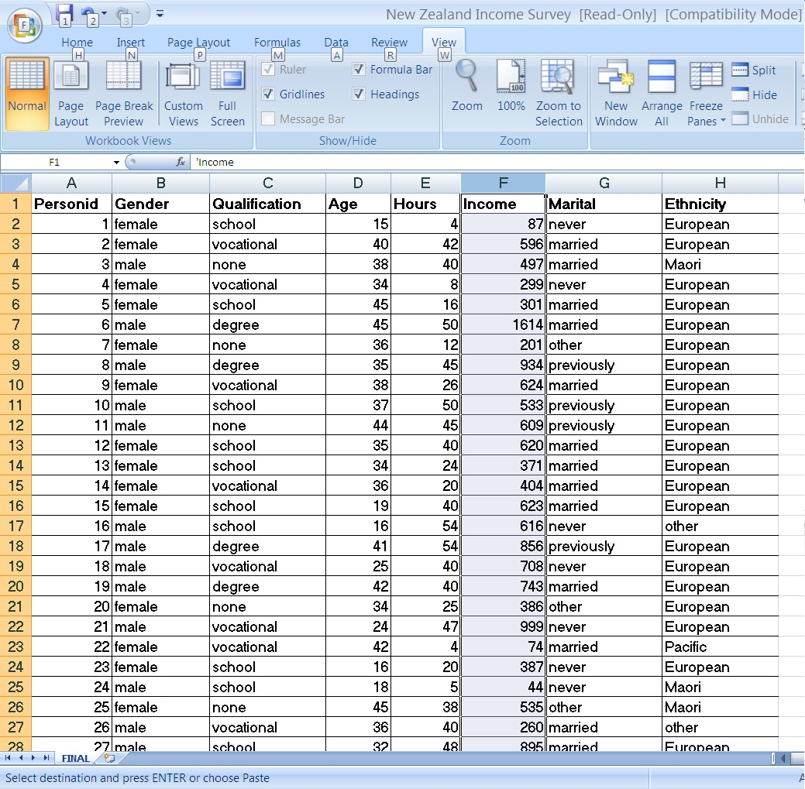

This (untaught) lecture reviews the basics of data exploration

## Example: the NZISSURF

The New Zealand Income Survey Synthetic Unit Record database is a  dataset of real information on  200 individuals and seven variables. It reflects information  from the year 2004. The actual data  is confidential, but Statistics New Zealand  have released a SURF (synthetic unit-record dataset) for educational purposes. The "synthetic" part is that if any data were missing then the holes were filled with a best-guess. 



## Classify the variables

We ought to first decide which variables are

- Categorical (nominal or ordinal)           
- Measurements (continuous or discrete)

Sometimes categorical data are referred to as qualitative. In R they are called 'Factors'.

Sometimes measurement variables are referred to as quantitative.  In a regression context they are sometimes called 'Covariates'.


We shall read in and look at the first few rows and summary information.
Our data has extra variables Sex and Qual which are coded versions of Gender and Qualification.


```{r NZISSURF}
NZISSURF <- read.csv(file="../../data/NZISSURF.csv", header=TRUE)
head(NZISSURF)
summary(NZISSURF)
```


## Exploring the categorical variables


If we wanted to see more information about the categorical data we could ask for tables.  We can ask for them directly or save the table as an object to look at, or manipulate, later. The following shows a basic table, a table of proportions (useful for checking if the gender balance is the same for all ethnic groups), and a bar-chart to help us visualise the data. 

```{r tables}
Tbl = with(NZISSURF, table( Gender, Ethnicity))
Tbl 
prop.table( Tbl, 2)        # the 2 means calculate column proportions
barplot(prop.table( Tbl, 2), main="Gender by Ethnicity",legend=TRUE, ylim=c(0,1.19))
```

## Exploring quantitative data


To look at quantitative data, such as Income, we can produce a stem and leaf plot or a histogram. 

If we want to compare a response variable across the different levels of a factor (e.g. compare income distributions for the two genders) the best graph is probably a boxplot. 

```{r exploration}
stem(NZISSURF$Income)
hist(NZISSURF$Income)
boxplot(Income ~ Gender, data=NZISSURF)
```

Question: How would you describe the difference in incomes between male and females? 

## Is the Income data normally distributed? 


Histograms can help us assess whether data is normal-shaped. In the graph below I have put both histograms on the same x-axis.


```{r normality1}
par(mfrow=c(2,1))
minI= min(Income)     ;  maxI= max(Income)
hist(Income[ Gender=='female'], xlim=c(minI,maxI))
hist(Income[ Gender=='male'], xlim=c(minI,maxI))
```

Also we can use a special graph called a  normal quantile-quantile plot.
If the data are normal then the points should fall along the straight line. If they curve up above the line at one or both ends, then the data are right-skewed.  If they trend to fall below the line at one or both ends then the data are left-skewed. 
```{r normality2}
par(mfrow=c(1,2))
qqnorm(Income[ Gender=="female"])
qqline(Income[ Gender=="female"])
qqnorm(Income[ Gender=="male"])
qqline(Income[ Gender=="male"])
par(mfrow=c(1,1))
```

## Hypothesis test for normality

We can also do a hypothesis test for normality.  

It is called the Shapiro-Wilk test. The null hypothesis is **H0:  the data are normal**. 

The test produces a p-value, which measures how likely the data are, to have come about by random chance,  if the null hypothesis is true. 

So if the p-value is small  < 0.05 then we conclude the data are too unlikely to have come about by mere chance, and we reject the null hypothesis in favour of the alternative hypothesis **H1:  the data are not normal**

```{r shapiro}
shapiro.test(Income[ Gender=="female"])
shapiro.test(Income[ Gender=="male"])
```

Exercise.  Suppose  we were to look instead at the square root of the income. e.g. **hist( sqrt(Income[Gender=="female"])** and  **shapiro.test(sqrt(Income[ Gender=="female"]))**.  Does this make the shape normal? What about the qqnorm() and qqline() ? 


## Scatterplots

Scatterplots are useful to help us see the relationship between  two quantitative variables. 

the following does a simple scatterplot of Income (y-axis) vs Hours (x-axis)
The lines(lowess(  ) ) command let us add a smoother to the graph. 

A lowess smoother is like a running average of the nearby y values as a window of x values moves from left to right.   It does not need to give a straight line, but if it does, then it suggests a straight line relationship would be a good one to describe these data. 

```{r scatterplot}
plot(Income ~Hours )      
lines(lowess(Income ~Hours ))
```

The plot shows incomes are higher for people who work longer hours, but are more spread out at the right hand side,
The smoother indicates the relationship is  linear (straight-line)

## Plotting with different symbols and colours by group

To plot using different symbols and colours  for males and females we can do something like what follows.   

The options  pch=plotting character,   col = colour.    

```{r scatterplot with groups}
Sex = (Gender=="female")+1
plot(Income ~Hours, pch=Sex, col=Sex, main="Income versus Hours of Work, by Sex" )
lines(lowess(Income[Sex==1] ~Hours[Sex==1]), col=1)
lines(lowess(Income[Sex==2] ~Hours[Sex==2]), col=2, lty=2)
```

lty means line type.   1=solid, 2= dashes. 


To plot with Qualification as the group variable we need to convert text to numbers. The dataset already has a variable Qual that does this.  (The following code shows how Qual could be created. You can ignore the details for now.) 

```{r creating a group variable}
Qual= (Qualification=="none")  #  = 1 if true, 0 otherwise.
Qual= Qual+  (Qualification=="school")*2
Qual= Qual+  (Qualification=="vocational")*3
Qual= Qual+  (Qualification=="degree")*4
table(Qualification)
table(Qual)
```

The we can use a for( ) loop to go through the values of Qual

```{r scatterplot many groups}
plot( Income ~ Hours, pch=Qual, col=Qual)
  for( i in 1:4){   
 lines( lowess(Income[Qual==i]~ Hours[Qual==i]), col= i)  }            
```

The symbols go in the order: circle, triangle, +, x. 

The graph is getting cluttered, but indicates higher incomes (on average) for those with higher qualifications.


