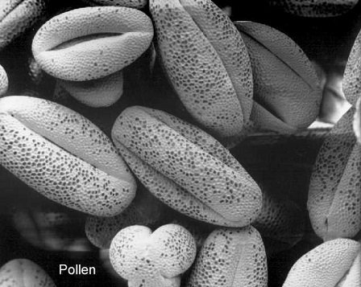


In the examples that we have considered so far it has made sense to
    consider the main effects of ALL factors.

However, for nested factors the levels of one are defined within the
    context of the levels of another.

We shall explore the use of nested factors, and consider the
    analysis of models containing such factors.

## Example of nested factor design

Response = concentration of chemical in sample.

Interested to see whether two labs deliver the same results.

Send off samples to each lab, and get three technicians at each lab
    to analyse the samples.


## Scientists in Labs


There are two factors here – (i) the lab and (ii) the technician.

Makes sense to ask, if both labs give equal readings.

Does not make sense to ask if technician 1 gives  
    greater readings than technician 2.


That is, the concept of level 1 of the technician factor cannot be
    applied universally.

Technician number 1 at lab A and the technician number 1 at lab B
    are entirely different people.

It makes no sense to ask whether technician 1 or 2 is better because
    they are lab specific.

Notice that this is entirely different to the swimming example where
    level 1 of ‘goggles’ meant the same thing at every level of every
    other factor.


In this labs and technician example the second factor – the
    technician – is said to be ‘nested with’ the labs.

When such nesting occurs one should **not include the main effect of
    the nested factor**, but only the effect of the nested factor
    ‘within’ the factor nesting it.

## Modelling with Nested Factors

A two factor model with factor *B* nested within factor *A* is
    written as $$Y_{ijk} = \mu + \alpha_i + \beta_{j(i)} + \varepsilon_{ijk}.
    \label{nested}$$

The model in equation ([$$nested$$](#nested)) only contains a main
    effect for *A* and an interaction term, but no main effect for
    *B*.
    
We have a main effect for comparing labs only.

Note that the factor *B* effects (the $\beta$’s) depend on
    factor *A*, hence the notation for the subscript of $\beta$.
    
Looking at differences between technicians in lab A separately
        to those in lab B.

Nesting of factors is the one case where you do not need main
    effects corresponding to all terms in an interaction.

$$Y_{ijk} = \mu + \alpha_i + \beta_{j(i)} + \varepsilon_{ijk}$$

As per usual, the parameters will be constrained.

Using the treatment constraint, $\alpha_i$ is the effect of level
    *i* of *A* relative to the reference group (level 1).

$\beta_{j(i)}$ is the effect of level *j* of *B* within level
    *i* of *A*, relative to level 1 of *B* within level *i* of
    *A*.
    
Bob is level 1 in lab A, and Max is level 1 in lab B. So, the $\beta$’s will reflect how Bill and Bea relate to Bob and how
        Mel and Meg relate to Max.

## R Code for Nested Factors

The notation `A/B` on the right hand side of an R formula represents
    the factor *B* nested within *A*.

The notation `A/B` can equivalently be written as `A + A:B`.

Going back to the labs and technicians example, we would have factor
    A as the labs and B as the scientists.

## Analysis of Pollen Data


A Canadian botanist was interested in the abundance of pine pollen in cores taken from the bottom of several bogs in northern Alberta.
The botanist sampled pollen at three depths: `shallow`, "medium`, and `deep` respectively (corresponding to 0.5, 2 and 3 metre depths respectively).
She took two samples of peat at each of these depths, and prepared 2 slides from each of the six samples for microscopic examination.
The number of pollen grains from the microscope slides is the response.





In this example the factor `Sample` is *nested* within the factor `Depth`    .

To understand why, note that sample A at shallow depth has no
    connection with sample A at medium depth.

### The Data

`r xfun::embed_file("../../data/pollen.csv")`

```{r getPollenData, echo=-1, eval=-2}
Pollen <- read.csv(file="../../data/pollen.csv", header=TRUE) 
Pollen <- read.csv(file="pollen.csv",header=TRUE) 
Pollen
```


### Modelling

```{r }
Pollen.lm <- lm(Count ~  Depth/Sample, data=Pollen)
anova(Pollen.lm)
```


### Estimates

```{r }
summary(Pollen.lm)$coefficients
```

### Comments

The levels of `Depth` are ordered `deep`, `medium`,  and `shallow` by (alphabetical) default, so `deep` is the
    reference level for the treatment constraint.

There is clear evidence that pollen varies with depth ($P=0.0016$
    from the ANOVA table).

There is no evidence of an effect of `Sample` within `Depth`. In other words, there
    do not seem to be systematic differences between the two samples
    taken at each depth.

The table of parameter estimates indicates (from the fixed effects)    that pollen count is highest in the deep bog.

The interaction terms estimate the effect of Sample B in comparison
    to Sample A (baseline) at each depth.

### Calculations from Pollen Data Model

Based on the parameter estimates from the model fitted in this Example ,
compute the fitted values in the following cases:

1.  An observation from Sample A taken at medium depth.

2.  An observation from Sample B taken at deep depth.

3.  An observation from Sample B taken at shallow depth.

