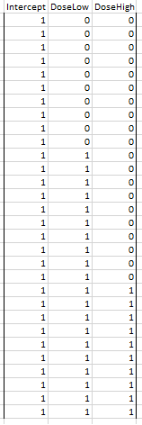

So far we have focused on regression models, where a continuous     random response variable is modelled as a function of one or more
    numerical explanatory variables.

  - Another common situation is where the explanatory variables are
    categorical variables, or factors.

  - In this lecture we will begin to look at such models, and will
    focus in particular on one-way models.

## The One-Way Model

The one-way (or one factor) model is used when a continuous
    numerical response *Y* is dependent on a single
    factor (categorical explanatory variable).

In such models, the categories defined by a factor are called the
    levels of the factor.

## Stimulating Effects of Caffeine

Question: does caffeine stimulation affect the rate at which
    individuals can tap their fingers?

Thirty male students randomly allocated to three treatment groups of
    10 students each. Groups treated as follows:

Group 1: zero caffeine dose
    
Group 2: low caffeine dose
    
Group 3: high caffeine dose

Allocation to treatment groups was blind (subjects did not know their
    caffeine dosage).

Two hours after treatment, each subject tapped fingers as quickly as
    possible for a minute. Number of taps recorded.


Number of taps is the response variable, caffeine dose is the explanatory variable.
Here caffeine dose is a factor with 3 levels - zero, low and high.
Does apparent trend in boxplot provide convincing evidence that caffeine affects tapping rate?

```{r boxplotTapsDose, echo=FALSE}
Caffeine <- read.csv(file="../../data/caffeine.csv", header=TRUE)
boxplot(Taps~Dose, data=Caffeine) 
```

## Mathematical Formulation of the One-Way Model

It is common to express the One-way model as

$$Y_{ij} = \mu_j + \varepsilon_{ij}~~~~~~~~(j=1,\ldots,K,~~~~~i=1,\ldots,n_j)$$ 

where: *Y~ij~* is the response of the *i*^th^ unit at the *j*^th^ level     of the factor;
*K* denotes the number of levels;
$\mu_j$ is the population mean for level $j$

*n~j~* the number of observations (replications) at level *j* of     the factor; and, 
the values $\varepsilon_{11},..,\varepsilon_{Kn_K}$ are random errors satisfying
    assumptions ***A1*** to ***A4***  
    

The null hypothesis is then expressed as 

$$H_0:  ~~~ \mu_1 = \mu_2 = ... =\mu_K $$
and the alternative hypothesis is 

$$H_1: ~~~\mbox{ means not all equal.}$$ 

Another way of writing this is 
$$Y_{ij} = \mu + \alpha_j + \varepsilon_{ij}~~~~~~~~(j=1,\ldots,K,~~~~~i=1,\ldots,n_i)$$ 

where $\alpha_j = \mu_j - \mu$ (mean difference to the baseline)  for  $j=1,...,K$.  

The mean response is $$E[Y_{ij}] = \mu + \alpha_j$$

## Parameterisation of the One-Way Model

However, as it stands, the model appears to be  **overparameterised**.

That is, we have $K$ means and $K+1$ parameters $\mu,\alpha_1,...,\alpha_K$

We cannot estimate $K+1$ numbers from $K$. 
 

## Solution to Overparameterisation

We impose a constraint on the parameters
    $\alpha_1, \alpha_2, \ldots, \alpha_K$.


The two most popular (and easily interpretable) constraints are:
    
- Sum constraints: $\sum_{j=1}^K \alpha_j = 0$.  
        In this case $\mu$ can be interpreted as a kind of "grand
        mean", and $\alpha_1, \alpha_2, \ldots, \alpha_K$ measure
        deviations from this grand mean.
    
- Treatment constraint: $\alpha_1 = 0$.  
        In this case level 1 of the factor is regarded as the
        baseline or reference level, and
        $\alpha_2, 
        \alpha_3 \ldots, \alpha_K$ measure deviations from this
        baseline. This is highly appropriate if level 1 corresponds to a
        control group, for example.

We will work with the treatment constraint. It is also used by      default for factors in R.

## Expressing Factor Models as Regression Models

We can express a one-way factor model as a regression model by      using dummy (indicator) variables.

Define dummy variables $z_{11}, z_{12}, \ldots, z_{n K}$ by
    $$z_{ij} = 
    \left \{ 
    \begin{array}{ll}
    1 & \mbox{unit i observed at factor level j}\\
    0 & \mbox{otherwise.}
    \end{array}
    \right .$$


## Regression form of one-way factor model

A one-way factor model can be expressed as follows:
$$Y_i = \mu + \alpha_1 z_{i1} + \alpha_2 z_{i2} + \ldots + \alpha_K z_{iK} + \varepsilon_i~~~~~(i=1,2,\ldots,n)$$

This has the form of a multiple  linear regression model.

The parameter $\mu$ is the regression intercept and, under the   treatment constraint ($\alpha_1 = 0$), the mean baseline (factor level  1) response.

## Modelling the Caffeine Data

Our one-way factor model, where the factor has three levels, can be
expressed as follows:
$$Y_i = \mu + \alpha_2 z_{i2} + \alpha_{3} z_{i3} + \varepsilon_i$$

where: *Y~i~* is the number of taps recorded for the *i*th subject; *z~i2~ = 1* if subject *i* is on low dose; *z~i2~ = 0*
    otherwise; and *z~i3~ = 1* if subject *i* is on high dose; *z~i3~ = 0*
    otherwise.

Then,   $\mu$ is mean response for a subject on zero dose; $\alpha_2$ is the effect of low dose in contrast to zero dose; and, $\alpha_3$ is the effect of high dose in contrast to zero dose.

## Expressing Factorial Models using Matrices

Since factorial models can be expressed as linear regression models,
    they may be described using matrix notation as we saw earlier.

For a one-way factorial model with treatment constraint:
    $${\boldsymbol{y}} = X {\boldsymbol{\beta}} + \varepsilon$$ where: $${\boldsymbol{y}} = \left [
    \begin{array}{c}
    Y_1\\
    Y_2\\
    \vdots\\
    Y_n
    \end{array}
    \right ]
    ~~~~X = \left [
    \begin{array}{cccc}
    1 & z_{12} & \ldots & z_{1K}\\
    1 & z_{22} & \ldots & z_{2K}\\
    \vdots & \vdots & \ddots & \vdots\\
    1 & z_{n2} & \ldots & z_{nK}
    \end{array}
    \right ]
    ~~~
    {\boldsymbol{\beta}} = \left [
    \begin{array}{c}
    \mu\\
    \alpha_2\\
    \vdots\\
    \alpha_K\\
    \end{array}
    \right ]
    ~~~
    \boldsymbol{\varepsilon} = \left [
    \begin{array}{c}
    \varepsilon_1\\
    \varepsilon_2\\
    \vdots\\
    \varepsilon_n\\
    \end{array}
    \right ]$$

There is no $\alpha_1$ in the parameter vector, and no row for
    $z_{i1}$ in the design matrix, because of the treatment
    constraint.
    
The following shows  the <strong>design matrix</strong>  for the one-way model for the caffeine data.




## Factor Models as Regression Models


Since factor  models can be regarded as regression models, all ideas about parameter estimation, fitted values etc. follow in the natural  manner.

Parameter estimation can be done by the method of least squares, to
    give vector of estimates
    $\hat {\boldsymbol{\beta}} = (\hat \mu, \hat \alpha_2, \ldots, 
    \hat \alpha_K)^T$.

Fitted values and residuals defined in the usual way.

## Back to the Caffeine Data

### R Code

The factor levels of Dose have a natural ordering. In particular, it is
intuitive to set the zero level as baseline (factor level 1).

`r xfun::embed_file("../../data/caffeine.csv")`


```{r getCaffeineData, eval=-1}
Caffeine <- read.csv(file="caffeine.csv",header=T)
str(Caffeine)
Caffeine
```

Note that earlier versions of R would automatically assume that a text column entered into an lm() model was a factor. 
Recent versions *may* require you to make that more explicit by putting it in a factor() statement. Below we also fix up the order of the factor levels (default is alphabetical).

```{r getCaffeineData 2 }
levels(Caffeine$Dose)
Caffeine$Dose <- factor(Caffeine$Dose, levels=c("Zero",
"Low", "High"))
levels(Caffeine$Dose)
```
The syntax using the `factor()` command (with specified levels) reorders
the factor levels so that zero, low and high dose are interpreted as
levels 1, 2 and 3 respectively.


**Fitting the Model**

We can use the `lm()` function in R to fit model
in the same manner as for regression models.

```{r Caffeine.lm}
Caffeine.lm <- lm(Taps~Dose, data=Caffeine) 
summary(Caffeine.lm)
```


Using the notation introduced earlier, the parameter estimates are
    $\hat \mu = 244.8$, $\hat \alpha_2 = 1.6$ and
    $\hat \alpha_3 = 3.5$.


##   fitted values ##
Dose (level) | mean response      | fitted value 
--- | --- | --- 
Zero (1)   | $\mu$            | 244.8        
Low (2)      | $\mu + \alpha_2$ | 246.4        
High (3)     | $\mu + \alpha_3$ | 248.3    

============================================

## Hypothesis tests

There are three ways we can think of the hypothesis test. 

The first formulation of the model (with $H_0:  ~~~ \mu_1 = \mu_2 = ... =\mu_K$) can be tested by just looking at the $F$ test at the bottom of the summary(lm)  output, or applying the anova() command to the output. 
```{r anova version}
anova(Caffeine.lm)
```

On the other hand writing the Factor  models (using the treatment constraint) can be written as
multiple linear regression models, using dummy
variables:

$$Y_i = \mu + \alpha_2 z_{i2} + \ldots + \alpha_K z_{iK} + \varepsilon_i \quad(i=1,2,\ldots,n)$$

we can regard the F test as testing the hypothesis that all slopes are zero $H_0: \alpha_2 = ...=\alpha_K = 0$,
which gives the same omnibus F test. 

```{r regression version}
z2 =   Caffeine$Dose == "Low"
z3 =   Caffeine$Dose == "High" 
Caffeine.lm2 = lm( Caffeine$Taps ~ z2 + z3 )
summary(Caffeine.lm2)
```

Finally we can consider the problem as a comparison of two models  

   $$M0:~~~~ Y_i = \mu + \varepsilon_i \quad (i=1,2,\ldots,n)$$ and
    $$M1:~~~~ Y_i = \mu + \alpha_2 z_{i2} + \ldots + \alpha_K z_{iK} + \varepsilon_i  \quad (i=1,2,\ldots,n)$$
Thus 
```{r comparison}
Caffeine.M0 = lm(Caffeine$Taps ~ 1)
Caffeine.M1 = lm(Caffeine$Taps ~ z2 + z3)
anova(Caffeine.M0, Caffeine.M1)
```


**Important**:
    
- In a multiple linear regression model it makes sense to add or         remove a single explanatory variable.
- In a factor  model it (usually) only makes sense to add or
        remove a whole factor, not single levels of a factor.
- This will usually require *F* tests (not just t-tests for
    single parameters).


#### Conclusions from the ANOVA table

The observed *F*-statistic for testing for the significance of
    caffeine dose is *f* = `r round(summary(Caffeine.lm)$fstatistic["value"], 3)` on *K-1* = `r summary(Caffeine.lm)$fstatistic["numdf"]` and *n-K* = `r summary(Caffeine.lm)$fstatistic["dendf"]`
    degrees of freedom.

The corresponding *P*-value is *P*=`r round(anova(Caffeine.lm)["Dose", "Pr(>F)"], 4)`; we therefore have very
    strong evidence against *H~0~*; i.e. finger tapping speed does seem
    to be related to caffeine dose.

The table of coefficients in the R output shows that the mean
    response difference between the high dose and control groups is a
    little more than twice as big as the difference between low dose and
    control group.

### Interpretation of the anova output

Use the anova output produced by R to answer the following questions on
the caffeine data.

1.  What is the residual sum of squares for the full model *M1*?

2.  What is the mean sum of squares for the model *M1*?

3.  What is the residual sum of squares for the null model *M0*, given
    below? $$M0: Y_i = \mu + \varepsilon_i~~~~~~~(i=1,2,\ldots,30)$$

4.  What is the mean sum of squares for the model *M0*?

