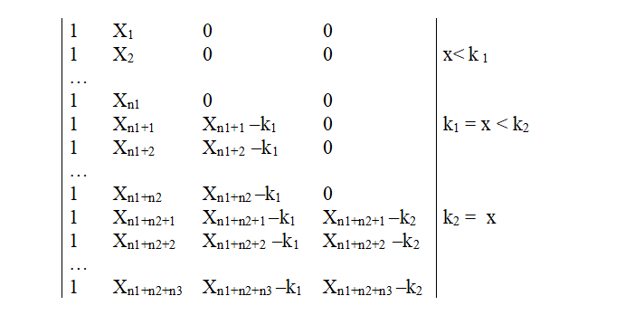

 
Sometimes we need to specify a different line or curve for different ranges of  $X$.  Such a model is called a *piecewise* regression model. 

An example is the Indianapolis 500 race dataset, which records the race speed of the winner from 1911 to 1971. There appear
to be three separate line segments with different slopes: before World War I, between the two wars, and after World War II. 

```{r Indianapolis500, eval = -2, echo = -1}
Indy <- read.csv("../../data/Indianap500.csv", header = TRUE)
Indy <- read.csv("Indianap500.csv", header = TRUE)
plot(Speed ~ Year, data = Indy)
```

The change points (i.e. the x values at which the slope changes) are called ‘knots’. Usually we insist that the lines join up at the knots (no discontinuities).  


A model with a single change in slope at knot $k$ would have equation  $$ y = \beta_0 + \beta_1x + \beta_2 (x-k)_+ $$

where the term $(x-k)_+$ is defined as: $x-k$  if  $x>k$;    and  0  if  $x  \le k$.

This can be calculated in R as $(abs(x-k)+ x-k)/2$.  (the function $abs()$ means abolute value). To convince you, an example is plotted below, taking $k = 1945$:

```{r exampleNewTerm}
x <- 1910:1970
k <- 1945
plot(x, (abs(x - k) + x - k)/ 2)
```


If there are two knots, $k_1$ and $k_2$, occuring at row $n_1$ and $n_1+n_2$ respectively, then our design matrix will be like this:



In the Indianapolis data we have gaps in the $X$ values, as the races were cancelled in  1917-18  and  1942-45 due to
the USA participating in the wars.  We will use the midpoints of the missing years as the knots: $k_1 = 1917.5$ and $k_2= 1943.5$.  Thus we fit the model

$$ y = \beta_0 + \beta_1.x + \beta_2 (x-k_1)_+ + \beta_3 (x-k_2)_+ $$

```{r Indianapolis.change.slopes}

Indy |> 
  mutate(t2 = (abs(Year-1917.5)+Year-1917.5)/2,
         t3 = (abs(Year-1943.5)+Year-1943.5)/2) -> Indy

head(Indy)

pce0.lm <- lm(Speed ~ Year, data = Indy)
pce1.lm <- lm(Speed ~ Year + t2 + t3, data = Indy)
summary(pce1.lm)
anova(pce0.lm,pce1.lm)
``` 


Note that, before WWI, the winning speed was rising by $\approx 2$ mph per year.  The second slope coefficient is 
$\approx -1$,  which modifies the previous speed.  So between the two World Wars the winning speed was rising by $\approx 1$ mph per year.   The third slope coefficient is $\approx 0.5$ , which means that after WWII the winning speed was rising by $\approx 1.5$ mph per year. 

the plot below shows the fitted values as solid lines, with different colours to emphasise the changes in slope. The dotted lines show the three slopes that are used on either sides of the knots.

```{r fittedmodelwithlines, echo = FALSE}
predicted_values <- data.frame(Year = seq(1910, 1970, by = 0.01)) |> 
  mutate(t2 = (abs(Year-1917.5)+Year-1917.5)/2,
         t3 = (abs(Year-1943.5)+Year-1943.5)/2,
         Colour = case_when(Year > 1943.5 ~ "c",
                            Year > 1917.5 ~ "b",
                            TRUE ~ "a"))

predicted_values$Speed <- predict(pce1.lm, predicted_values)

coefs <- coefficients(pce1.lm)

model_lines <- data.frame(Intercept = c(coefs[1],
                                        coefs[1] - coefs[3]*1917.5,
                                        coefs[1] - coefs[3]*1917.5 - coefs[4]*1943.5),
                          Slope = c(coefs[2],
                                    coefs[2] + coefs[3],
                                    coefs[2] + coefs[3] + coefs[4]),
                          Colour = c("a", "b", "c"))

ggplot(Indy, aes(x = Year, y = Speed)) + 
  geom_line(data = predicted_values, aes(colour = Colour), size = 1.5) + 
  geom_abline(data = model_lines, aes(intercept = Intercept, slope = Slope, colour = Colour), 
              linetype = 2) + 
  geom_point() +
  theme_bw() + 
  scale_colour_brewer(palette = "Set1", guide = "none")
```


### Allowing for discontinuity

The preceding analysis indicated a significant change in slope at the two wars. The next question is: Was there a discontinuity? That is, do the line segments have to join up?
To examine this hypothesis, we must fit a separate intercept for the line in each of the three segments. This can be accomplished by adding the two extra indicator variables, const2 and const3, to the model above to allow the intercepts, in addition to the slopes, to differ between the segments.

```{r lines with discontinuity}
Indy |> 
  mutate(Const2 = as.numeric( Year > 1917.5),
         Const3 = as.numeric( Year > 1943.5)) -> Indy

pce2.lm <- lm(Speed ~ Year + t2 + t3 + Const2 + Const3, data = Indy)
summary(pce2.lm)
anova(pce1.lm, pce2.lm)
```

The anova() indicates that, overall, the model is significantly improved by allowing for discontinuity. The regression coefficients show this is almost entirely due to the change at the second knot, not the first. 

The significant coefficient of Const2 says that, if the lines
before and after 1943.5 were extended through the period 1941-45, then there would be a drop of 7.1 mph. In practice it looks as if  Speed just stopped rising
between the wars, rather than actually dropping.

The fitted lines are shown below:

```{r fittedmodelwithlines2, echo = FALSE}
predicted_values <- data.frame(Year = seq(1910, 1970, by = 0.01)) |> 
  mutate(t2 = (abs(Year-1917.5)+Year-1917.5)/2,
         t3 = (abs(Year-1943.5)+Year-1943.5)/2,
         Const2 = as.numeric( Year > 1917.5),
         Const3 = as.numeric( Year > 1943.5),
         Colour = case_when(Year > 1943.5 ~ "c",
                            Year > 1917.5 ~ "b",
                            TRUE ~ "a"))

predicted_values$Speed <- predict(pce2.lm, predicted_values)

coefs <- coefficients(pce2.lm)

model_lines <- data.frame(Intercept = c(coefs[1],
                                        coefs[1] - coefs[3]*1917.5 + coefs[5],
                                        coefs[1] - coefs[3]*1917.5 - coefs[4]*1943.5 + coefs[5] + coefs[6]),
                          Slope = c(coefs[2],
                                    coefs[2] + coefs[3],
                                    coefs[2] + coefs[3] + coefs[4]),
                          Colour = c("a", "b", "c"))

ggplot(Indy, aes(x = Year, y = Speed)) + 
  geom_line(data = predicted_values, aes(colour = Colour), size = 1.5) + 
  geom_abline(data = model_lines, aes(intercept = Intercept, slope = Slope, colour = Colour), 
              linetype = 2) + 
  geom_point() +
  theme_bw() + 
  scale_colour_brewer(palette = "Set1", guide = "none")
```


### Extending the piecewise approach

The approach can be extended to allow piecewise quadratic or cubic curves.

Often the curves are constrained so that the sections are not only continuous but smooth i.e. have continuous first derivative at the knots (and of course everywhere else).   Such curves are called  ‘splines’.    Curve fitting by cubic splines is a very old technique.   Various splines are available in R,  but  we will not pursue them any further in this course. In the past splines have frequently been used as a technique for smoothing data, but we can use Lowess curves for that purpose. 

It is  assumed the knots  $k_1$ and $k_2$
   are known and do not have to be estimated. Sometimes this is reasonable.  For example   $x$   may represent time and  $k_1$ and $k_2$ are known events  eg. war, stock market crash, etc.  
   
If the position of the knots do have to be estimated   then we have  much more complicated statistical problem.  This is an area of relatively recent statistical research (e.g.
in the last 30 years.)  An example where the knot needs to be estimated is where there is some sort of biological tipping point, where the system responds differently to stimuli beyond a certain (unknown) level. 

One way of fitting such models is using a nonlinear  regression model  (see later).


## Example: Child Lung Function Data


FEV (forced expiratory volume) is a measure of lung function.
The data include determinations of FEV on 318 female children who were seen in a childhood respiratory disease study in Massachusetts in the U.S.
Child's age (in years) also recorded.  It is  of interest to model FEV (response) as function of age.


`r xfun::embed_file("../../data/fev.csv")`


 Data source: Tager, I. B., Weiss, S. T., Rosner, B., and Speizer,
F. E. (1979). Effect of parental cigarette smoking on pulmonary function in children. *American Journal of Epidemiology*, **110**, 15-26. 


```{r getFevData, echo=-1, eval=-2}
Fev <- read.csv(file="../../data/fev.csv", header=TRUE)
Fev <- read.csv(file="https://r-resources.massey.ac.nz/161221/data/fev.csv", header=TRUE)
plot(FEV~Age, data=Fev)
```

`r xfun::embed_file("../../data/FEV.csv")` 

The scatter plot of data indicates that relationship between FEV and age is not linear.
We will try to model FEV as a polynomial in age.


```{r Fev.poly}
Fev.lm1 <- lm(FEV~poly(Age,1), data=Fev)
Fev.lm2 <- lm(FEV~poly(Age,2), data=Fev)
Fev.lm3 <- lm(FEV~poly(Age,3), data=Fev)
Fev.lm4 <- lm(FEV~poly(Age,4), data=Fev)
Fev.lm5 <- lm(FEV~poly(Age,5), data=Fev)
Fev.lm6 <- lm(FEV~poly(Age,6), data=Fev)
anova(Fev.lm1, Fev.lm2, Fev.lm3, Fev.lm4, Fev.lm5,Fev.lm6)
```

The analysis suggests a quartic (fourth-power) polynomial. 
If we plot this we find the model seems to have a strange wobble, and steep increasing curves at both ends of the 
age range.

```{r quartic plot}
plot(FEV~Age, data=Fev)
newdata <- data.frame(Age = seq(3, 19, by = 0.1))
lines(newdata$Age, predict.lm(Fev.lm4 , newdata = newdata), lty = 1, col = 2)
```

The `seq(3, 19, by = 0.1)` command creates the following Age values: 3,3.1,3.2,...,18.9, 19. This makes the plot smooth. 

Now suppose instead we fit a piecewise model.  Visually it looks as the FEV values flatten out from Age=12 onwards.


```{r Fev piecewise}
k <- 11.5
Fev$Changeslope <- (abs(Fev$Age-k) + Fev$Age-k)/2

Fev.pce1 <- lm(FEV ~ Age + Changeslope, data = Fev)
summary(Fev.pce1)
plot(FEV~Age, data=Fev)

newdata <- data.frame(Age = seq(3, 19, by = 0.1))
newdata$Changeslope <- (abs(newdata$Age-k) + newdata$Age-k)/2
lines(newdata$Age, predict.lm(Fev.pce1, newdata = newdata), lty = 1, col = 2)

summary(Fev.lm4)$sigma
summary(Fev.pce1)$sigma
```

The residual standard error for the simple piecewise model is almost the same as for the more complicated fourth-degree polynomial,  and the graph looks more biologically reasonable, so we would prefer the piecewise model. 


