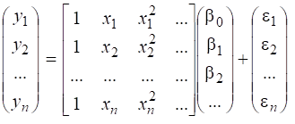
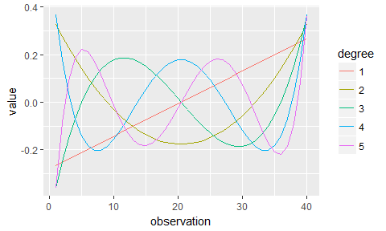

Sometimes the relationship between the response variable $Y$ and a predictor $x$ is obviously not straight-line, and we just want to describe the data in a flexible way. This will be particularly the case if the spread of errors seems to be fairly constant. 

(Recall that if we used a transformation to fix curvature, then it alters not just the curve $E[Y]$ but  also the  spread of errors around the curve.  So if the errors appear fairly constant to begin with we may not want to do a transformation. ) 

One approach is to fit polynomial models.  Sometimes we can regard this as just exploratory data analysis.  For example we may fit a quadratic model, not because we really do believe it is quadratic, but simply because we want to allow for curvature in some way, and this is a simple way to do it.

## Polynomial Models
The idea is to model a curve by a polynomial
                                                      
$$ Y_i  = \beta_0 + \beta_1 x_i     ~~~~~~\mbox{linear} $$

$$  Y_i  = \beta_0 + \beta_1 x_i+\beta_2 x^2_i   ~~~~~~\mbox{quadratic} $$   
$$Y_i  = \beta_0 + \beta_1 x_i+\beta_2 x^2_i+\beta_3 x^3_i  ~~~~~~\mbox{cubic}$$                                                    
$$Y_i  = \beta_0 + \beta_1 x_i+\beta_2 x^2_i+\beta_3 x^3_i
   +\beta_4 x^4_i ~~~~~~\mbox{quartic} $$        

$$ Y_i  = \beta_0 + \beta_1 x_i+\beta_2 x^2_i+\beta_3 x^3_i
   +\beta_4 x^4_i + \beta_5 x^5_i ~~~~~~\mbox{quintic}  $$


If the errors are independent, and normal, with constant variance, then this is just a special case of the general linear model (GLM)

$$y  =  X\beta+ \varepsilon$$


Note since the errors are  N(0, $\sigma^2$)  then the $y_i$’s must also be Normal around their respective means with variance  $\sigma^2$.

Since this is all part of the General Linear Model framework we can use standard techniques to get parameter estimates, confidence intervals and prediction intervals.  We can also use ANOVA to test the need for higher order powers of  $x$.
   
(Remember that the word *linear* in Gneral Linear Model refers to the fact that the response
    is linearly related to the regression *parameters*, not to the predictors.)

Note the order of adding variables follows the hierarchy principle so that we have nested models.  For example we don’t rearrange the model to test for the quadratic term if we have already decided we need the cubic.   

**Hierarchy Principle for Polynomials**:  If we decide we      a particular power $X^p$  in the model, then we include all
  the powers below as well: $X, X^2, X^3, ..., X^{p-1}$

This is a special case of the usual hierarchy principle that 
if you have an interaction term $A:B$ in a model then you should include the main effects  $A$ and $B$ .   Here $X^p$ can be regarded as the interaction  $X^{p-1}:X$ etc. 

There are rare exceptions to this, the most notable being sometimes when the data have been centered so that the mean of $X$ is zero.
In that case we may only need odd powers of$X$
or only even ones.  But usually we should stick with the hierarchy principle, as setting the coefficient $\beta_k$ of $X^k$  to zero may actually be making quite a strong statement (more than we think we are) about the roots and maxima or minima of the polynomial. 

NB.	Polynomials are OK for modelling curvature within the range of the data, but are notoriously bad for extrapolation far outside the range.  For example two curves may be fitted to almost exactly the same data but we may find the extrapolated curve starts to rise steeply,  or starts to go down the other side of a local maximum.

## Indianapolis 500 data
We consider whether a polynomial should be used to model the winning speeds for the Indianapolis 500 race for the years 1911 to 1971. The data are shown in the scatterplot below. Note that the race was not run during the war years of 1917-1918 or 1942-1945.
 
Let’s try fitting a fourth-order polynomial  (quartic). 
To write this in R we need to put powers inside an I() function.

`r xfun::embed_file("../../data/Indianap500.csv")`

```{r quartic, eval=-1, echo=-2}
Indy = read.csv("Indianap500.csv",header=TRUE)
Indy = read.csv("../../data/Indianap500.csv",header=TRUE)
head(Indy ) 
plot(Speed~ Year, data=Indy)
Indy.lm1 = lm(Speed ~ Year, data=Indy)
Indy.lm2 = lm(Speed ~ Year+ I(Year^2), data=Indy )
Indy.lm3 = lm(Speed ~ Year+ I(Year^2) + I(Year^3), data=Indy)
Indy.lm4 = lm(Speed ~ Year+ I(Year^2) +I(Year^3) + I(Year^4), data=Indy)
anova(Indy.lm1,Indy.lm2,Indy.lm3, Indy.lm4)
```
Note that the last model did not function:  it's not just that it did not explain anything, but it does not have any extra df either!    Let's look at the summary:

```{r quartic summary}
summary(Indy.lm4)
```

The reason the fourth power does not work here is because of a computational problem.  

The problem is that Year is  large number but the  difference between successive years is very small. This means the 
powers of Year  are very highly correlated: 


```{r correlated powers}
Year=1910:1970; Year2= Year^2; Year3=Year^3; Year4=Year^4
summary(cbind( Year, Year2, Year3, Year4))
pairs( cbind( Year, Year2, Year3, Year4))
cor( cbind( Year, Year2, Year3, Year4))
```

The consequence is that the design matrix $X$   has columns that are very  highly correlated  so that the matrix $(X^TX)^{-1}$ which is part of the Least Squares solution is numerically unstable -  i.e. small differences, of the size of rounding error, can lead to big differences in the results.  

This problem (having highly correlated predictors) is called “multicollinearity”.   The simplest first way to fix things is to centre the predictor first before  taking powers (see later).

Before we go further, note that another way to fit a polynomial is by using the poly()  function.  If 
we want to reproduce the results above we use the syntax 

```{r using poly}
Indy.lmp3 = lm( Speed ~ poly( Year, 3, raw=TRUE), data=Indy)
coef(Indy.lmp3)
coef(Indy.lm3)
```

You will see that the same coefficients occur in the poly() version as in the I() version.   However the poly() function does not fix the computational issue either: 


```{r poly4}
Indy.lmp4 = lm( Speed ~ poly( Year, 4, raw=TRUE), data=Indy)
summary(Indy.lmp4)
```


If one needs to fit very high degree polynomials, then sometimes people fit such models using so-called ‘orthogonal basis functions’  

The following graph,  from the CRAN website, illustrates   orthogonal polynomials R uses.
https://cran.r-project.org/web/packages/polypoly/vignettes/overview.html




```{r orthogonal poly regression}
Indy.lmo4 = lm(Speed ~ poly(Year,4) , data=Indy)
summary(Indy.lmo4)
Indy.lmo3 = lm(Speed ~ poly(Year,3) , data=Indy)
summary(Indy.lmo3)
```

Note that the first  analysis,  lmo4,  gives us no reason to suspect a fourth degree polynomial is needed.
The second analysis, lmo3, has the same summary statistics (residual standard error, $R^2$, F statistic) as for the I()  model  Indy.lm3 but the coefficients are changed. 


### Centering the variables
 
 Another approach, which is almost as good as using orthogonal polynomials, is to just centre (and optionally scale) the $X$  variable before calculating the polynomial. 
Here we subtract 1941 from all the dates (1911  to 1971)
 
```{r centred} 
Indy$Y = Indy$Year-1941
Indy.lmc4 = lm(Speed ~ Y + I(Y^2) + I(Y^3) + I(Y^4), data=Indy)
summary(Indy.lmc4)
Indy.lmc3 = lm(Speed ~ Y + I(Y^2) + I(Y^3) , data=Indy )
summary(Indy.lmc3)
```

Centering the predictor has given us models with the same p-value for 3rd and 4th power as in the orthogonal polynomial, while retaining the original units for the variables. 
 
 Finally, the following shows a plot with prediction bounds, using the home-made function FittedLinePlot.  Note it uses orthogonal polynomials by default. We see that only three points are outside the 95% prediction bounds, which is acceptable for $n$=55 data points. 
 
```{r fitted line plot, eval=FALSE}
FittedLinePlot = function(xydata, polyn = 1) {
    x = xydata[, 1]
    y = xydata[, 2]
    varname = names(xydata)
    model = lm(y ~ poly(x, polyn))
    pred.x = data.frame(x = min(x) + (0:100) * (max(x) - min(x))/100)
    pred.y = predict(model, newdata = pred.x, interval = "prediction")
    matplot(pred.x, pred.y, lty = c(1, 2, 2), col = c(1, 2, 2), type = "l", xlab = varname[1], 
        ylab = varname[2])
    matpoints(x, y, pch = 1)
}

FittedLinePlot(data.frame(Year,Speed) ,polyn=3)
```
 

