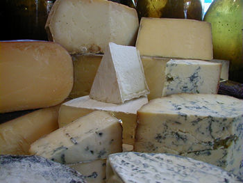

## Backwards, Forwards and Stepwise Variable Selection

Automated variable selection procedures work along the following lines:

1.  Choose a model to start with (often the model with no covariates, or
    the model with all covariates included).

2.  Test to see if there is an advantage in adding or removing
    covariates.

3.  Repeat adding/removing variables until there is no advantage in
    changing the model.

### Backwards Variable Selection

1.  Start with model containing all possible explanatory variables.
2.  For each variable in turn, investigate effect of removing variable
    from current model.
3.  Remove the least informative variable, unless this variable is
    nonetheless supplying significant information about the response.
4.  Go to step 2. Stop only if all variables in the current model are
    important.


The precise implementation depends on how we assess the importance
    of variables.

One approach is to use *F* tests (or equivalently *t* tests).

### Example: Analysis of Cheese Tasting Data


Data on production of cheddar cheese from the LaTrobe Valley of Victoria, Australia.
Taste of the final product is related to the concentration of several chemicals in the cheese.
30 samples of cheese were tasted by experts, and the following variables recorded for them:

- tasters' ratings.
- Acetic acid in cheese.
- Hydrogen sulphide in cheese.
- Lactic acid in the cheese.



```{r getCheeseData, echo=-1, eval=-2}
Cheese <- read.csv(file="../../data/cheese.csv", header=TRUE)
Cheese <- read.csv(file="https://r-resources.massey.ac.nz/data/161251/cheese.csv", header=TRUE)
str(Cheese)
head(Cheese)
```

`r xfun::embed_file("../../data/cheese.csv")` 


Of interest to the manufacturers to relate the cheese's taste to the
    'chemical' variables.

Therefore construct multiple linear regression model of `taste` on other
    variables.

Variable selection will allow us to produce a
    **parsimonious** model.


Backwards variable selection starts with the **full model**
(i.e. with all predictors):

```{r Cheese.lm.full}
Cheese.lm.full <- lm(taste ~ . , data=Cheese)
```

Consider effect of dropping each covariate using :

```{r drop1Cheese}
drop1(Cheese.lm.full,test="F") 
```

Note the F test tells us what would be the effect of dropping that variable ***after*** adjusting for the effect of everything else in the model. 

The R output tells us that 

- both `H2S` and `Lactic` should not be dropped, since the
    models without these terms have a considerably worse fit than the
    full model (as evidenced by the *p*-values of 0.004 and 0.031
    respectively).
- However, deletion of `Acetic` from the model makes little difference in terms
    of model fit (*p*-value of 0.942 in comparison with the full model),
    so we should omit this variable.
- If there had been more than one variable with *p*-value greater than
    0.05, then we would have removed the covariate with largest
    corresponding *p*-value.


We can create a new model without using `Acetic` via the update( ) function:

```{r Cheese.lm.A}
Cheese.lm.A <- update(Cheese.lm.full, .~. -Acetic, data=Cheese)
summary(Cheese.lm.A)
```

The general syntax for updating models is

```r
update(old.model, new.formula)
```

Note that full stops in the updated formula stand for whatever was in
the corresponding position in the old formula.


Look at effect of dropping single variable from :

```{r drop1Cheese2}
drop1(Cheese.lm.A,test="F")
```

- Output tells us that neither `H2S` nor `Lactic` can be removed without an important
    loss of fit.
- Hence, the **best** model (according to backwards selection) is $$E[ \mbox{taste}] = -27.59 + 3.95 \,  \mbox{H2S} + 19.89 \,  \mbox{Lactic}.$$

### Forward Model Selection

In this technique:

1. All one-X variable models are computed, and the one which has the smallest p-value is chosen  (provided any of the simple linear regression models are significant  at the  0.05% significance level, or whatever significance level is being used. ) 

2.  Then all two-variable models *which include the first chosen X-variable* are computed.  The variable whose regression coefficient is most significant (smallest p-value) is chosen (provided the p-value < 0.05) 

3. Then all three X-variable models which *include the two variables previously chosen* are computed ...
We continue to add variables to the model until there are no more significant ones to add.   

4. Then we stop.

Note the criterion for “significance” can be chosen  by the user:  e.g. One may choose to  only include  variables   that have P-value <  the usual significance level $\alpha$=0.05.  

In other software (e.g. Minitab) the default entry level for  forward selection is higher, e.g. P-value < $\alpha$= 0.25.  This is because we don’t want to ignore any potentially useful variables.  It is better to first find the possible predictors, and then weed them out, than to not know about them. 

For computing the P-value for entering each variable,  we can use the add1( ) function, see below


## Stepwise selection

Stepwise uses forward selection with an extra look backwards at each step (italic type below) 

1.  Start with some model, typically the null model (with no explanatory
    variables) but it may have pre-chosen variables in it.
2. *For each variable currently in the model, investigate the effect of removing it.*
3.  *Remove the least informative variable, unless this variable is nonetheless supplying significant information about the response.*
4.  Then for each variable not currently in the model, investigate the effect of
    including it.
5.  Include the most statistically significant variable not currently in the model (unless no significant variable exists).
6.  Go to step 2. Stop only if no change in steps 2–5.

## Implementing Stepwise Variable Selection

Stepwise variable selection using *F* tests can be implemented in R
    using a combination of `add1()` and `drop1()` commands.


### Cheese Example continued ...

We will perform stepwise variable selection starting from the **null
model** (i.e. the model with no explanatory variables).

```{r Cheese.lm.null}
Cheese.lm.null <- lm(taste~1, data=Cheese)
summary(Cheese.lm.null)
```


Now consider adding single terms into the model.

```{r add1Cheese}
add1(Cheese.lm.null,scope= ~Acetic+H2S+Lactic, data=Cheese,test="F")
```

- Note all the variables would be significant on their own, but `H2S` is the one included as it is the most significant.
- No need to try dropping terms at this stage.


```{r add1Cheese2}
Cheese.lm.B <- update(Cheese.lm.null, .~. + H2S, data=Cheese)
add1(Cheese.lm.B, scope=~Acetic+H2S+Lactic, data=Cheese, test="F")
```

We should add `Lactic` to the model.


```{r drop1Cheese3}
Cheese.lm.C <- update(Cheese.lm.B, .~.+Lactic,data=Cheese) 
drop1(Cheese.lm.C,test="F")
```

No terms should be deleted from the model.


```{r add1Cheese3}
add1(Cheese.lm.C,scope=~Acetic+H2S+Lactic,data=Cheese,test="F")
```


No need to add any more terms to `Cheese.lm.C`.

So the **best** model as selected by the stepwise procedure is
    $$E[ \mbox{taste}] = -27.59 + 3.95 \,  \mbox{H2S} + 19.89 \,  \mbox{Lactic}.$$

This is the same model as was selected by backwards variable
    selection.

N.B. Forward, Stepwise and backwards variable selection will sometimes generate the same   model, but this will not always be the case.


## Example with Different Model Selections: Hours of Sunshine

We consider the New Zealand Climate data, but this time we will use the variable **Sun** as the response, and try to explain it in terms of the other variables (main effects only).
We compare  a backwards elimination approach with forward selection.  

### Backwards Elimination

```{r read Climate data}
climate = read.csv("../../data/Climate.csv",header=TRUE,row.names=1)
climate.lm1= lm(Sun ~ . , data=climate)
summary(climate.lm1)
```

We drop the variable with highest P-value, in this case Lat.   NB only drop one variable at a time. 

```{r update}
climate.lm2 = update(climate.lm1, . ~ .-Lat)
drop1(climate.lm2, test="F")
```

The highest P-value is for MnJlyTemp, so we update to drop this one as well. 

```{r update 2}
climate.lm3 = update(climate.lm2, . ~ .-MnJlyTemp)
drop1(climate.lm3, test="F")
```

The F test indicates that Height has p-value =0.08, so we can drop that one as well. 

```{r update 3}
climate.lm4 = update(climate.lm3, . ~ .-Height)
drop1(climate.lm4, test="F")
```

Now we are told that Sea has p-value= 0.15, so we drop this as well. 

```{r update 4}
climate.lm5 = update(climate.lm4, . ~ .-Sea)
drop1(climate.lm5, test="F")
```

Finally we drop   Rain, which  has p-value= 0.10.  Then we stop. 

```{r update 5 }
climate.lm6 = update(climate.lm5, . ~ .-Rain)
drop1(climate.lm6, test="F")
summary(climate.lm6)
```
We see that annual hours of Sunshine are greater in places with high Longitude (i.e. eastern side of NZ), high mean January temperature and, perhaps surprisingly, that sunshine hours are apparently lower in the North Island.  Note NorthIsland and  Longitude correlated (with Latitude) so the "apparently" in the previous sentence may not be correct. 

### Forward selection 

We try using forward selection instead. Do we finish with the same model? 

```{r stepwise}
climate.null= lm(Sun ~ 1, data= climate )
add1(climate.null,  scope = ~Lat+Long+MnJanTemp+MnJlyTemp +Height+Rain+Sea+NorthIsland , data=climate, test="F")

climate.s1 = update(climate.null, .~.+MnJanTemp)
add1(climate.s1,  scope = ~Lat+Long+MnJanTemp+MnJlyTemp +Height+Rain+Sea+NorthIsland , data=climate, test="F")

climate.s2 = update(climate.s1, .~.+Rain)
add1(climate.s2,  scope = ~Lat+Long+MnJanTemp+MnJlyTemp +Height+Rain+Sea+NorthIsland , data=climate, test="F")

summary(climate.s2)
```

We find  that the model chosen by   forward selection is  different to the model by backwards elimination.

Usually the models are the same, but in this example they are not the same: they are not even nested one within the other. 

The reason for the difference is that sometimes two variables are both significant when **together**  in a regression, but are not significant enough to enter one-at-a-time in forwards selection.  That is why backwards elimination is usually the better approach. 
