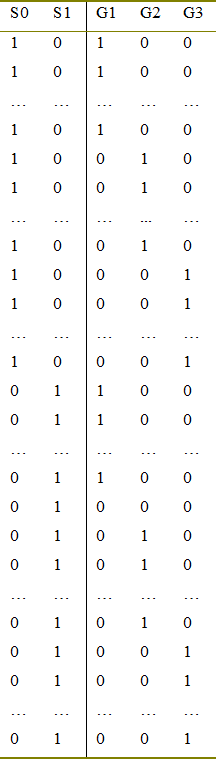
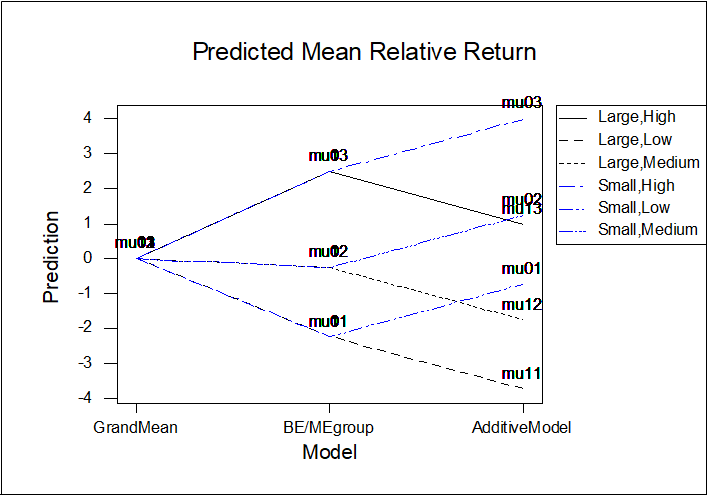
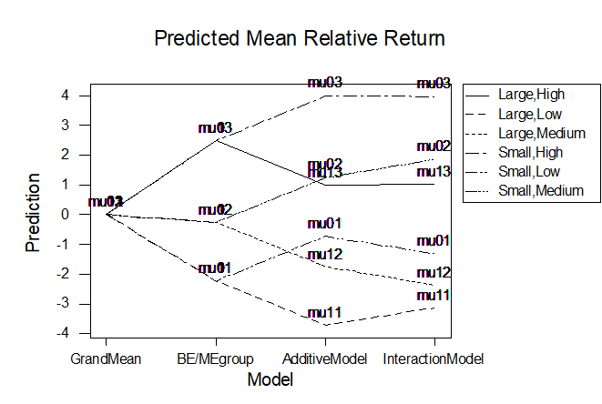

<!--- could switch data source to MASS::genotype --->

In this lecture we introduce linear models with two factors.

Complicating an analysis is the fact that factors may interact in a similar way to the way a factor and slope may interact. 

**Interaction**:   The key idea in interactions is that the effect of one variable (covariate or factor) on the response is modified according to the different levels of the other variable (covariate or factor).

We begin with an example of two factors in which there is no interaction.  

### Example  The Fama-French Factors

“The Fama-French Factors” describe a  classification of listed companies on the US stock markets according to their Size (in terms of market equity at the end of the fiscal year) and recent Growth (based on BM ratio, i.e. the ratio of Book Equity to Market Equity 6 months before).  

Each year, all companies listed on the stock market were classified into six portfolio groups based on the 2×3 combinations of factor levels as follows:

LargeFirm = 0   	for companies below the median size 

LargeFirm = 1   	for companies above the median size

BMRatio= 1      for companies with low Book/Market equity ratio (<30th percentile)

BMRatio = 2	    for companies with medium Book/Market equity ratio (30th-<70th  percentile)

BMRatio = 3	    for companies with high Book/Market equity ratio ($\ge$ 70th  percentile)

For our response we will consider **RReturn**, the average relative return by the end of the year, that one would have got from investing in each of the six portfolios given by the combination of factors above. 

RReturn  is a measure of *relative* profitability  of each portfolio combination. 

The relative return = the average weighted return for each portfolio, minus the overall average for the given year.  

The data are derived from Professor French’s Data Library website.  http://mba.tuck.dartmouth.edu/pages/faculty/ken.french/Data_Library/six_portfolios.html

We consider data from the years 1927-2000. 

###  General Notation

Suppose we let  $\mu_{jk}$ denote the mean return for  firms  in  size group $j$,   ($j$=0,1)   and    BMgroup   $k$ ,    ($k$=1,2,3).      
Then  the RReturn  for the $i$th  year, for the $j,k$  group is        
        $$y_{ijk} =\mu_{jk}   +  \varepsilon_{ijk}$$   
where $\varepsilon_{ijk}$   is the error, representing the variation in individual years around the group mean. 

Sometimes  the means are set out in a two-way table, according to the two subscripts,  as follows- 

Size | BMGroup |   |  
--- | --- | --- | --
 .    |  1 (low) | 2 (medium) | 3 (high) 
Size     0=small|	$\mu_{01}$	| $\mu_{02}$	| $\mu_{03}$
Size     1=large|	$\mu_{11}$|	$\mu_{12}$	| $\mu_{13}$

Because of this two-dimensional layout, the analysis is described as a Two-way ANOVA.

### Data Exploration
 Before doing anything complicated we should check what the “main effect” of each factor is. Since the response is relative return, the overall average is zero. A negative RReturn  means the return in a particular year was below the market average. 
 
```{r main effect of size}
Fama = read.csv("../../data/FamaFrench.csv", header=TRUE)
summary(Fama[,2:5])
attach(Fama)
boxplot(RReturn ~ Size )
summary(lm(RReturn~ Size))
```


Overall, larger firms (Size=1) had a lower relative return. (Handy investment hint: if you are looking for growth, invest in small companies!)

Note since Size is binary $\{0,1\}$ we do not need to tell R specifically that Size is a factor.   We would get the same results by typing  lm(RReturn~ factor(Size) ) 

Next we consider the predictive power of past earnings (BMgroup).


```{r main effect of BMgroup}
boxplot(RReturn ~ BMgroup )
summary(lm(RReturn~ factor(BMgroup)))
```
 
 It is clear that, overall, the BM Ratio Group is a significant predictor of the Relative Return.    Specifically, those firms with the higher BM ratio (higher recent growth) tended to have higher RReturn in the next few months. 
 
 
 The next questions we want to answer are:
 
(1) Whether both factors are needed?   (I.e. is the effect of one redundant in the presence of the other).

(2) Whether it makes a difference to the analysis which factor is entered first?

(3) Whether the effect of the BMgroup  on RReturn  is the same for large size firms as for small firms. 

```{r both factors}
Fama.lm3 = lm(RReturn ~ Size + factor(BMgroup)  ) 
summary(Fama.lm3)
anova(Fama.lm3)
Fama.lm4 = lm(RReturn ~ factor(BMgroup) +Size ) 
summary(Fama.lm3)
anova(Fama.lm4)
```

In answer to 1.,  both variables are significant, so we need both of them. 

In answer to 2., the coefficients and anova results are the same regardless of the order of entry of the factors. Indeed the coefficients for each factor are same as in the single-factor analyses (although the standard errors etc. are different).

The reason we get the same numbers is because the data have a particular structure called **orthogonal** and **balanced**.
Basically every combination of BMgroup and Size (every portfolio) is represented, and the same number of times each.
This is the result of careful design of the dataset. 

Unless the data collection has been specifically designed,  it is uncommon to have factor combinations with orthogonality and balance.  We will see an example later without these characteristics.   In that case we will find that the order of entry of factors makes a big difference to the results. 

Finally, we want to know whether Size alters the effect of BMgroup on RReturn.  (That is, whether it is more important to consider recent growth for small or large firms.)  This involves considering an interaction of the factors. 

```{r interaction}
Fama.lm5 = lm(RReturn ~ Size * factor(BMgroup)  ) 
summary(Fama.lm5)
anova(Fama.lm5)
```

It seems the interaction is not significant.  But what do the numbers actually *mean* and how are they derived?  That is the next question we will deal with.

## Theory of Two-Way ANOVA and Interactions


The structure of a main effects model with two factors is 
GROUP MEAN RESPONSE = 
 	INTERCEPT +    ‘SIZE’ effect  +   ‘BMGroup’ effect     
or  in symbols    $$\mu_{jk}  = \alpha + \beta_{j} + \gamma_{k} ~~~~~~(*)$$                                            
where $\alpha$ is an intercept,    $\beta_j$ represents the group regression coefficient depending on the level of the factor ‘Size’    j=0,1,  and 
$\gamma_k$ represents a group regression coefficient, corresponding to the level of ‘BMGroup’  which  applies,  k=1,2,3.
The model (*)  is also called an  “additive model”  because the simple (main) effects are just added together.    That is, the effect of being in, say, the low BM group is assumed to be the same for large firms as for small firms. 

Similarly the effect of being in the middle BM group  or in the high  BM group  is assumed to be the same for large firms as for small firms.  Putting it another way, the factors are assumed to be operating and affecting the response variable independently. 

Now if we wanted to fit the model using Regression, we would first have to create indicator variables (with zeros and ones) to indicate each factor level.   Let the indicators for Size be S0 and S1,   and the indicators for BMgroup be  G1, G2, and G3. 




Now if we want to fit the model using regression we cannot include all the columns.  
This is because once we have the intercept (column of 1s) in the model then  S1 and S0 are linearly dependent  :   S1= 1- S0.    And so are  G1, G2 and G3  :   G3= 1– G1 – G2. 

The consequence is that we are forced to exclude one level of each factor:  if we exclude the  indictor variables corresponding to the lowest factor levels then we would fit the model with  predictors S1,  G2 and G3 only.

```{r regression main effects}
m5 = lm(RReturn ~ S1 + G2 + G3)
summary(m5)
```

Suppose we store the fitted values for 
(1) 	the overall mean, 
(2) 	the BM group means  (from the previous one-way ANOVA),  and 
(3) 	the additive regression model above with both factors.     
Plotting these fitted values on a graph we get the following, with columns representing the three models:



The right-hand column shows the means $\mu_{jk}$  for each of j=0,1;   k=1,2,3, under the additive model.
 
In the middle column, (corresponding to the One-Way ANOVA) the results are amalgamated over the two firm sizes:     e.g.   the groups corresponding to $\mu_{01}$ and $\mu_{11}$  (the low BM groups)   are combined together across firm size, so on the graph this is symbolized by having the first subscripts overlaid on the graph.  Mathematically you may sometimes see this written as   $\mu_{.1}$   where the  dot ($.$) stands for summing over the factor level.   Similarly   the groups for medium BM  (combined over size of firm) would be written mathematically as $\mu_{.2}$ ,  and for high BM  written as  $\mu_{.3}$ . 
For the grand mean  (denoted mathematically as  $\mu_{..}$)  both subscripts are overlaid on the graph.  This is the point at the left of the graph.

The reason for showing this graph is that, geometrically,  the two right-hand branches off each column two node are the same distance apart:  $$\mu_{01}-\mu_{11} = \mu_{02} - \mu_{12}  = \mu_{03} - \mu_{13} .$$     In other words for an additive model the effect of the second factor (Size) is **assumed** to be the same for each level of the first factor.  

This however is very much an  assumption.  We have *forced* it to be this way, but the additive model could be wrong. In an interaction  model, which assumption is relaxed (as we will see shortly.)    

###  Aliasing

Before we go to look at interactions, consider if we wanted to write down the equation for the model used in the regression. We would have to use four parameters - corresponding to the intercept and the three chosen indicator variables: 
     $$\mu_{jk} = \alpha + \beta_1. S1  + \gamma_2.G2 + \gamma_3. G3 $$
We *could* use notation to include  *all* the group indicators in the model by writing:      
$$\mu_{jk} = \alpha  + \beta_0. S0  + \beta_1. S1  + \gamma_1.G1 + \gamma_2. G2+ \gamma_3. G3 $$             
but explicitly forcing  $\beta_0=0$ and  $\gamma_1$=0.   We say then that $\beta_0$ and $\gamma_1$ have been explicitly aliased. 

The effect of aliasing is in this way is to make the first level of Size (small firms), and   BM group =1,  into the control group.  Then  the means correspond to particular sums of regression coefficients


Mean 	| Model | 	Mean | 	Model | Mean | 	Model |
---	| --- | --- | --- | --- | --- |
$\mu_{01}$ | $\alpha$ | $\mu_{02}$ | $\alpha+ \gamma_2$  |$\mu_{03}$ | $\alpha+ \gamma_3$ | 
$\mu_{11}$|	$\alpha+ \beta_1$	|$\mu_{12}$| $\alpha+ \beta_1+ \gamma_2$  |$\mu_{13}$|	 $\alpha+ \beta_1+ \gamma_3$ |

There is also something called implicit aliasing, which is where we force the coefficients for a factor to add up to zero:  $\beta_0 + \beta_1 =0$  and  $\sum \gamma_i = 0$.  We will not use this method in this course. 

## Interactions
In practice it may be untrue that one factor (e.g. size) has the same effect for each level of the other factor (e.g. BM group)

Suppose instead	

GROUP MEAN RESPONSE = 
INTERCEPT +    ‘SIZE’ effect   +   ‘BM GROUP’ effect 
         +  ‘SIZE-BY-BM GROUP Interaction’ effect 

in symbols      $$\mu_{jk}  =  \alpha +\beta_j + \gamma_k+ (\beta\gamma)_{jk}$$ 

Here  $(\beta\gamma)_{jk}$ is an extra parameter to indicate a modification to the additive model.      There are now  1+ 2+ 3+ 6 = 12 parameters to represent 6 means!

To reduce the problem so that we have at most 6 means  $\mu_{jk }$ we need to alias:  we set anything to do with the first level of each factor equal to zero.   Thus
 $\beta_0 =\gamma_1 = 0$  and    $(\beta\gamma)_{01}=  (\beta\gamma)_{02} =         (\beta\gamma)_{03}  =  (\beta\gamma)_{11} =  0$. 

Thus we have 6 remaining parameters that are not constrained to equal  0.   These are  $\alpha,	\beta_1, \gamma_2, \gamma_3,  (\beta\gamma)_{12}, 
(\beta\gamma)_{13}$.   These are the parameters that R will compute by default. 

To fit the model using dummy variables we need to construct these indicator variables for the factor interactions in the same way as  we construct a change of slope interaction term: by multiplying. Thus what we have to do  is to multiply the indicator variable columns:

Let  S1G1 = S1* G2 and  S1G3 = S1*G3.

Now fitting the regression with  S1, G2, G3, and S1G2 and S1G3 in the model gives: 

```{r interaction dummies}
S1G2= S1*G2  ;   S1G3 = S1*G3
m6 = lm(RReturn ~ 1 +S1+ G2 +G3 +S1G2+ S1G3)
summary(m6)
anova(m5,m6)
```

Clearly the slopes for the interaction terms are not significant,  and overall, judging by the anova,  the improvement in fit between the two models is not significant.

Nevertheless it is instructive to look at the fitted values.



Note with the interaction, we are essentially back to the individual group means ($\bar Y_{01}$, $\bar Y_{02}$, $\bar Y_{03}$, $\bar Y_{11}$, $\bar Y_{12}$  and $\bar Y_{13}$ ) that we would have without any model. 

The graph shows that the difference between the additive model and the full interaction model is that the ends of the branches are no longer forced to be equally spaced.  

for low BM ratio firms, the difference in RReturn between large and small firms was slightly less than expected: and for medium BM ratio firms the difference in RReturn between large and small firms was slightly more than expected.    However the difference to the additive model is so slight that we can ignore it. 
 
Back in terms of the factor representation, we can say 

```{r factor interactions}
m7 = lm( RReturn ~ Size + factor(BMgroup) )
m8 = lm( RReturn ~ Size * factor(BMgroup) )
anova(m7, m8)
```

###  Predicted values

To show that you understand what is going on, we expect you  to be able to look at the summary of the factor coefficients and evaluate predicted values from them.   For example, for the additive model:

```{r predict additive}
summary(m7)
```


 predicted value  | additive estimate 
--- | ---
the predicted value for | $\hat\mu_{01}$ = - 0.74
the predicted value for | $\hat\mu_{02}$ = - 0.74 + 1.98  = 1.24 
the predicted value for | $\hat\mu_{03}$ = - 0.74 + 4.74  = 4.00
the predicted value for | $\hat\mu_{11}$ = - 0.74 - 3.00   = -3.73
the predicted value for | $\hat\mu_{12}$ = - 0.74 -3.00 +1.98= -1.76
the predicted value for | $\hat\mu_{13}$ =  -0.74 -3.00 +4.74= 1.0

While   for the interaction model:

```{r predict interaction}
summary(m8)
```

 predicted value  | interaction estimate 
--- | ---
the predicted value for | $\hat\mu_{01}$ = -1.33
the predicted value for | $\hat\mu_{02}$ = -1.33 + 3.19  = 1.86 
the predicted value for | $\hat\mu_{03}$ = -1.33 + 5.31  = 3.98
the predicted value for | $\hat\mu_{11}$ = -1.33 - 1.81   = -3.14
the predicted value for | $\hat\mu_{12}$ = -1.33 -1.81 +3.19 - 2.44 = -2.39
the predicted value for | $\hat\mu_{13}$ = -1.33 -1.81 +5.31 -1.14= 1.03


### Exercise

Find the NSRent data and fit 

(m1) the linear model for rent with factor(bedrooms)

(m2) the linear model for rent with factor(bathrooms)

(m3) an additive model for rent in terms of factor(bedrooms)  + factor(bathrooms)  .  


In the additive model,  are the regression coefficients for the levels of bedrooms the same in m1 and m3?  Similarly compare m2 and m3.

Produce a  table of the levels of bedrooms and bathrooms. Are these variables orthogonal? 

Use  anova(m3).  Are both variables significant? 

(m4) Now swap the order of the factors:   factor(bathrooms) + factor(bedrooms).     Use anova(m4).    Are the results the same as for m3?    

Predict the mean rental for houses with 3 bedrooms and 1 bathroom using the additive model.   Use both the coefficients, and check your answer using  the predict.lm() function.

(m5) Trying fitting an interaction model  factor(Bathrooms) * factor(Bedrooms) . Do we get estimates for every level combination? If not why not? 

Use anova(m4,m5).  Is the interaction significant? 

(m6) Refit the lm() treating Bedrooms and  Bathrooms as covariates.   Does this fit significantly worse than the equivalent model treating them as factors? 

```{r solution, eval=FALSE}
NSRent = read.csv("../../data/NSRent2021.csv", header=TRUE)
head(NSRent)
attach(NSRent)
m1 = lm(rent~ factor(bedrooms))
summary(m1)
m2 = lm(rent~ factor(bathrooms))
summary(m2)

m3 = lm(rent~ factor(bedrooms) + factor(bathrooms))
summary(m3)
anova(m3)

table(bedrooms, bathrooms)

m4 = lm(rent~factor(bathrooms) + factor(bedrooms))
anova(m4)

predict.lm(m4, newdata=data.frame(bathrooms=1, bedrooms=3))

m5 = lm(rent~ factor(bathrooms) * factor(bedrooms))
summary(m5)
anova(m4,m5)

m6 =  lm(rent~  bedrooms + bathrooms)
summary(m6)
anova(m6,m3)

m7=  lm(rent~  bedrooms * bathrooms)
summary(m7)
anova(m7,m5)

```
 

Discussion: 

You should find that the variables bedrooms and bathrooms are not orthogonal.  If they were orthogonal then all the entries of the table would be non-zero, and balanced (equal numbers).

Consequently the coefficients in the additive model are  *not* the same as in the one-factor model  (they would be the same if orthogonal).

Also the Sums of squares in anova(m3) and anova(m4) are greatly changed.  If we had less data we would be able to see that  the p-values  are different as well.    This is another consequence of non-orthogonality. 

Check that you can find the predicted rent. 

The interaction model is missing certain combinations of bedrooms and bathrooms, but R has still been able to fit it. (Some other software would give up!)

The interaction model is not significantly different to the additive model.   This is probably because of using so many df for the interaction.   

Comparing additive models, the additive factor model fits significantly better than an additive covariate model. 

However the covariate interaction model fits significantly better than the covariate additive model. 

Finally the factor interaction model is almost significant at the 5% level compared to the covariate interaction model. 

So, so far, no model is really satisfactory.    

The output below shows that a model bedrooms* factor(bathrooms) seems adequate compared the factor(bedrooms)* factor(bathrooms)  model. 

In the MultiPlot output the steeper (blue) line for 4 bathroom houses may reflect that these are more recent, higher-quality houses, and hence the price rises rapidly with bedrooms. 

```{r combination, eval=FALSE}
m8 = lm(rent ~ bedrooms* factor(bathrooms))

anova(m7, m8)
anova(m8, m5)

```

```{r Multiplot, eval=FALSE}
MultiPlot = function(xygdata, Int=TRUE ,polyn=1,showpoints=TRUE,showlines=TRUE ) {
      varname = names(xygdata)
x = xygdata[, 1]
   	 y = xygdata[, 2]
 	 group=factor(xygdata[, 3])
groupname=  names(table(group)) 
ngroups =length(groupname)
   if(!Int)  model = lm(y ~ poly(x,polyn) + group)
      if(Int)  model = lm(y ~ poly(x,polyn) *group)
plot(y ~ x, pch=""  , xlab = varname[1],   ylab = varname[2], main=c(paste(varname[2], " versus ", varname[1],  sep=""),paste("grouped by",varname[3],  sep=" ") ) )
pred.x =   min(x) + (0:100) * (max(x) - min(x))/100 
 for(J  in 1:ngroups){ 
 index=(1:length(y))[ group==groupname[J]]
if(showpoints){points(x[index],y[index],pch=J,cex=1.2,col=J)}
if(showlines){ repgroup=rep(groupname[J],101)
pred.y = predict(model, newdata = data.frame(x=pred.x, group=repgroup ))   
lines(pred.x, pred.y,   lty = J,  lwd=1.5, col = J) }
 }
}


MultiPlot(data.frame(bedrooms,rent,bathrooms))
```


