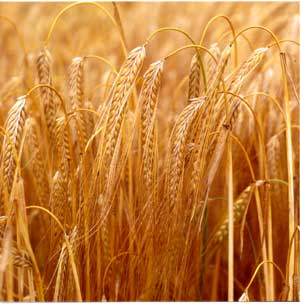

This lecture will take the form of an interactive data
    analysis...

  - ... Interactive in the sense that you have to participate (i.e. do
    the work!)

  - We will be analyzing data from an experiment on the yield of barley.

## An Experiment on Barley Yield


Classic experiment to measure the effect of manure on the yield of barley.
Six blocks of three whole plots were used, together with three varieties of barley.
Each plot was divided (at random) into 4 subplots to cater for the 4 levels of manure: 0, 0.01, 0.02 and 0.04 tons per acre.

 []()


 Data source: Hand, D.J., Daly, F., Lunn, A.D., McConway, K.J. and
Ostrowski, E. (1994).  *A Handbook of Small Data Sets*.
Chapman and Hall. 

## Aims of Analysis

  - investigate whether yield is related to the variety of barley and
    the manure level;

  - find best combination of manure/variety.

## The Data

```{r getBarley}
data(oats(package="MASS")
str(oats)
```

which is not quite what we will need for the work that follows. Let's just make a few changes so that the data is a little more friendly.

```{r makeFriendly}
library(tidyverse)
Barley = oats |> rename(Block=B, Variety=V, Yield=Y) |> mutate(Manure=as.numeric(N))
head(Barley)
tail(Barley)
```


## Some Initial Questions

Take a few minutes to discuss the following questions (and any other
issues regarding the data that occur to you) with the person sitting
next to you.

1.  Is the experimental design balanced and complete?

2.  Which variables (if any) should be regarded as factors, and which
    variables (if any) should be regarded as numeric covariates?

3.  What models should we consider fitting to the data?

<!---
Answers:
1. Yes, the design is balanced and complete. The right number of observations for the $6\times3\times4=72$ combinations of the factors, but finding a suitable way to confirm this is important if the data set cannot (easily)  be verified by eye. I often use the range of the counts of treatment combinations.

2. All three of the predictor variables are factors, but the numeric nature of the `manure` factor means I can use a `poly(manure,3)` instead of a factor to get the same models; use of `poly()` can help us optimise the value of manure, especially if we can decide to dispense with the higher order polynomial terms. 

3. OK, this gets tricky. This is not a simple factorial experiment. Look carefully at the description. We have an experiment for manure conducted within an experiment for variety. It is called a "split plot experiment" and is common in settings where one factor is harder to change than the other. In this case, big areas are used for varieties and get split into four smaller areas for the application of the manure. 

- We do not have a standard factorial experiment because we do not randomise the 72 combinations of the three factors. Even if we did have this full randomisation, we would not be able to fit the full factorial model as there is no replication and the model is "saturated" because it uses up 72 degrees of freedom (including the overall mean).
- We do not have a randomised complete block design because that would have us apply each of the 12 treatment combinations in each of the 6 blocks, with the layout within each block being completely random. If this was the case, the right hand side would be `Block+Variety*Manure` and we'd have plenty of df left over for the residual SS.
- So, what do we have? We have two experiments. The first experiment is a randomised complete block design with 6 blocks and 3 varieties of barley. The random assignment of treatments is constrained by the blocks, and ultimately we only have the 18 (blocks/varieties) combinations to change around at this level of the overall experiment. Then, in a second layer of experimentation, we split the 18 areas up into 4 subplots each. When we do this, we are effectively creating a randomised complete block for the 4 manures in each of the 18 blocks from the top layer of experimentation. To get the right fitted values and the correct allocation of degrees of freedom, we need to fit a right hand side that has `Block*Variety+Variety*Manure`. The ANOVA for this model will show the right p values for the `Manure` and `Variety:Manure` terms but not the correct p value for `Variety`. Why not?

Imagine for a moment that the second part of this experiment never took place. We'd fit a right hand side of `Block+Variety` to the 18 observations we would have. This would lead to the correct ANOVA table.

Now imagine I took 4 little readings for each of those 18 areas instead of the 1 big one I did take. Should I just fit the `Block+variety` model to the 72 observations? NO. Even though the 4 little areas may not be exactly the same, this is about as valid as cloning humans in a survey; it is fabricating data. The distinction here is that there are 18 experimental units, but each is observed 4 times which means we should average (or total) over the 4 observations to remove the minor observational differences leaving us with one data point per experimental unit. This "averaging" is equivalent to the fitting of the 18 different values from use of `Block*Variety` in the full (correct) model; adding in the `Variety*Manure` terms after this does give us the required tests for `Manure` and its interaction with `Variety`.

The only way to get the "proper" hypothesis test for the varieties using `lm()` is to  fitthe the randomised complete block design with the 18 cell means. You would find these 18 Block*Variety means and fit the model with `Block+Variety` on the right hand side.
--->
