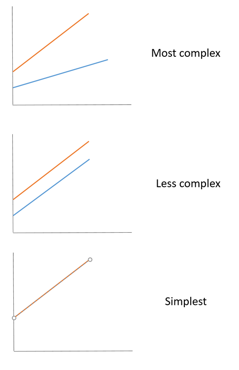

So far we have mostly considered regression models containing numerical covariates and ANOVA-type models containing factors. There is no reason to keep these separate. A linear model can contain both numerical covariates and factors.

Historically, models containing both were often called **general linear models**. Do not confuse this with **generalised linear models**, which are a broader class of models covered later. In this lecture we are still fitting ordinary linear models with `lm()`.

The central question is:

> When we add a factor to a regression, does it change the intercept, the slope, or both?

We will answer this question first with simple model diagrams and then with a data set on the falling speed of samara.

## General Linear Models as Regressions

A factor is represented in a regression model using indicator variables. This means that ANOVA models and regression models are not fundamentally different model classes. They can all be fitted using least squares, and fitted values and residuals continue to have their usual meanings.

Adding a factor can allow different groups to have different intercepts. Adding an interaction between the factor and a numerical covariate can also allow the groups to have different slopes.

## One Factor and One Covariate

Suppose that we have a response variable, *y*, a numerical covariate *x*, and a factor *A*. We can build models by asking what the factor is allowed to change:

1. Does *A* matter at all?
2. Does *A* shift the regression up or down, while the slope remains common?
3. Does the relationship with *x* depend on the level of *A*, so that the slopes can differ as well?

The last two questions are the key progression in this lecture. The factor-only and null models are useful submodels, particularly when comparing models, but they are not the main conceptual focus here.



## A Single Regression Line

The simplest regression ignores the factor:

$$Y_{ij} = \mu + \beta x_{ij} + \varepsilon_{ij}$$

There is one intercept and one slope for all observations. The factor *A* plays no role in the model.

The R formula is `Y ~ x`.

## Parallel Regression Lines

Next, allow the factor to change the intercept, but require the slope to remain common:

$$Y_{ij} = \mu + \alpha_i + \beta x_{ij} + \varepsilon_{ij}$$

The slope is the same at every level of *A*, but the intercept can depend on the factor level *i*. Under the treatment constraint, the reference level has $\alpha_1=0$.

The R formula is `Y ~ A + x`.

Geometrically, the lines are parallel. Statistically, the factor adjusts the expected response after accounting for *x*, but it does not change the expected change in *Y* for a one-unit increase in *x*.

## Separate Regression Lines

Finally, allow both the intercept and the slope to depend on the factor level:

$$Y_{ij} = \mu + \alpha_i + \beta_i x_{ij} + \varepsilon_{ij}$$

The interaction term allows the slope to depend on the factor level. Under the treatment constraint, the reference level has $\alpha_1=0$ and its slope is represented by the reference slope.

The R formula can be written as `Y ~ A + A:x`. The more familiar shorthand is `Y ~ A * x`, because

```r
A * x
```

means

```r
A + x + A:x
```

The interaction `A:x` means that the effect of *x* is allowed to depend on the level of *A*. Geometrically, the regression lines no longer need to be parallel.

## The Five Common Models

For one factor *A* and one covariate *x*, the five models shown in the figure are:

| Model | R formula | What is allowed to vary? |
| :---- | :-------- | :------------------------ |
| Null model | `Y ~ 1` | Nothing: one common mean |
| Factor only | `Y ~ A` | The intercept can differ by level of *A* |
| Single line | `Y ~ x` | One common intercept and slope |
| Parallel lines | `Y ~ A + x` | Intercepts can differ; slopes are common |
| Separate lines | `Y ~ A * x` | Intercepts and slopes can differ |

The factor-only and null models are submodels that will be useful when we compare models. The main model-building progression is:

$$Y \sim x \quad \longrightarrow \quad Y \sim A + x \quad \longrightarrow \quad Y \sim A * x.$$

This asks, in order: does the factor do nothing, does it change the intercept, or does it change the slope as well?

## Reading Linear Model Formulae

The same ideas extend to models with several factors and covariates. The formula operators have the following meanings:

| Formula component | Meaning |
| :---------------- | :------ |
| `A` | The expected response can differ between levels of *A* |
| `x` | A common linear effect of *x* |
| `A:x` | The slope for *x* can depend on the level of *A* |
| `A * x` | Shorthand for `A + x + A:x` |
| `A * B` | Shorthand for `A + B + A:B` |

For example, consider the formula

```r
Y ~ A * B + A * x + z
```

This expands to `A + B + A:B + x + A:x + z`. The model includes:

* main effects for the factors *A* and *B*;
* an interaction between *A* and *B*, so the effect of *B* can depend on *A*;
* a common linear effect of *x*;
* an interaction between *A* and *x*, so the slope for *x* can depend on *A*; and
* a common linear effect of *z*.

Using treatment constraints, one way to write the corresponding model is

$$Y_{ijkl} = \mu + \alpha_i + \beta_j + (\alpha\beta)_{ij} + \gamma x_{ijkl} + (\alpha\gamma)_i x_{ijkl} + \delta z_{ijkl} + \varepsilon_{ijkl}.$$

Here $\gamma$ is the slope for the reference level of *A*, while $(\alpha\gamma)_i$ is the slope adjustment for the other levels. This is the same baseline-plus-adjustment interpretation used later for `Velocity ~ Load * TreeF`.

The formula tells us which parts of the model can vary between groups. We do not need a new model class each time we add a factor or covariate.

## Samara

Samara are small winged fruit on maple trees. In autumn these fruit fall to the ground, spinning as they go. Research on the aerodynamics of the fruit has applications for helicopter design.

{width=80%}

## Linear Models for Samara Data

In one study the following variables were measured on individual samara:

1. `Velocity`: speed of fall;
2. `Tree`: the tree from which the samara was collected, with data from three trees; and
3. `Load`: disk loading, an aerodynamical quantity based on each fruit's size and weight.

We expect fall velocity to depend on disk loading, but we have sampled samara from three different trees. This gives us two scientific questions:

1. Do the trees have different expected velocities after accounting for load?
2. Does the relationship between load and velocity itself differ among trees?

These questions map directly onto the parallel-lines model and the separate-lines model:

```r
Velocity ~ Load + TreeF
Velocity ~ Load * TreeF
```

The first formula allows the trees to have different intercepts but a common slope. The second also allows the slopes to differ.

## Samara Data: R Code

`r xfun::embed_file("../data/samara.csv")`

```{r getSamara, echo=-1, eval=-2}
Samara <- read.csv(file="../data/samara.csv", header=TRUE)
Samara <- read.csv(file="samara.csv", header=TRUE)
str(Samara)
Samara |> mutate(TreeF = factor(Tree)) -> Samara
```

`Tree` is stored using numbers, but these numbers identify trees rather than measure a numerical quantity. They therefore have no meaningful ordering or spacing. We convert `Tree` to a factor before modelling so that R treats it as a categorical variable.

## Samara Data: Plot of Data

```{r SamaraPlot, fig.cap="Scatter plot of data with different colours and plotting symbols used to distinguish data from different trees."}
Samara |>
  ggplot(mapping = aes(y=Velocity, x=Load)) +
  geom_point(mapping = aes(col=TreeF, pch=TreeF))
```

## Building Models for the Samara Data

We now fit the three models in the main progression.
```{r SamaraModels}
m1 <- lm(Velocity ~ Load, data = Samara)
m2 <- lm(Velocity ~ Load + TreeF, data = Samara)
m3 <- lm(Velocity ~ Load * TreeF, data = Samara)
```

The models are:

* `m1`: one regression line, so tree has no effect;
* `m2`: parallel lines, so tree can change the intercept but not the slope; and
* `m3`: separate lines, so tree can change both the intercept and the slope.

## Fitted Samara Models

Before looking at any coefficient output, compare the fitted lines. The observations, colours, symbols, axes, and scales are the same in all three panels. Only the fitted model changes.

```{r SamaraFittedModels, echo=FALSE, fig.width=14, fig.height=4, out.width="100%", fig.cap="The same Samara observations with fitted lines from the three candidate models."}
model_labels <- c(
  m1 = "m1: one line",
  m2 = "m2: parallel lines",
  m3 = "m3: separate lines"
)

plot_data <- bind_rows(
  Samara |> mutate(model = unname(model_labels["m1"])),
  Samara |> mutate(model = unname(model_labels["m2"])),
  Samara |> mutate(model = unname(model_labels["m3"]))
) |>
  mutate(model = factor(model, levels = unname(model_labels)))

load_grid <- tibble(
  Load = seq(min(Samara$Load), max(Samara$Load), length.out = 100)
)

pred_m1 <- load_grid |>
  mutate(
    Velocity = predict(m1, newdata = load_grid),
    model = unname(model_labels["m1"])
  )

new_m2 <- tidyr::expand_grid(
  Load = load_grid$Load,
  TreeF = levels(Samara$TreeF)
)
pred_m2 <- new_m2 |>
  mutate(
    Velocity = predict(m2, newdata = new_m2),
    model = unname(model_labels["m2"])
  )

new_m3 <- tidyr::expand_grid(
  Load = load_grid$Load,
  TreeF = levels(Samara$TreeF)
)
pred_m3 <- new_m3 |>
  mutate(
    Velocity = predict(m3, newdata = new_m3),
    model = unname(model_labels["m3"])
  )

samara_model_plot <- ggplot() +
  geom_point(
    data = plot_data,
    mapping = aes(x = Load, y = Velocity, colour = TreeF, shape = TreeF),
    size = 2.2,
    alpha = 0.8
  ) +
  geom_line(
    data = pred_m1,
    mapping = aes(x = Load, y = Velocity),
    colour = "black",
    linewidth = 1
  ) +
  geom_line(
    data = pred_m2,
    mapping = aes(x = Load, y = Velocity, colour = TreeF, group = TreeF),
    linewidth = 1
  ) +
  geom_line(
    data = pred_m3,
    mapping = aes(x = Load, y = Velocity, colour = TreeF, group = TreeF),
    linewidth = 1
  ) +
  facet_wrap(~ model, nrow = 1) +
  scale_colour_brewer(palette = "Dark2") +
  labs(x = "Load", y = "Velocity", colour = "Tree", shape = "Tree") +
  theme_minimal(base_size = 13) +
  theme(legend.position = "bottom")

samara_model_plot
```

Moving from `m1` to `m2` allows the trees to move vertically apart. Moving from `m2` to `m3` also allows their slopes to differ.

Looking at the three panels, predict which terms must appear in each model and what those terms must change.

## Reading the Coefficients

The coefficient structure becomes more complicated only as the fitted lines become more flexible:

```text
m1: Velocity ~ Load

(Intercept)
Load
```

```text
m2: Velocity ~ Load + TreeF

(Intercept)
Load
TreeF2
TreeF3
```

```text
m3: Velocity ~ Load * TreeF

(Intercept)
Load
TreeF2
TreeF3
Load:TreeF2
Load:TreeF3
```

The `Load` coefficient is the slope for the reference tree. The `TreeF2` and `TreeF3` terms adjust the intercept for the other two trees, so they move the fitted lines vertically. The `Load:TreeF2` and `Load:TreeF3` terms adjust the slopes, so they allow those lines to rotate.

The following table shows only the coefficient part of the three model summaries. It is a compact way to compare the terms while retaining the estimates, standard errors, and *P*-values.

```{r SamaraCoefficients, results='asis'}
coefficient_table <- bind_rows(
  broom::tidy(m1) |> mutate(model = "m1: Load"),
  broom::tidy(m2) |> mutate(model = "m2: Load + TreeF"),
  broom::tidy(m3) |> mutate(model = "m3: Load * TreeF")
) |>
  select(model, term, estimate, std.error, p.value)

knitr::kable(
  coefficient_table,
  digits = 3,
  col.names = c("Model", "Term", "Estimate", "SE", "P-value"),
  caption = "Coefficient summaries for the three Samara models."
)
```

This is the information about coefficients that appears in `summary()`. The full output also includes residual summaries, the residual standard error, the coefficient of determination, and the overall *F* test. We can inspect the full output for the most flexible model:

```{r SamaraModelSummary}
summary(m3)
```

The coefficient table for `m3` now has a direct geometric interpretation. The intercept and slope describe the reference tree, `TreeF2` and `TreeF3` adjust the intercepts, and `Load:TreeF2` and `Load:TreeF3` adjust the slopes.

## Two Parameterisations of the Separate-Lines Model

We have decided that we want three separate lines. There is still more than one way to describe those same lines using coefficients. These parameterisations describe the same fitted model, but their coefficients answer different questions.

First, we can obtain a direct intercept and slope for each tree:

```{r SamaraDirect}
direct <- lm(
  Velocity ~ 0 + TreeF + TreeF:Load,
  data = Samara
)
summary(direct)
```

Because `0` removes the common intercept, the coefficients for `TreeF1`, `TreeF2`, and `TreeF3` are the intercepts for the three trees. The coefficients for `TreeF1:Load`, `TreeF2:Load`, and `TreeF3:Load` are their slopes.

For comparison, the usual treatment-parameterised model uses Tree 1 as the reference:

```{r SamaraReference}
reference <- lm(
  Velocity ~ TreeF * Load,
  data = Samara
)
summary(reference)
```

Here the `Intercept` is the intercept for Tree 1, and `Load` is its slope. The `TreeF2` and `TreeF3` coefficients are adjustments to the Tree 1 intercept, while `TreeF2:Load` and `TreeF3:Load` are adjustments to the Tree 1 slope.

The two coefficient tables look different because the coefficients represent different hypotheses. For example, the direct parameterisation can test whether the slope for Tree 2 is zero. The reference parameterisation can test whether the slope for Tree 2 differs from the slope for Tree 1. These are different questions, even though the fitted model is the same.

We can verify that the fitted lines are identical:

```{r SamaraEquivalent}
all.equal(fitted(direct), fitted(reference))
```

Two parameterisations of the same model have the same fitted values, residuals, residual sum of squares, and overall fit. Their individual coefficients and coefficient tests can differ because the parameters have different meanings.

The separate-lines panel above is therefore the same fitted plot for `direct` and `reference`. The picture and predictions do not change when we change the parameterisation; only the coefficient table changes.

## Conclusions

Using either parameterisation, the fitted model gives the following expected velocities:

$$\begin{aligned}
    &\mbox{Tree 1}&~~~E[ \mbox{Velocity}] =  0.541 + 3.06  \mbox{Load}\\
    &\mbox{Tree 2}&~~~E[ \mbox{Velocity}] = -0.299 + 6.80  \mbox{Load}\\
    &\mbox{Tree 3}&~~~E[ \mbox{Velocity}] =  0.242 + 3.88  \mbox{Load}
\end{aligned}$$

The important point is not which parameterisation is used to fit the model. It is which scientific comparison each coefficient represents:

* the direct parameterisation gives the intercept and slope for each tree;
* the reference parameterisation gives Tree 1's intercept and slope, followed by differences from Tree 1; and
* both parameterisations produce the same fitted lines.

This is why parameterisation changes the interpretation of individual coefficients and their hypothesis tests without changing the underlying model.
