```{r extraPkgs, message=FALSE, warning=FALSE, include=FALSE}
library(kableExtra)
```

## Learning objectives

By the end of this lecture you should be able to:

1. Identify when one linear model is nested within another.
2. State the hypothesis tested by comparing two nested models.
3. Use a partial *F* test to decide whether the additional terms in a larger model improve the fit.
4. Interpret the change in RSS, degrees of freedom, *F* statistic and *P*-value in a nested-model comparison.
5. Explain the difference between `anova(model)` and `anova(reduced_model, full_model)`.
6. Apply nested-model comparisons to the Samara and body-fat examples introduced in the course.

## Quick recall of Lecture 25

Lecture 25 gave us three increasingly flexible ways to combine a factor `A` with a numerical covariate `x`. The factor can do nothing, shift the intercept, or also change the slope.

The progression was:

```
Y ~ x
Y ~ A + x
Y ~ A * x
```

Now we ask the next question: is that extra flexibility actually supported by the data?

## Nested linear models

A model is nested within another model if it can be obtained by placing restrictions on the parameters of the larger model.

For one factor `A` and one numerical covariate `x`, the nesting relationships are:

{width=70%}

Both `Y ~ A` and `Y ~ x` are nested within `Y ~ A + x`. However, `Y ~ A` and `Y ~ x` are not generally nested within each other.

The separate-lines model `Y ~ A * x` contains the parallel-lines model `Y ~ A + x`, because setting all `A:x` interaction coefficients to zero produces the parallel-lines model.

## Recall from [Lecture 14: the partial *F* test](https://knowlton.co.nz/161251/notes/model-comparison-1.html#f-tests-for-nested-models)

We do not need a new test here. [Lecture 14’s notes](https://knowlton.co.nz/161251/notes/model-comparison-1.html#f-tests-for-nested-models) already gave us nested-model comparisons and the partial *F* test. We now use the same machinery for the factor-and-covariate models from Lecture 25, where one scientific effect can correspond to several coefficients.

Adding terms to a linear model cannot increase its residual sum of squares. A larger model has more flexibility, so its RSS will be the same or smaller. The question is whether the decrease in RSS is large enough to justify the additional parameters, relative to the residual variation that remains in the larger model.

Let $M_R$ be a reduced model and $M_F$ be a full model, with $M_R$ nested within $M_F$. The hypotheses are

$$
H_0:\text{the additional coefficients in }M_F\text{ are all zero}
$$

versus

$$
H_1:\text{at least one of the additional coefficients is non-zero}.
$$

The partial *F* statistic is

$$
F = \frac{ (RSS_R-RSS_F)/(df_R-df_F) }{ RSS_F/df_F }.
$$

The numerator is the reduction in RSS per additional parameter.

The denominator is the residual mean square from the full model, which estimates the remaining error variance.

A large *F* statistic means that the additional terms have removed a large amount of residual variation relative to the background residual variation.

Under $H_0$, the statistic follows an *F* distribution with $df_R-df_F$ and $df_F$ degrees of freedom.

The models must be nested and fitted to the same observations. The usual linear-model assumptions also apply.

## The Samara data revisited

Recall that we model the mean speed of fall of samara as a function of disk loading and the tree from which each fruit fell.

Grab the data here: `r xfun::embed_file("../data/samara.csv",text = " samara.csv")`

```{r SamaraReadData, echo=FALSE}
Samara <- read_csv("../data/samara.csv", show_col_types = FALSE) |>
  mutate(TreeF = factor(Tree))
```

We use the same three models as Lecture 25:

```{r samara-models}
m1 <- lm(Velocity ~ Load, data = Samara)
m2 <- lm(Velocity ~ Load + TreeF, data = Samara)
m3 <- lm(Velocity ~ Load * TreeF, data = Samara)
```

Here `m1` is one common regression line, `m2` gives parallel lines with different intercepts but a common slope, and `m3` gives separate lines with different intercepts and potentially different slopes.

## Comparing the Samara models

First look at what happens as we make the model more flexible: residual degrees of freedom decrease and RSS gets smaller.

```{r samara-summaries, echo=FALSE, results='asis'}
summaries <- tibble(
  Model = c("m1: one line", "m2: parallel lines", "m3: separate lines"),
  Formula = c("Velocity ~ Load", "Velocity ~ Load + TreeF", "Velocity ~ Load * TreeF"),
  `Residual df` = c(df.residual(m1), df.residual(m2), df.residual(m3)),
  RSS = c(sum(residuals(m1)^2), sum(residuals(m2)^2), sum(residuals(m3)^2))
)

summaries |>
  mutate(RSS = round(RSS, 3)) |>
  kable(caption = "Residual information for the three Samara models") |>
  kable_styling(full_width = FALSE)
```

Before looking at the tests, compare the fitted lines. The observations, colours, axes, and scales are the same in all three panels.

```{r fittedlines, echo=FALSE, fig.width=14, fig.height=4, dpi=150, out.width="100%", fig.cap="The same Samara observations with fitted lines from the three candidate models."}
model_labels <- c(
  m1 = "m1: one line",
  m2 = "m2: parallel lines",
  m3 = "m3: separate lines"
)

plot_data <- bind_rows(
  Samara |> mutate(model = unname(model_labels["m1"])),
  Samara |> mutate(model = unname(model_labels["m2"])),
  Samara |> mutate(model = unname(model_labels["m3"]))
) |>
  mutate(model = factor(model, levels = unname(model_labels)))

load_grid <- tibble(
  Load = seq(min(Samara$Load), max(Samara$Load), length.out = 100)
)

pred_m1 <- load_grid |>
  mutate(
    Velocity = predict(m1, newdata = load_grid),
    model = unname(model_labels["m1"])
  )

new_m2 <- tidyr::expand_grid(Load = load_grid$Load, TreeF = levels(Samara$TreeF))
pred_m2 <- new_m2 |>
  mutate(
    Velocity = predict(m2, newdata = new_m2),
    model = unname(model_labels["m2"])
  )

new_m3 <- tidyr::expand_grid(Load = load_grid$Load, TreeF = levels(Samara$TreeF))
pred_m3 <- new_m3 |>
  mutate(
    Velocity = predict(m3, newdata = new_m3),
    model = unname(model_labels["m3"])
  )

samara_model_plot <- ggplot() +
  geom_point(
    data = plot_data,
    mapping = aes(x = Load, y = Velocity, colour = TreeF, shape = TreeF),
    size = 2.2,
    alpha = 0.8
  ) +
  geom_line(
    data = pred_m1,
    mapping = aes(x = Load, y = Velocity),
    colour = "black",
    linewidth = 1
  ) +
  geom_line(
    data = pred_m2,
    mapping = aes(x = Load, y = Velocity, colour = TreeF, group = TreeF),
    linewidth = 1
  ) +
  geom_line(
    data = pred_m3,
    mapping = aes(x = Load, y = Velocity, colour = TreeF, group = TreeF),
    linewidth = 1
  ) +
  facet_wrap(~ model, nrow = 1) +
  scale_colour_brewer(palette = "Dark2") +
  labs(x = "Load", y = "Velocity", colour = "Tree", shape = "Tree") +
  theme_minimal(base_size = 13) +
  theme(legend.position = "bottom")

samara_model_plot
```

Moving from `m1` to `m2` allows the trees to move vertically apart. Moving from `m2` to `m3` also allows their slopes to differ.

| Model | Formula | What changed? |
|:--|:--|:--|
| `m1` | `Velocity ~ Load` | One common line |
| `m2` | `Velocity ~ Load + TreeF` | Adds `TreeF`: 2 additional df, allowing vertical shifts |
| `m3` | `Velocity ~ Load * TreeF` | Adds `TreeF:Load`: 2 additional df, allowing slope differences |

Now we can ask the two questions we actually care about:

- Does `TreeF` shift the lines vertically? Compare `m1` with `m2`.
- Do the slopes differ by Tree? Compare `m2` with `m3`.

## Comparison 1: Do the slopes need to differ?

`m3` adds the `TreeF:Load` interaction to `m2`. The null hypothesis is therefore that the interaction coefficients are all zero.

So, once we allow the trees to have different intercepts, is there evidence that the relationship between Load and Velocity also differs among trees?

```{r samara-anova-m2-m3}
anova(m2, m3)
```

The evidence for different slopes is borderline. At a strict 5% significance level we would not reject the parallel-slopes model, but a *P*-value this close to 0.05 should not be interpreted as evidence that the slopes are identical.

## Comparison 2: If slopes are parallel, do the trees need different intercepts?

`m2` adds `TreeF` to the model that already contains `Load`. This tests whether Tree provides additional information about Velocity after accounting for Load.

```{r samara-anova-m1-m2}
anova(m1, m2)
```

There is little evidence that Tree requires an additional intercept shift after accounting for Load.

## Comparison 3: Joint comparison

This comparison adds both the Tree main effect and the Tree-by-Load interaction at once. It tests whether allowing Tree to affect either the intercept or the slope improves the model compared with one common regression line.

```{r samara-anova-m1-m3}
anova(m1, m3)
```

This is a different question from carrying out the previous two tests separately. The joint comparison has a *P*-value of approximately 0.099.

## Why explicit comparisons matter

This is where the orthogonality point from Lecture 23 matters. In an orthogonal design, changing the order of terms does not change the sums of squares attributed to them. The Samara data are not orthogonal: the trees were sampled over different Load distributions, so Tree and Load overlap in the information they carry.

```{r samara-load-by-tree, echo=FALSE, fig.width=6, fig.height=4, out.width="65%", fig.cap="The Samara data have different Load distributions across trees."}
ggplot(Samara, aes(x = TreeF, y = Load, colour = TreeF)) +
  geom_jitter(width = 0.08, height = 0, alpha = 0.75, show.legend = FALSE) +
  stat_summary(fun = mean, geom = "point", size = 4, show.legend = FALSE) +
  labs(x = "Tree", y = "Load") +
  theme_minimal(base_size = 13)
```

That means the variation attributed to Tree depends on whether Load has already been accounted for. The two uses of `anova()` below therefore answer different questions.

```{r samara-type-one}
samara_tree_first <- lm(Velocity ~ TreeF + Load, data = Samara)
samara_load_first <- lm(Velocity ~ Load + TreeF, data = Samara)

anova(samara_tree_first)
anova(samara_load_first)
```

`anova(model)` produces a sequential, or Type I, ANOVA table. Terms are added to the model in sequence, so in a non-orthogonal design the sums of squares can depend on the order of the terms.

In contrast, `anova(reduced_model, full_model)` directly compares two fitted nested models. The hypothesis is determined by the terms that are present in the full model but absent from the reduced model.

If our scientific question is specifically whether Tree adds information after accounting for Load, the comparison should be written explicitly:

```{r samara-adjusted-question}
anova(m1, m2)
```

Here `m1` already contains `Load`, and `m2` adds `TreeF`. The test therefore asks whether Tree improves the model after Load has already been accounted for.

Type II and Type III sums of squares provide other conventions for adjusted tests in non-orthogonal designs. We do not need them here because we can state the scientific comparison directly using reduced and full models.

## A small R detail

When several nested models are supplied in one `anova()` call, R uses the largest model's residual mean square as the common denominator. For a specific scientific hypothesis, use `anova(reduced, full)` so the comparison is explicit. This is why the `m1` versus `m2` result can differ when `m3` is included in the same call.

```{r samara-anova-all}
anova(m1, m2, m3)
```

Model comparison does not replace model checking. Once we have chosen the mean structure, the usual LINE diagnostics still need to be checked.

## Body Fat case study

Now do the same thing with the Body Fat data. The response is percentage body fat, Age is the numerical covariate, and Gender is the factor.

Grab the data here: `r xfun::embed_file("../data/fat.csv",text = " fat.csv")`

```{r load-fat, echo=FALSE, message=FALSE}
Fat <- readr::read_csv("../data/fat.csv", show_col_types = FALSE) |>
  mutate(Gender = factor(Gender))
```

Use the same nested-model logic as for the Samara data. Does Gender need to change the Age slope, the intercept, or neither?

```{r fat-models}
F0 <- lm(Percent.Fat ~ Age, data = Fat)
F1 <- lm(Percent.Fat ~ Gender + Age, data = Fat)
F2 <- lm(Percent.Fat ~ Gender * Age, data = Fat)
```

Before looking at the tests, predict which comparison tests the slope difference and which tests the intercept difference.


```{r fat-fitted-lines, echo=FALSE, fig.width=14, fig.height=4, dpi=150, out.width="100%", fig.cap="The same Body Fat observations with fitted lines from the three candidate models."}
fat_model_labels <- c(
  F0 = "F0: one line",
  F1 = "F1: parallel lines",
  F2 = "F2: separate lines"
)

fat_plot_data <- bind_rows(
  Fat |> mutate(model = unname(fat_model_labels["F0"])),
  Fat |> mutate(model = unname(fat_model_labels["F1"])),
  Fat |> mutate(model = unname(fat_model_labels["F2"]))
) |>
  mutate(model = factor(model, levels = unname(fat_model_labels)))

age_grid <- tibble(Age = seq(min(Fat$Age), max(Fat$Age), length.out = 100))

pred_F0 <- age_grid |>
  mutate(
    Percent.Fat = predict(F0, newdata = age_grid),
    model = unname(fat_model_labels["F0"])
  )

new_F1 <- tidyr::expand_grid(Age = age_grid$Age, Gender = levels(Fat$Gender))
pred_F1 <- new_F1 |>
  mutate(
    Percent.Fat = predict(F1, newdata = new_F1),
    model = unname(fat_model_labels["F1"])
  )

new_F2 <- tidyr::expand_grid(Age = age_grid$Age, Gender = levels(Fat$Gender))
pred_F2 <- new_F2 |>
  mutate(
    Percent.Fat = predict(F2, newdata = new_F2),
    model = unname(fat_model_labels["F2"])
  )

fat_model_plot <- ggplot() +
  geom_point(
    data = fat_plot_data,
    mapping = aes(x = Age, y = Percent.Fat, colour = Gender, shape = Gender),
    size = 2.2,
    alpha = 0.8
  ) +
  geom_line(
    data = pred_F0,
    mapping = aes(x = Age, y = Percent.Fat),
    colour = "black",
    linewidth = 1
  ) +
  geom_line(
    data = pred_F1,
    mapping = aes(x = Age, y = Percent.Fat, colour = Gender, group = Gender),
    linewidth = 1
  ) +
  geom_line(
    data = pred_F2,
    mapping = aes(x = Age, y = Percent.Fat, colour = Gender, group = Gender),
    linewidth = 1
  ) +
  facet_wrap(~ model, nrow = 1) +
  scale_colour_brewer(palette = "Dark2") +
  labs(x = "Age", y = "Percent fat", colour = "Gender", shape = "Gender") +
  theme_minimal(base_size = 13) +
  theme(legend.position = "bottom")

fat_model_plot
```

## Does Gender need to change the slope?

`F2` adds one Gender-by-Age interaction coefficient. This tests whether the Age slope differs between females and males.

```{r fat-anova-F1-F2}
anova(F1, F2)
```

The *P*-value is approximately 0.068, so there is not strong evidence at the 5% level that separate slopes are required. We therefore continue with the parallel-lines model `F1`.

## Does Gender need to change the intercept?

`F1` adds the Gender intercept shift to a model that already contains Age.

```{r fat-anova-F0-F1}
anova(F0, F1)
```

The *P*-value is approximately 0.018, providing evidence that Gender contributes to expected percentage body fat after accounting for Age.

Of these three prespecified models, `F1` is the simplest model supported by these comparisons: the fitted lines have different intercepts but a common Age slope.

When the larger model adds exactly one coefficient, the partial *F* test and the corresponding two-sided *t* test are equivalent:

$$F=t^2.$$

This is why the *P*-value from `anova(F1, F2)` matches the *P*-value for the `Gender:Age` coefficient in `summary(F2)`, and why `anova(F0, F1)` matches the Gender coefficient test in `summary(F1)`.

## Fitted equations for the retained Body Fat model

```{r fat-summary}
summary(F1)
```

With females as the reference level:

$$
E(\text{Fat}\mid\text{Female}) = \beta_0+\beta_{\text{Age}}\text{Age}
$$

and

$$
E(\text{Fat}\mid\text{Male}) = (\beta_0+\beta_{\text{GenderM}}) + \beta_{\text{Age}}\text{Age}.
$$

## Body Fat fitted equations

The common Age coefficient gives the slope of both lines. `GenderM` gives the vertical difference between the male and female fitted lines.

```{r fat-equation}
co <- coef(F1)
beta0 <- unname(co["(Intercept)"])
beta_age <- unname(co["Age"])
beta_male <- unname(co["GenderM"])
tibble(
  model = c("Females", "Males"),
  equation = c(
    sprintf("Fat = %.2f + %.2f * Age", beta0, beta_age),
    sprintf("Fat = %.2f + %.2f * Age", beta0 + beta_male, beta_age)
  )
) |>
  kable(caption = "Fitted equations by Gender (parallel-slopes model)") |>
  kable_styling(full_width = FALSE)
```

## Reporting a nested-model comparison

A good write-up of a nested-model comparison needs five things:

1. State the reduced and full models.
2. State what additional terms are being tested and translate that into the scientific question.
3. Report the change in RSS and degrees of freedom, the *F* statistic and the *P*-value.
4. State whether the data provide evidence that the additional model structure is needed.
5. Interpret the retained model in terms of the response and explanatory variables.

A non-significant comparison does not prove that the smaller model is true. It means that the data do not provide sufficient evidence that the additional structure improves the model.

Everything in this lecture was manageable because the candidate models were specified in advance. The scientific question told us which reduced model to compare with which full model.

The next problem is harder. What if there are many plausible predictors and no single obvious reduced-versus-full comparison? That takes us from **model comparison** to **model selection**, which is where we go next.