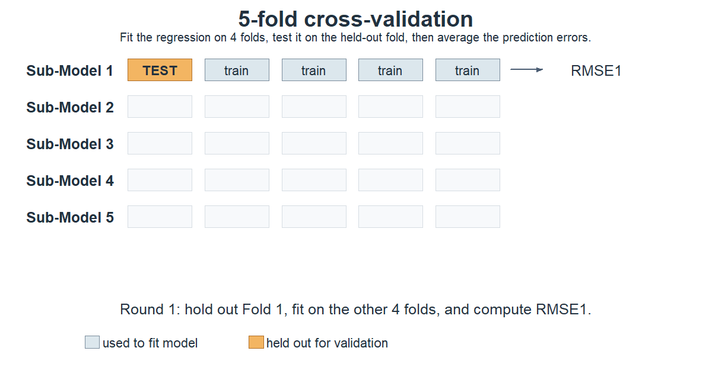

## From model comparison to model selection

In Lecture 26, the scientific question gave us a reduced model and a full model to compare. We knew in advance which additional terms we wanted to test.

Real modelling problems are usually messier. We may have several plausible predictors and a lot of reasonable-looking models, with no single reduced-versus-full comparison that settles the question.

At that point we have moved from **model comparison** to **model selection**.

The central question is:

> How do we balance model fit against model complexity when several models are plausible?

### What are we trying to do?

Before choosing a model, identify the modelling goal:

- **Explanation or inference:** estimate and interpret effects after adjustment for other variables.
- **Prediction:** predict new observations accurately.
- **Description:** find a compact model that describes the observed relationships.

These are different jobs, and they can favour different models. A variable might matter scientifically without helping prediction much, while a strong predictor does not automatically have a causal interpretation.

## Overfitting and underfitting

So why not just put everything into the model? 

```{r bias-variance-continuum, echo=FALSE, fig.width=9, fig.height=1.8, out.width="90%", fig.cap="The bias-variance trade-off as model flexibility changes."}
continuum <- tibble(
  x = c(1, 5, 9),
  label = c("Too simple\nunderfitting\nmore potential bias", "A useful balance", "Too flexible\noverfitting\nmore variance")
)

ggplot(continuum, aes(x = x, y = 0)) +
  geom_segment(aes(x = 1.4, xend = 8.6, y = 0, yend = 0),
               arrow = grid::arrow(ends = "both", length = grid::unit(0.12, "inches")),
               colour = "#325d88", linewidth = 1.2) +
  geom_point(aes(colour = label), size = 4, show.legend = FALSE) +
  geom_text(aes(label = label), vjust = -0.8, lineheight = 0.95, size = 3.7) +
  scale_colour_manual(values = c("#f47c3c", "#325d88", "#93c54b")) +
  coord_cartesian(xlim = c(0.5, 9.5), ylim = c(-0.2, 1.8), expand = FALSE) +
  theme_void()
```

This is the **bias-variance trade-off**. A model that is too simple can omit structure. A model that is too complicated can fit accidental features of the current data and produce less stable estimates.

### Dropping or Including Variables that have $\beta=0$

Suppose one candidate variable really has coefficient $\beta=0$. If we leave it out, the remaining coefficients and predictions are usually estimated more precisely. If we include it anyway, we spend a degree of freedom estimating something that is not contributing signal.

That is one form of **overfitting**: the model is more complicated than it needs to be.

### Dropping or Including Variables that have $\beta \ne 0$

The opposite mistake is to leave out a variable that really belongs in the model. That is **underfitting**.

If the omitted predictor overlaps with predictors that remain in the model, their coefficient estimates can be biased because they are now being asked to absorb some of the missing structure. Predictions can also be biased because the fitted mean structure is wrong.

The awkward part is that we do not know in advance which coefficients are truly zero. A hypothesis test gives us evidence, but it does not solve the model-selection problem by itself.

## A Numerical Illustration of Under and Overfitting

To make this concrete, consider an artificial industrial process where Yield depends on the process temperature at stage A, and may also depend on the temperature at stage B.

We consider the model 
$$ Y=\beta_0 + \beta_1 A+ \beta_2 B +\varepsilon.$$
	
We will assume the values of $A$ and $B$ and $\varepsilon$ are given in the data below.  The errors are random $\varepsilon \sim \mbox{Normal}(0, 1)$.

`r xfun::embed_file("../data/simulation1.csv")` 

```{r read Simulation1, eval=-1, echo=-2, message=FALSE}
sim = read.csv("simulation1.csv",header=TRUE)
sim = read.csv("../data/simulation1.csv",header=TRUE)
```


We will use two simple scenarios to see what happens when the fitted model is either too complicated or too simple.
	
### Scenario 1: $\beta_0=50$, $\beta_1=10$ and $\beta_2=0$.

In the first scenario, $B$ genuinely does nothing:
$$Y  =  50 + 10 A + \varepsilon$$

Compare the correct model using $A$ alone with an unnecessarily larger model that also includes $B$.

```{r overfitting}
dat <- sim |> mutate(Y = 50 + 10*A + epsilon)
lm1 = lm(Y ~ A, data=dat)
lm2 = lm(Y ~ A + B, data=dat)
lst(lm1, lm2) |> map_dfr(tidy, .id='model')
```

Adding the unnecessary variable doesn't introduce bias ($\hat\beta_1 \approx 10$), but the standard error of $\hat\beta_1$ is higher in the misspecified model.

## Under and Overfitting con't

### Scenario 2: $\beta_0=50$, $\beta_1=5$ and $\beta_2=5$.

Now both predictors genuinely matter:
$$	Y  =  50 + 5 A + 5 B + \varepsilon $$

```{r underfitting}
dat <- sim |> mutate(Y = 50 + 5*A + 5*B + epsilon)
lm1 = lm(Y ~ A, data=dat)
lm2 = lm(Y ~ A + B, data=dat)
lst(lm1, lm2) |> map_dfr(tidy, .id='model')
```

When we wrongly omit $B$, the estimated coefficient for $A$ is pulled away from its true value. Once both predictors are included, the fitted coefficients are close to the values used to generate the data.

### Summary: Bias vs Variance Trade-off

Omitting a needed variable can bias the remaining estimates and predictions, especially when the omitted predictor overlaps with variables retained in the model. Including an unnecessary variable can leave the estimates centred correctly while increasing their standard errors.

In practice we do not know which situation we are in. Model selection therefore requires a modelling goal and criteria that reflect the cost of complexity. A hypothesis test can contribute evidence, but it is not a complete decision rule.

## How should we judge extra complexity?

Adding variables will always make RSS smaller, so that alone cannot tell us whether the extra complexity was worth it. We need criteria that put the improvement in fit into context.

### Fit measures

The coefficient of determination

$$R^2 = 1 - \frac{\sum(y_i-\hat y_i)^2}{\sum(y_i-\bar y)^2}$$

measures the proportion of sample response variation accounted for by the fitted model. It does not penalise complexity, so $R^2$ cannot decrease when variables are added.

Adjusted $R^2$ accounts for residual degrees of freedom:

$$R^2_{\mathrm{Adj}} = 1 - \frac{\sum(y_i-\hat y_i)^2/(n-p)}{\sum(y_i-\bar y)^2/(n-1)}.$$

It can decrease when an added term does not reduce RSS enough to justify its degrees of freedom. A decrease is evidence against that particular added structure, not proof that the variable should never be used.

The residual standard error is the residual scale estimate:

$$S = \sqrt{\frac{RSS}{df_{\mathrm{residual}}}}.$$

It measures remaining unexplained variation on the response scale. It is useful for comparing fitted models to the extent that they have the same response and observations.

## Partial *F* tests and AIC

Partial *F* tests are useful when we have a particular nested change in mind. AIC provides another criterion:

$$AIC = n\log(RSS/n) + 2p + \text{constant},$$

where $p$ is the number of fitted regression parameters. Smaller AIC is preferred when comparing candidate models fitted to the same response and observations.

Unlike the partial *F* test, AIC can compare models that are not nested. It is still just a criterion, not a machine for finding the one true model, but it gives us a practical way to trade fit against complexity.

Individual coefficient *P*-values answer a more specific question about one coefficient under one parameterisation. They should not be treated as a complete model-selection rule.

## Cross-validation: a prediction question

Everything above is based on the data used to fit the model. If prediction is the goal, the more useful question is:

> How well does the model predict observations it did not use to fit itself?

The basic cross-validation idea is:

```{r cross-validation-diagram, echo=FALSE, out.width="90%", fig.cap="The basic cross-validation cycle."}

```

```{r cross-validation-gif, echo=FALSE, out.width="90%", fig.cap="Five-fold cross-validation in action."}

```

Your focus her should be on the idea not the implementation. We will apply it in Lecture 28 when to help us fit *large* models.

## Select terms, not arbitrary coefficients

One more thing before we start selecting models: a model term is not always the same thing as one coefficient. A four-level factor creates three treatment coefficients, but scientifically it is still one predictor.

Similarly, in

```
y ~ A * x
```

`A:x` is one interaction term, even though it can correspond to several interaction coefficients. If we retain an interaction, we normally retain the corresponding main effects as well. This is the hierarchy principle.

## Example:  Model Selection for Climate Data

We will build a model for mean July temperature across 36 towns in Aotearoa New Zealand. We have location variables such as latitude, longitude, elevation, coastal location and island, together with summer temperature, sunshine and rainfall.

`r xfun::embed_file("../data/climate.csv")` 

```{r read climate,eval=-1, echo=-2, message=FALSE}
climate = read_csv("climate.csv")
climate = read_csv("../data/climate.csv")
climate
```

## Climate Exploratory Data Analysis

```{r, fig.width=10, fig.height=4}
climate |>
  pivot_longer(-c(Place, MnJlyTemp)) |>
  ggplot() +
  geom_point(mapping=aes(x=value, y=MnJlyTemp)) +
  facet_wrap(vars(name), scales = 'free_x', ncol=4)
```

### Higher winter temperature associations

- Lower elevations (height)
- Lower latitudes (further north)
- Higher longitudes (further east - recall how Ao/NZ is oriented on a map - possibly correlation with latitude, will check next!)
- Higher summer temperatures
- North island (could just be latitude?)
- Increased rainfall - up to a point! (subtropical vs rainy westcoast - interaction with Island/latitude??)
- Closeness to the sea
- Increased sunshine hours

Several of these predictors are clearly telling us partly the same story.

## Climate: Latitude/Longitude and North vs South

```{r climate-map, echo=FALSE}
nz <- read_csv("../resources/nz_outline.csv", show_col_types = FALSE)

climate_map <- climate |>
  mutate(Island = if_else(NorthIsland == 1, "North Island", "South Island"))

ggplot() +
  geom_polygon(
    data = nz,
    aes(x = long, y = lat, group = group),
    fill = "#e9f0f3", colour = "#325d88", linewidth = 0.4
  ) +
  geom_point(
    data = climate_map,
    aes(x = Long, y = -Lat, fill = MnJlyTemp, shape = Island),
    colour = "#22313F", size = 3.8, stroke = 0.8
  ) +
  geom_text(
    data = climate_map,
    aes(x = Long, y = -Lat, label = Place),
    size = 2.6, hjust = 0, nudge_x = 0.12, nudge_y = 0.08
  ) +
  scale_fill_viridis_c(
    option = "C", name = "Mean July temperature"
  ) +
  scale_shape_manual(
    name = "Island",
    values = c("North Island" = 21, "South Island" = 24)
  ) +
  coord_quickmap(xlim = c(165.5, 180), ylim = c(-48, -33.5), expand = FALSE) +
  labs(x = NULL, y = NULL) +
  theme_void() +
  theme(legend.position = "bottom")
```


The map makes the geography easier to see: the North Island towns are generally warmer, while longitude mostly reflects the orientation of the islands. Elevation also appears to matter, although it may be confounded with whether a town is close to the sea (it cannot really be both!).

So we'd expect some collinearity here and figuring out which are the best variables to be used might take a bit of playing!

## Climate: Latitude/Longitude and North vs South

Let's start with Latitude, then add in Height and Sea:

```{r}
lm1 = lm( MnJlyTemp ~ Lat, data=climate)
lm2 = lm( MnJlyTemp ~ Lat + Height, data=climate)
lm3 = lm( MnJlyTemp ~ Lat + Height + Sea, data=climate)
```

## Building the Climate Model

#### Model 1: Lat only

```{r}
lm1 |> summary()
```

#### Model 2: Lat + Height

```{r}
lm2 |> summary()
```

#### Model 3: Lat + Height + Sea

```{r}
lm3 |> summary()
```

#### First three predictors: assessment

The first three additions agree across the measures we have considered: the added-term *P*-values are small, $S$ decreases, and adjusted $R^2$ increases. This is consistent with retaining `Lat`, `Height` and `Sea` for this candidate model path.

The `Height` coefficient also changes noticeably when `Sea` is added. This tells us that the interpretation of `Height` depends on whether `Sea` is adjusted for. The predictors overlap in the information they carry, so the coefficient in a multiple regression is a conditional association, not an isolated effect of height.

## Model 4: Adding NorthIsland

```{r fourth variable}
lm4 = lm( MnJlyTemp ~ Lat+ Height + Sea + NorthIsland, data=climate)
lm4 |> summary()
```

The added-term *P*-value is small, and the fit measures improve. The large change in the `Lat` coefficient tells us that the interpretation of latitude depends on whether `NorthIsland` is included. It does not, by itself, prove that the new variable is correcting bias.

**Why do you think adding North vs South island is useful over and above Latitude? Wouldn't Latitude do everything here??**

## Model 5: Adding Rain

```{r fifth variable}
lm5 = lm( MnJlyTemp ~ Lat+ Height+ Sea + NorthIsland + Rain, data=climate)
lm5 |> summary()
```


The evidence for `Rain` is mixed. Its coefficient *P*-value is approximately 0.10, while $S$ decreases and adjusted $R^2$ increases. These are all in-sample measures, so they do not establish that `Rain` will improve prediction for new towns. If prediction were the primary goal, this would be a natural case for validation or cross-validation.

## Model 6: Adding Longitude

```{r sixth variable, warning=FALSE}
lm6 = lm( MnJlyTemp ~ Lat+ Height+ Sea + NorthIsland+ Rain + Long, data=climate)
lm6 |> summary()
```

The evidence against adding `Long` is consistent: its *P*-value is greater than 0.5, adjusted $R^2$ decreases, and $S$ increases. This candidate addition does not improve the fitted model by these measures.

## Climate model-building progression

This is a model-building path, not proof that we have discovered the only correct formula. The table simply puts the evidence from each candidate addition in one place.

```{r climate-progression, echo=FALSE, results='asis'}
climate_progression <- tibble(
  Model = paste("lm", 1:6),
  `Added term` = c("Lat", "Height", "Sea", "NorthIsland", "Rain", "Long"),
  `Adjusted R2` = sapply(list(lm1, lm2, lm3, lm4, lm5, lm6), function(model) summary(model)$adj.r.squared),
  RSE = sapply(list(lm1, lm2, lm3, lm4, lm5, lm6), sigma),
  AIC = sapply(list(lm1, lm2, lm3, lm4, lm5, lm6), AIC),
  `Added-term evidence` = c("< 0.001", "< 0.001", "< 0.001", "< 0.001", "0.10", "> 0.5")
)

knitr::kable(climate_progression, digits = 3,
             caption = "Climate candidate models and in-sample comparison measures")
```

The table is useful because it shows what each extra term buys us. It still does not replace the modelling goal, subject-matter knowledge, or proper validation if prediction is what we care about.

## Final Model Diagnostic Plots

### A final model check

Once we have a plausible mean structure, we still need to check whether the fitted model shows obvious problems with the LINE assumptions.

`lm(MnJlyTemp ~ Lat + Height + Sea + NorthIsland + Rain, data = climate)`.


```{r diagnostic plots, echo=FALSE}
# Generate the 4 standard diagnostic plots
par(mfrow = c(2, 2))
plot(lm5)
```

### Interpretation of diagnostic plots

- Residuals vs. Fitted: the points show no strong systematic pattern, so there is not strong evidence of a problem with the linear mean structure.
- Normal Q-Q: the points are reasonably close to the reference line, with one noticeable departure. This is not proof of normality, but it gives no strong warning at this scale.
- Scale-Location: the spread does not show a strong trend across fitted values, so there is not strong evidence of changing variance.
- Residuals vs. Leverage: no observation stands out as obviously influential from this plot alone.

These plots do not certify the model. They tell us whether there are obvious departures that need more attention.

## A more realistic running example

From this point in the course, we are going to keep coming back to one more complex dataset rather than starting from scratch with a new toy example each time. The data are hourly bike rentals in Seoul, South Korea, together with weather and calendar variables that might help us explain or predict demand.

We will build this model up as the course goes on. Here we start with several plausible predictors. Later we will come back to the same data for automated variable selection, penalised regression, multicollinearity and the other problems that appear once a model starts looking more like something we would fit in practice.

`r xfun::embed_file("../data/seoul_bike_hourly.csv")`

```{r read seoul hourly, message=FALSE}
seoul_hourly = read_csv("../data/seoul_bike_hourly.csv")
seoul_hourly
```

The response is `rented_bike_count`. Potential explanatory variables include weather measurements such as temperature, humidity, wind speed and rainfall, as well as calendar information such as hour, season and whether the day is a holiday.

There is no obvious single model here. Several predictors are plausible, some are clearly related to one another, and the number of possible models gets large very quickly. That is exactly why this is useful as a running example.

```{r seoul candidate models, message=FALSE}
seoul_basic = lm(
  rented_bike_count ~ temperature + humidity + wind_speed,
  data = seoul_hourly
)

seoul_richer = lm(
  rented_bike_count ~ temperature + humidity + wind_speed +
    visibility + dew_point_temperature + solar_radiation +
    rainfall + snowfall + hour + season + holiday + functioning_day,
  data = seoul_hourly
)

tibble(
  model = c("basic weather model", "richer weather + calendar model"),
  adj_r_squared = c(
    summary(seoul_basic)$adj.r.squared,
    summary(seoul_richer)$adj.r.squared
  ),
  sigma = c(summary(seoul_basic)$sigma, summary(seoul_richer)$sigma),
  aic = c(AIC(seoul_basic), AIC(seoul_richer))
)
```

The richer model looks better on all three in-sample criteria: adjusted $R^2$ is higher, while residual standard error and AIC are lower. That tells us it fits these data better after accounting, to some extent, for the extra complexity. It does not yet tell us that it will predict new bike demand better.

With only a few candidate models we can still do this by hand. Once the predictor list gets longer, that becomes painful. In the next lecture we look at two ways forward: automate the search through candidate models, or keep a larger model and shrink the coefficients instead of repeatedly adding and removing terms.
