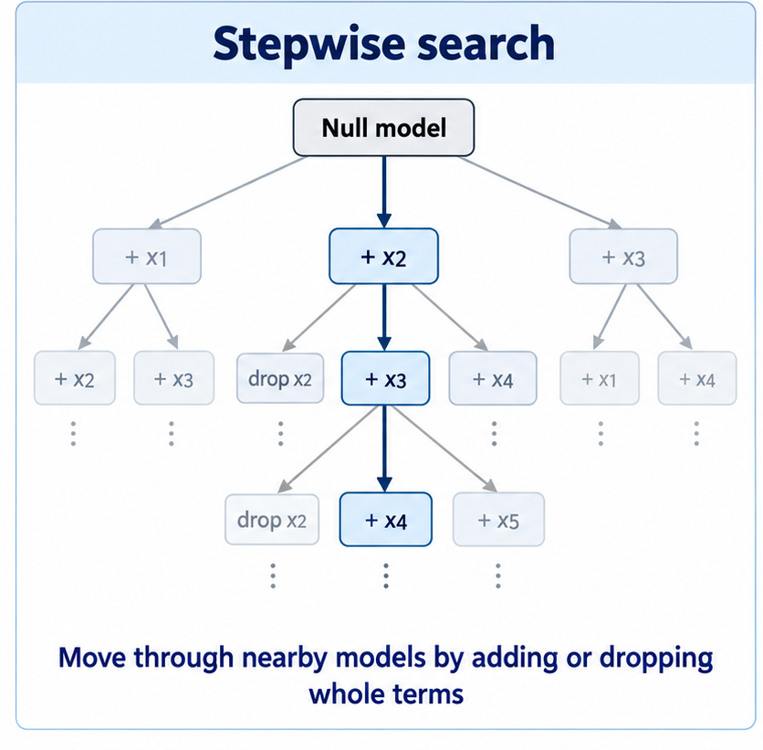
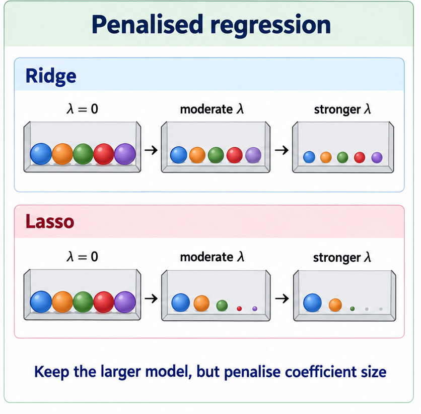

## From manual model building to automated search

In Lecture 27, we still chose the candidate models ourselves. Once the number of plausible predictors grows, there are two broad ways to stop doing all of that by hand.

{.incremental width="43%"} {.incremental width="43%"}

We will use both approaches in this lecture.

## Forward, backward, and stepwise search

The basic idea is simple.

::: incremental
- **Forward selection** starts small and adds one term at a time.
- **Backward elimination** starts large and removes one term at a time.
- **Stepwise selection** allows moves in either direction.
:::

. . .

The unit being added or removed is a **model term**, not an arbitrary coefficient. A factor can generate several coefficients and still count as one term.

For a prespecified nested comparison, a partial $F$ test is still useful. For a larger automated search, we need a criterion that can be evaluated repeatedly. Here we will use **AIC**, introduced in Lecture 27.

In practice, `step()` looks at models one move away from the current model and takes a move that lowers AIC. That makes the search local, so the path and starting model can matter.


## Climate data: small enough to watch the search

The climate data are small enough that we can actually watch the search process move from one model to the next.

```{r read-Climate-data-30, message=FALSE}
climate <- read.csv("../data/climate.csv", header = TRUE, row.names = 1) |>
  drop_na(Sun, Lat, Long, MnJanTemp, MnJlyTemp, Rain, Height, Sea, NorthIsland)

climate_null <- lm(Sun ~ 1, data = climate)
climate_full <- lm(
  Sun ~ Lat + Long + MnJanTemp + MnJlyTemp + Rain + Height + Sea + NorthIsland,
  data = climate
)
climate_scope <- list(
  lower = formula(climate_null),
  upper = formula(climate_full)
)
```

. . .

The full model for annual sunshine is

. . .

$$
\text{Sun} \sim \text{Lat} + \text{Long} + \text{MnJanTemp} +
\text{MnJlyTemp} + \text{Rain} + \text{Height} + \text{Sea} +
\text{NorthIsland}.
$$

## Forward selection

Start with the intercept-only model. At each step, ask which single addition gives the best reduction in AIC. We will follow each step and examine how the candidate models are considered by the algorithm.


```{r climate-forward-28}
climate_forward <- step(
  climate_null,
  scope = climate_scope,
  direction = "forward",
  trace = 1
)
```

. . .

Finally stopped.Let's check what we ended up with again.

. . .

```{r climate-forward-result-28}
formula(climate_forward)
AIC(climate_forward)
```

## Backward elimination

This is the same overall idea as forward selection, however we start with all terms in the model and kick terms out based on the best reduction in AIC.


```{r climate-backward-28}
climate_backward <- step(
  climate_full,
  scope = climate_scope,
  direction = "backward",
  trace = 1
)
```

. . .

Done.

```{r climate-backward-result-28}
formula(climate_backward)
AIC(climate_backward)
```

. . .

Now where did we end up? Not the same model as the forward selection. Now let's try stepwise!?

## Stepwise selection

Stepwise selection allows both kinds of move. We start small, but after adding a term the algorithm can reconsider terms already in the model.

```{r climate-both-28}
climate_both <- step(
  climate_null,
  scope = climate_scope,
  direction = "both",
  trace = 1
)
```

. . .

Done.

. . .

```{r climate-both-result-28}
formula(climate_both)
AIC(climate_both)
```

Does the bidirectional search finish at the forward model, the backward model, or somewhere else?

## Comparing the climate searches

```{r climate-search-comparison-28, echo=FALSE}
model_formula <- function(model) paste(deparse(formula(model)), collapse = " ")

climate_searches <- tibble(
  Search = c("Forward", "Backward", "Stepwise: both"),
  `Final formula` = c(
    model_formula(climate_forward),
    model_formula(climate_backward),
    model_formula(climate_both)
  ),
  AIC = c(AIC(climate_forward), AIC(climate_backward), AIC(climate_both))
)

knitr::kable(climate_searches, digits = 2)
```

|  |  |
|:---|:---|
| {width="100%"} | The lower AIC is preferred among the models actually reached by the search. Different starting points can finish at different local solutions. Agreement between searches is reassuring for this dataset, but it does not make the selected formula uniquely correct. |

## A larger problem: Seoul bike demand

The Seoul data contain hourly bike rentals together with weather and calendar variables. We have already watched forward, backward and bidirectional search on the smaller climate problem, so here we will use one bidirectional search and focus on defining the model space.

```{r seoul-stepwise-read, message=FALSE}
seoul_hourly <- read_csv("../data/seoul_bike_hourly.csv", show_col_types = FALSE) |>
  mutate(hour = factor(hour))

seoul_subset <- seoul_hourly |>
  select(
    rented_bike_count, hour, season, holiday, functioning_day,
    temperature, humidity, wind_speed, visibility, dew_point_temperature,
    solar_radiation, rainfall, snowfall
  ) |>
  drop_na()
```

Note that we are treating `hour` records as a factor rather than forcing bike demand to change linearly from midnight to 11 pm.

. . .

```{r seoul-stepwise-setup}
seoul_null <- lm(rented_bike_count ~ 1, data = seoul_subset)

seoul_full <- lm(
  rented_bike_count ~ hour + season + holiday + functioning_day +
    temperature + humidity + wind_speed + visibility +
    dew_point_temperature + solar_radiation + rainfall + snowfall,
  data = seoul_subset
)

seoul_scope <- list(
  lower = formula(seoul_null),
  upper = formula(seoul_full)
)

seoul_scope
```

The R term `scope` tells `step()` the smallest and largest formulas it is allowed to consider. This is handy if you always want a certain term in the model.

## Stepwise search on the Seoul data


```{r seoul-step-preview}
seoul_step <- step(
  seoul_null,
  scope = seoul_scope,
  direction = "both",
  trace = 1
)
```

. . .

Done.

. . .

```{r seoul-step-result-28}
formula(seoul_step)
seoul_step$anova
```

This is where automated search becomes convenient. We do not want to fit every plausible formula ourselves. But the procedure still makes a consistent decision at each step: a term is either in the model or out.

## Penalized Regression Models

Until now, we have taken discrete steps when selecting terms: include a term, or leave it out. Just as moving from categories to numbers gave us a smoother way to represent a variable, there is a smoother approach to building multivariable models: shrinkage.

When shrinkage is applied to regression, we call it a penalised regression model. Rather than immediately removing terms, we can keep the larger model but discourage large coefficient values. Coefficients are pulled towards zero, with the amount of shrinkage controlled by a penalty.

Different penalties let us express different kinds of model structure. We might expect the response to reflect many small influences, or instead expect that only a smaller number of predictors have substantial effects.

Remember that Ordinary Least Squares (OLS) minimises

$$
RSS = \sum_{i=1}^{n}(y_i-\hat y_i)^2.
$$

Penalised regression minimises

$$
RSS + \lambda \times \text{penalty}.
$$


The two penalties we will use are **L2** for ridge and **L1** for lasso.

::: incremental
- $\lambda = 0$ gives ordinary least squares.
- Larger $\lambda$ means a stronger penalty.
- The intercept is normally left unpenalised.
:::

## Ridge regression: L2 penalty

Ridge regression minimises

$$
RSS + \lambda\sum_{j=1}^{p}\beta_j^2.
$$

::: incremental
- Large coefficients are penalised more strongly than small coefficients.
- As $\lambda$ increases, the fitted coefficient vector is pulled towards zero.
- Ridge generally keeps all predictors rather than setting coefficients exactly to zero.
:::

. . .

In matrix form,

$$
\hat{\boldsymbol\beta}_{\text{ridge}}
=
(X^\top X+\lambda I)^{-1}X^\top y.
$$

A useful way to read this is that ridge adds $\lambda$ to the diagonal of $X^\top X$. That stabilises the inversion when predictors contain overlapping information.

## Lasso regression: L1 penalty

Lasso minimises

$$
RSS + \lambda\sum_{j=1}^{p}|\beta_j|.
$$

::: incremental
- Lasso also shrinks coefficients as $\lambda$ increases.
- Unlike ridge, some coefficients can become **exactly zero**.
- Lasso can therefore perform shrinkage and variable selection at the same time.
:::

. . .

Ridge and lasso both control coefficient size. The difference is what the penalty allows to happen at zero.

## Why standardisation matters

The penalty acts on coefficient size, and coefficient size depends on the units used for the predictor.

Suppose the same rainfall variable is measured in millimetres or metres.

```{r standardisation-units-28, echo=FALSE}
unit_example <- tibble(
  Units = c("millimetres", "metres"),
  Coefficient = c(0.002, 2),
  `Squared coefficient` = c(0.002^2, 2^2)
)

knitr::kable(
  unit_example,
  digits = c(0, 3, 6),
  col.names = c(
    "Rainfall units",
    "Equivalent coefficient",
    "Contribution to an L2 penalty"
  )
)
```

The fitted relationship is identical, but the raw coefficient penalty is not. Without standardisation, changing units can change how strongly a predictor is penalised.


## Using `glmnet`

For a Gaussian response variable, `glmnet` minimises

$$
\text{Objective}(\beta_0,\boldsymbol\beta)
= \frac{RSS}{2n} + \lambda\left[
\frac{1-\alpha}{2}\sum_j\beta_j^2
+
\alpha\sum_j|\beta_j|
\right].
$$

The first term measures fit, with RSS divided by $2n$. The bracketed term penalises coefficient size.

Here $\alpha$ is the mixing parameter, with $0 \leq \alpha \leq 1$. We choose its value to set the balance between the L2 and L1 parts of the penalty.

::: incremental
- `alpha = 0`: the L1 term disappears, giving ridge (**L2**).
- `alpha = 1`: the L2 term disappears, giving lasso (**L1**).
- $0 < \alpha < 1$: elastic net, a mixture of the two. We will not develop elastic net further here.
:::

. . .

Note: `glmnet` standardises predictors by default when `standardize = TRUE`.

. . .

The remaining tuning parameter is $\lambda$, which we choose by cross-validation.

```{r seoul-penalised-setup, message=FALSE, warning=FALSE}
library(glmnet)

X <- model.matrix(
  rented_bike_count ~ hour + season + holiday + functioning_day +
    temperature + humidity + wind_speed + visibility +
    dew_point_temperature + solar_radiation + rainfall + snowfall,
  data = seoul_subset
)[, -1]

y <- seoul_subset$rented_bike_count

set.seed(42)
foldid <- sample(rep(seq_len(10), length.out = nrow(X)))
```

## Ridge: choosing $\lambda$

```{r seoul-ridge-fit-28, include=FALSE}
seoul_ridge <- cv.glmnet(
  x = X,
  y = y,
  alpha = 0,
  foldid = foldid,
  standardize = TRUE
)

ridge_cv <- tibble(
  log_lambda = log(seoul_ridge$lambda),
  cv_error = seoul_ridge$cvm,
  cv_se = seoul_ridge$cvsd
)
```

```{r seoul-ridge-cv-plot-28, echo=FALSE, fig.width=9, fig.height=5}
ggplot(ridge_cv, aes(x = log_lambda, y = cv_error)) +
  geom_errorbar(
    aes(ymin = cv_error - cv_se, ymax = cv_error + cv_se),
    width = 0, alpha = 0.35
  ) +
  geom_line() +
  geom_point(size = 1.4) +
  geom_vline(xintercept = log(seoul_ridge$lambda.min), linetype = 2) +
  geom_vline(xintercept = log(seoul_ridge$lambda.1se), linetype = 3) +
  annotate(
    "text", x = log(seoul_ridge$lambda.min),
    y = max(ridge_cv$cv_error), label = "lambda.min",
    angle = 90, vjust = -0.4, hjust = 1
  ) +
  annotate(
    "text", x = log(seoul_ridge$lambda.1se),
    y = max(ridge_cv$cv_error), label = "lambda.1se",
    angle = 90, vjust = 1.2, hjust = 1
  ) +
  labs(
    x = expression(log(lambda)),
    y = "Cross-validated mean squared error"
  ) +
  theme_bw(base_size = 13)
```

`lambda.min` gives the lowest mean cross-validation error.

`lambda.1se` is the **largest** $\lambda$ whose estimated error is within one standard error of that minimum. It gives stronger regularisation while remaining close to the best estimated cross-validation performance.

## Ridge: `lambda.min` versus `lambda.1se`

Let's look at both the min and 1se in an example dataset.

```{r seoul-ridge-summary-28}
ridge_coef_compare <- cbind(
  `lambda.min` = as.matrix(coef(seoul_ridge, s = "lambda.min"))[, 1],
  `lambda.1se` = as.matrix(coef(seoul_ridge, s = "lambda.1se"))[, 1]
)

round(ridge_coef_compare, 3)
```

The `lambda.1se` column uses the stronger penalty, so the coefficient vector is more strongly regularised.

**For the rest of this lecture we will use `lambda.1se`.**

For ridge that means stronger shrinkage. For lasso it usually also means fewer non-zero coefficients.

## Lasso coefficient paths

```{r seoul-lasso-fit-28, include=FALSE}
seoul_lasso <- cv.glmnet(
  x = X,
  y = y,
  alpha = 1,
  foldid = foldid,
  standardize = TRUE
)

lasso_beta <- as.data.frame(t(as.matrix(seoul_lasso$glmnet.fit$beta)))
lasso_beta$log_lambda <- log(seoul_lasso$glmnet.fit$lambda)

lasso_path <- lasso_beta |>
  pivot_longer(
    cols = -log_lambda,
    names_to = "term",
    values_to = "coefficient"
  ) |>
  mutate(
    group = case_when(
      grepl("^hour", term) | term %in% c("holidayNo Holiday", "functioning_dayYes") ~ "Time / calendar",
      grepl("^season", term) ~ "Season",
      term %in% c("temperature", "humidity", "wind_speed", "visibility") ~ "Temperature / air",
      term %in% c("rainfall", "snowfall", "solar_radiation", "dew_point_temperature") ~ "Rain / snow / solar / dew",
      TRUE ~ NA_character_
    ),
    group = factor(
      group,
      levels = c("Time / calendar", "Season", "Temperature / air", "Rain / snow / solar / dew")
    )
  )

stopifnot(!anyNA(lasso_path$group))
```

```{r seoul-lasso-path-28, echo=FALSE, fig.width=12, fig.height=6, out.width="100%"}
ggplot(lasso_path, aes(x = log_lambda, y = coefficient, group = term, colour = group)) +
  geom_hline(yintercept = 0, linetype = 3, colour = "grey55") +
  geom_line(alpha = 0.72, linewidth = 0.75) +
  geom_vline(xintercept = log(seoul_lasso$lambda.min), linetype = 2, colour = "grey30") +
  geom_vline(xintercept = log(seoul_lasso$lambda.1se), linetype = 3, colour = "grey30") +
  scale_colour_manual(
    name = "Predictor group",
    values = c(
      "Time / calendar" = "#0072B2",
      "Season" = "#D55E00",
      "Temperature / air" = "#009E73",
      "Rain / snow / solar / dew" = "#CC79A7"
    ),
    labels = c(
      "Hour, holiday, functioning day",
      "Season indicators",
      "Temperature, humidity, wind, visibility",
      "Rainfall, snowfall, solar, dew point"
    )
  ) +
  guides(colour = guide_legend(override.aes = list(alpha = 1, linewidth = 2))) +
  labs(
    x = expression(log(lambda)~"(stronger penalty to the right)"),
    y = "Coefficient",
    caption = "Dashed line: lambda.min    Dotted line: lambda.1se"
  ) +
  theme_bw(base_size = 13) +
  theme(
    legend.position = "right",
    legend.title = element_text(face = "bold"),
    legend.text = element_text(size = 10),
    plot.caption = element_text(hjust = 0)
  )
```

Each line is one model-matrix coefficient. The colours group related predictors; several lines can share a colour, especially the hour indicators. Moving to the right means increasing $\lambda$.

For lasso, coefficients do not just get smaller. Some paths hit zero and stay there. At `lambda.1se` we use the stronger of the two marked penalties.

```{r seoul-lasso-1se-28}
coef(seoul_lasso, s = "lambda.1se")
```

## Stepwise regression versus shrinkage

| Method | Decision being made | Typical result |
|---|---|---|
| Stepwise search | Add or remove whole model terms | A smaller selected formula |
| Ridge, L2 | Penalise squared coefficient size | Keep predictors but shrink/stabilise the coefficient vector |
| Lasso, L1 | Penalise absolute coefficient size | Shrink coefficients and set some exactly to zero |

|  |  |
|:---|:---|
| {width="100%"} | Stepwise and lasso can both produce sparse models, but they do not select the same object. Stepwise works with **model terms**. `glmnet` works with **columns of the model matrix**, so a multi-level factor can contribute several penalised coefficients.<br><br>These procedures are also data-dependent. Change the sample slightly and the selected stepwise model or lasso set can change. |

## Looking ahead

Automated search and shrinkage give us useful ways to work with a larger predictor set, but they expose another problem.

When predictors carry nearly the same information, ordinary least-squares coefficients can become unstable. A small change in the data or model can produce a large change in the separate coefficient estimates.

That is the **multicollinearity** problem we turn to next.
